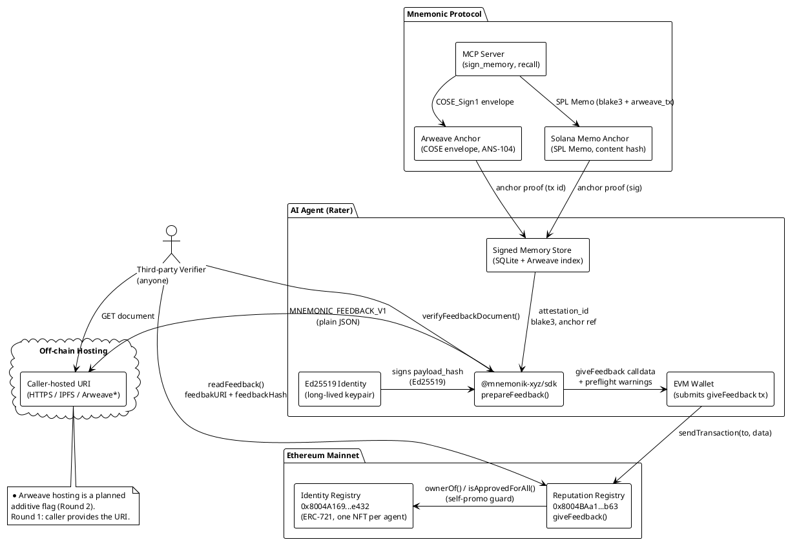
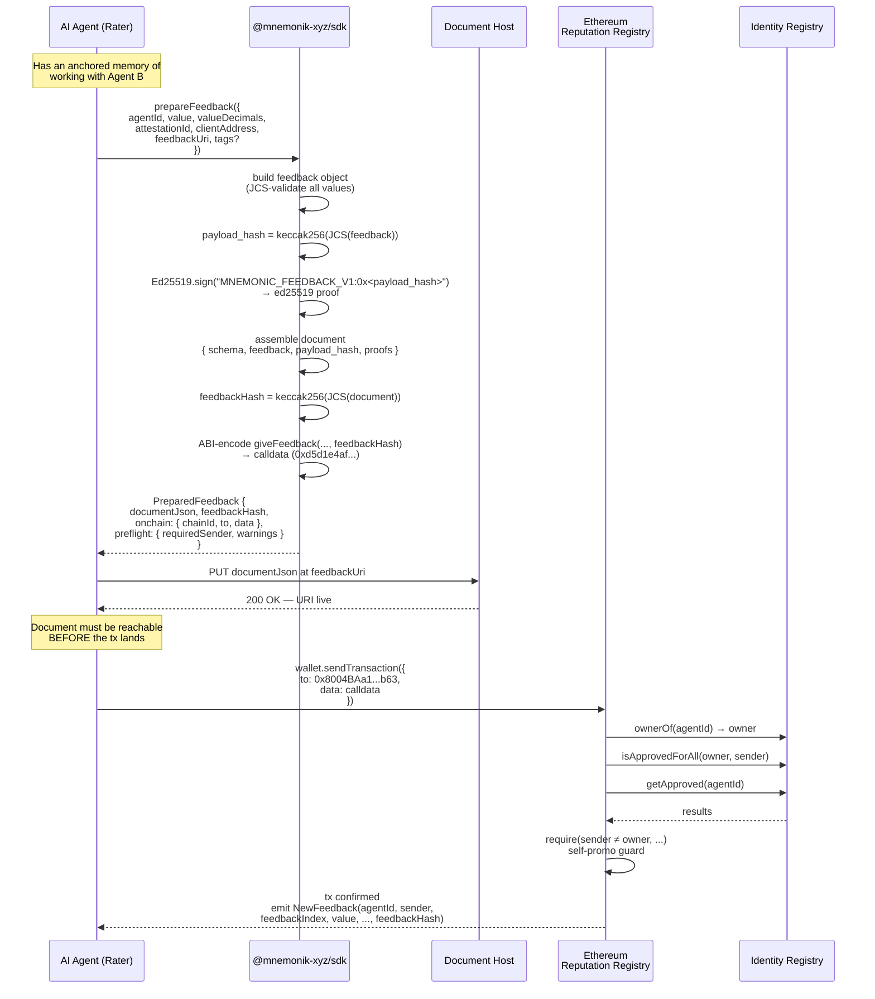
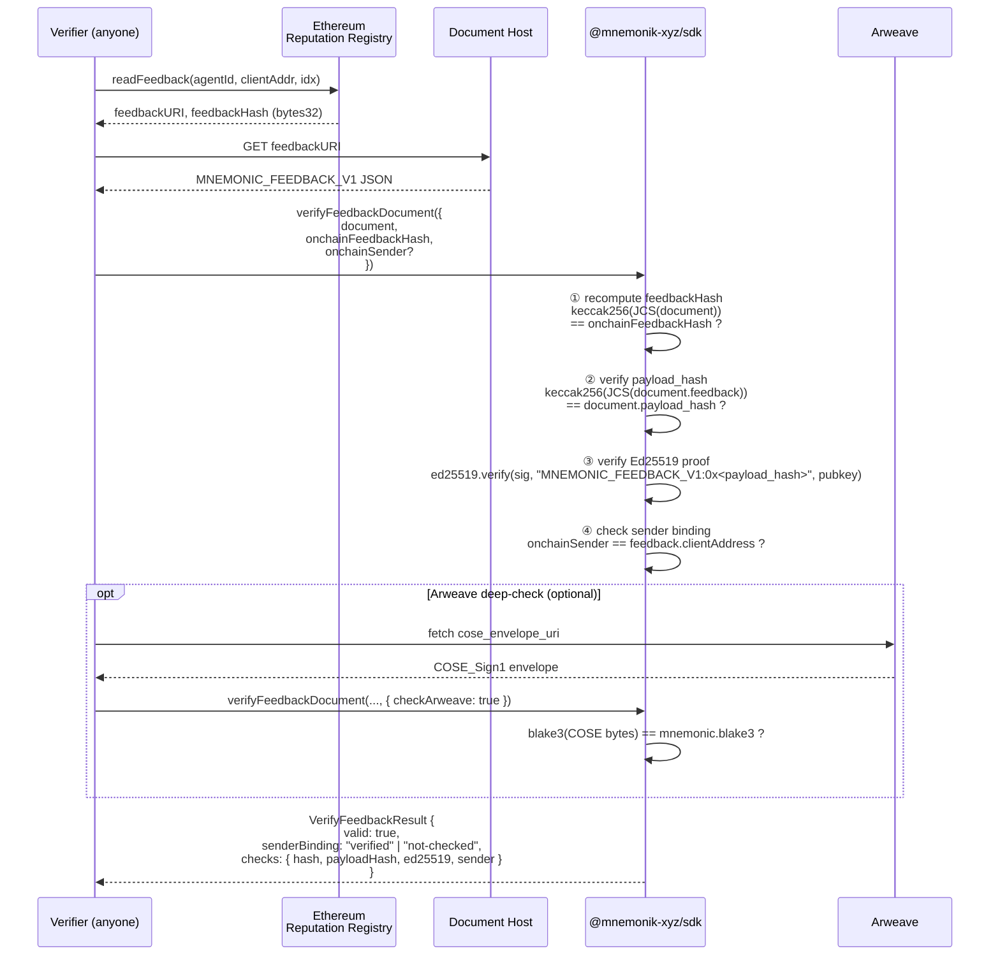
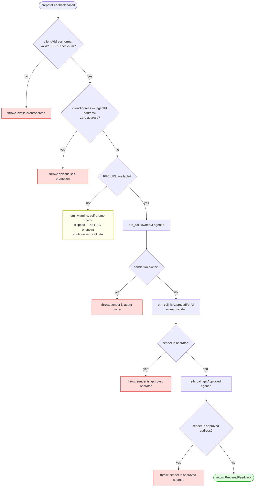
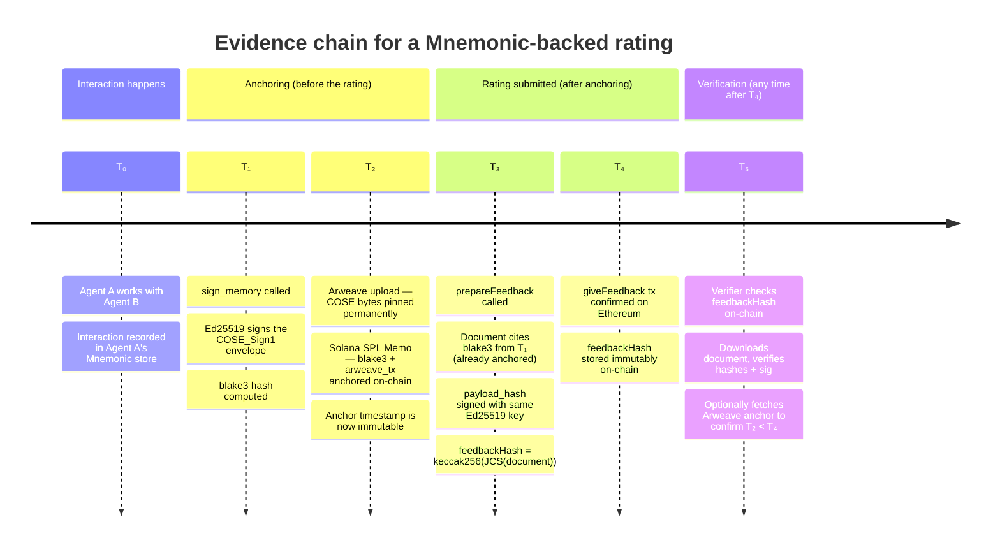

# Mnemonic as ERC-8004 Reputation Layer

This document describes how the Mnemonic Protocol extends ERC-8004 ("Trustless Agents") with cryptographically verifiable reputation evidence. It covers the architecture, the `MNEMONIC_FEEDBACK_V1` document format, all interaction flows, and the verification procedure.

Related: `work/erc8004-reputation/tech-spec.md`, issue `#73`.

---

## The problem

ERC-8004 Reputation Registry accepts any rating from any wallet. A score of 98/100 stored on-chain carries no proof that the rater ever interacted with the rated agent, no proof the rater's identity has a history worth trusting, and no proof the specific claim was not fabricated after the fact.

Mnemonic closes that gap. Every agent interaction is signed with a long-lived Ed25519 identity and anchored on Arweave and Solana before the rating is written. The anchoring is time-ordered and content-addressed — a fabricated memory cannot be backdated, because the anchor transaction already exists at a block height that predates the rating.

---

## Architecture



---

## Two-layer trust model

Mnemonic adds a distinct trust category to the ERC-8004 ecosystem, which already has:

| Trust type | Providers | How it works |
|---|---|---|
| TEE attestation | Phala, Marlin | Hardware-signed execution proof |
| Crypto-economic | Staking protocols | Slashable bond as collateral |
| **Signed memory** | **Mnemonic** | **Ed25519 identity + time-anchored evidence** |

The third category is unclaimed. The key property: a staking deposit can be posted today with a fresh wallet. A year of anchored memory history cannot be backdated — it would require rewriting Arweave blocks that are already globally replicated.

---

## The `MNEMONIC_FEEDBACK_V1` document

A plain JSON file hosted at `feedbackURI`. Any viem/ethers consumer can `JSON.parse` it. The Mnemonic signature lives inside it as a `proofs[]` entry; no CBOR stack is needed to read or verify the document.

```jsonc
{
  "schema": "MNEMONIC_FEEDBACK_V1",
  "feedback": {
    // Which registry and which agent is being rated.
    "agentRegistry": "eip155:1:0x8004BAa17C55a88189AE136b182e5fdA19dE9b63",
    "agentId": "42",                         // decimal STRING — uint256 exceeds JSON safe range

    // The rater's EVM address. MUST equal msg.sender of the giveFeedback tx.
    // Lives inside the hashed payload, so it is signed.
    "clientAddress": "0xAb5801a7D398351b8bE11C439e05C5B3259aeC9B",

    "createdAt": "2026-09-27T12:00:00Z",     // RFC 3339, UTC, second precision
    "value": 9800,                           // safe-range integer
    "valueDecimals": 2,                      // → score is 98.00
    "tags": {                                // optional; omit keys rather than setting null
      "tag1": "quality",
      "tag2": "research"
    },
    "endpoint": "https://agent.example.com/a2a",  // optional: rated agent's service endpoint

    // The Mnemonic evidence. The cited attestation must have been anchored
    // BEFORE this document is created — that is the tamper-evident property.
    "mnemonic": {
      "schema": "MEMORY_V1",
      "attestation_id": "mn_01j...",
      "blake3": "<64 lowercase hex chars>",  // content hash of the cited attestation
      "ed25519_pubkey": "<base58>",          // rater's long-lived identity key
      "cose_envelope_uri": "ar://<txid>",    // optional: direct Arweave link
      "anchor": {                            // optional; anchor-agnostic shape
        "chain": "solana",
        "kind":  "spl-memo",
        "ref":   "<solana sig>"
      }
    },
    "note": "Completed 3 research tasks on time."   // optional, ≤ 280 chars
  },

  // keccak256 of JCS(document.feedback). This is what the Ed25519 key signs.
  "payload_hash": "0x<32 bytes hex>",

  // One or more proofs. The Ed25519 proof is always present.
  // The EIP-191 proof is optional — the caller produces it with their own wallet.
  "proofs": [
    {
      "type": "ed25519",
      "kid":  "<base58 pubkey>",
      "sig":  "<base64, 64 raw bytes>"
    },
    {
      "type":    "eip191",                   // optional
      "address": "0x<EIP-55>",
      "sig":     "0x<65 bytes>"
    }
  ]
}
```

### Why two hashes?

A single hash fails either way:

- Put the signatures **inside** the hashed bytes → circular dependency (you can't sign bytes that contain the signature).
- Put the signatures **outside** → an adversary strips or replaces them while the on-chain `feedbackHash` still matches.

The two-level design resolves this:

```
payload_hash  = keccak256(JCS(document.feedback))   ← what Ed25519 signs
feedbackHash  = keccak256(JCS(document))             ← covers payload_hash + proofs
```

The on-chain `feedbackHash` covers the proofs. Stripping a proof changes the document, which changes `feedbackHash`, which no longer matches the chain.

---

## Interaction flows

### Flow 1 — Agent submits a rating



---

### Flow 2 — Third party verifies a rating



---

### Flow 3 — Self-promotion guard (pre-flight)



---

### Flow 4 — Evidence chain (why Mnemonic ratings are harder to fake)



---

## Contract addresses (pinned)

Deployed via CREATE2 — same address on all mainnets, same address on all testnets.

| Registry | Mainnet | Testnet (Sepolia / Base Sepolia) |
|---|---|---|
| Identity Registry (ERC-721) | `0x8004A169FB4a3325136EB29fA0ceB6D2e539a432` | `0x8004A818BFB912233c491871b3d84c89A494BD9e` |
| Reputation Registry | `0x8004BAa17C55a88189AE136b182e5fdA19dE9b63` | `0x8004B663056A597Dffe9eCcC1965A193B7388713` |

Source: `qntx/erc8004` `networks.rs`, fetched 2026-09-27.

### `giveFeedback` ABI

```solidity
function giveFeedback(
    uint256 agentId,       // ERC-721 token ID of the rated agent
    int128  value,         // signed fixed-point score
    uint8   valueDecimals, // decimal places (0–18)
    string  tag1,          // plain string, passed through directly
    string  tag2,
    string  endpoint,      // optional: rated agent's service endpoint
    string  feedbackURI,   // URI of the MNEMONIC_FEEDBACK_V1 document
    bytes32 feedbackHash   // keccak256(JCS(document)) — the on-chain commitment
) external
```

4-byte selector: `0xd5d1e4af`
(`keccak256("giveFeedback(uint256,int128,uint8,string,string,string,string,bytes32)")[0:4]`)

**Deviations from the original backlog spec (`work/a2a-bridge/backlog.md` Path 3):**

| Parameter | Backlog (incorrect) | Actual contract |
|---|---|---|
| `value` | `uint256` | `int128` (signed) |
| `tag1`, `tag2` | `bytes32` | `string` |
| `endpoint` | not listed | extra `string` param |
| `feedbackHash` | `blake3(canonical JSON)` | `keccak256(JCS(document))` |

---

## Signed message format

Both proof types sign the same string — one line, shell-safe, copy-pasteable into `cast wallet sign`:

```
MNEMONIC_FEEDBACK_V1:0x<payload_hash lowercase hex>
```

The Ed25519 proof is a raw 64-byte signature over the UTF-8 bytes of that string. Not COSE: a verifier with `@noble/ed25519` or `ed25519-dalek` can verify in three lines and no CBOR stack.

The optional EIP-191 proof is a standard personal_sign over the same string. The caller produces it with their own wallet; Mnemonic never holds the EVM key.

---

## What this proves (and what it does not)

### Proves

- The document has not been modified since `feedbackHash` was committed on-chain (hash binding).
- The Ed25519 key named in `mnemonic.ed25519_pubkey` endorsed this exact payload at creation time (signature binding).
- The cited memory existed on Arweave before the rating was written, if `mnemonic.anchor` is present and the verifier checks Arweave.
- The rater's EVM address is the same entity that holds the Ed25519 key, for this specific rating (conditional on the sender check).

### Does not prove

- That the cited memory is *about* Agent B. `blake3` and the anchor prove existence and time, not semantic content.
- Anti-Sybil protection. A single operator can hold many identities. Mnemonic adds cost: a long history cannot be backdated. It does not make new identities impossible.
- A permanent rater-to-address binding. The EVM address is committed per-document, not globally linked to the Ed25519 key forever.

---

## Reproducible fixture verification

The canonical fixture at `packages/sdk/test/fixtures/erc8004-feedback-v1.json` is reproducible by any third party with no Mnemonic code:

```bash
# Recompute feedbackHash from the document bytes alone:
jq -j '.documentJson' packages/sdk/test/fixtures/erc8004-feedback-v1.json | cast keccak
# Must equal fixture.feedbackHash

# Verify the giveFeedback calldata selector:
cast 4byte 0xd5d1e4af
# Must return: giveFeedback(uint256,int128,uint8,string,string,string,string,bytes32)
```

The Rust parity test (`mcp/tests/erc8004_feedback_parity.rs`) reads the same fixture and asserts both hashes using `alloy_primitives::keccak256` — cross-ecosystem proof that the TypeScript JCS + keccak256 matches the Rust implementation.
