# Mnemonic — Non-Custodial, Self-Sovereign Paradigm (Target Design)

**Status:** design / pre-implementation. Companion to the audit in
[`../payments-robustness/report.md`](../payments-robustness/report.md).

**One sentence:** the user signs their own memories with their own key, and pays
on their own rail — the operator becomes a *relay + facilitator* (embed,
compress, anchor, index), never a custodian of keys or funds.

---

## 1. Principles

1. **Self-sovereign authorship.** The COSE_Sign1 signature is produced by the
   **user's** Ed25519 key, client-side. The operator never holds the user's
   signing key. (*Correcting report §7.3: user-signing is the default, not a
   Level-3 opt-in.*)
2. **Non-custodial funds.** No prepaid balance held by the operator. Payment is
   per-call (x402) or drawn from an **on-chain allowance** the user controls — no
   bearer-secret API key, no operator-held float.
3. **Operator = relay, not authority.** The operator computes the embedding,
   canonicalizes, anchors to Arweave/Solana, and indexes for recall. It cannot
   forge authorship (no key) and cannot move user funds (no custody).
4. **Verifiable output unchanged.** blake3 + COSE + on-chain anchor still make
   every artifact independently verifiable — now with the *user's* pubkey as
   signer, which is strictly stronger.
5. **Clean break — no legacy.** Operator-signed inline mode is **removed**, not
   kept: *all* artifacts are client-signed. Custodial `mnm_` API keys are
   **removed**. No dual-mode, no migration shims — one scheme.

---

## 2. What already exists (we are promoting, not inventing)

Mnemonic already ships **two** signing modes:

| Mode | Who signs | Where | Code |
|---|---|---|---|
| **Inline operator-sign** (legacy default) | operator Ed25519 | server, synchronous | `codec::sign` in the `sign_memory` path, `mcp/src/tools.rs` |
| **Deferred user-sign** (self-sovereign — already built) | **user** Ed25519 | client (browser today) | `mcp/src/tools.rs:854`, `mcp/src/api.rs:128`, `mcp/src/pending.rs:286` |

The deferred path today:
- `sign_memory` prepares embedding + canonical CBOR, parks a **pending bundle**, returns `{status:"awaiting_signature", approve_url, correlation_id}` (`tools.rs:854`).
- The user opens `approve_url` (`mnemonik.xyz/sign/{id}`) and signs the COSE envelope **with their key** in the browser.
- `POST /api/sign-callback` (`api.rs:128`) receives the signed bytes + `signer_pubkey`, **verifies the COSE `kid` == `signer_pubkey`** (`api.rs:196`), and persists with **`signer = owner = user`** (`api.rs:369`), bound to the authenticated `jwt_sub` (`pending.rs:301`).
- `mnemonic_check_pending` resolves the final on-chain state (`tools.rs:884`).

**Implication:** self-sovereign authorship is ~80% built. The target paradigm =
**(A)** make user-sign the default and extend it beyond the browser (SDK/CLI/
extension sign locally — they already hold keys via the keychain), and **(B)**
replace custodial API-key payment with non-custodial x402 + on-chain allowance.

---

## 3. Today vs target (at a glance)

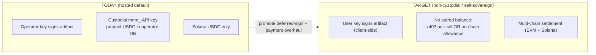

## 4. Two key ROLES — one identity, no external wallet

**No MetaMask / browser wallet anywhere.** Both keys are **client-held and
derived from the single identity seed** (§14, §18); the client signs *authorship*
and *payment* transactions itself. They are distinct **roles**, not distinct
custodies or apps.

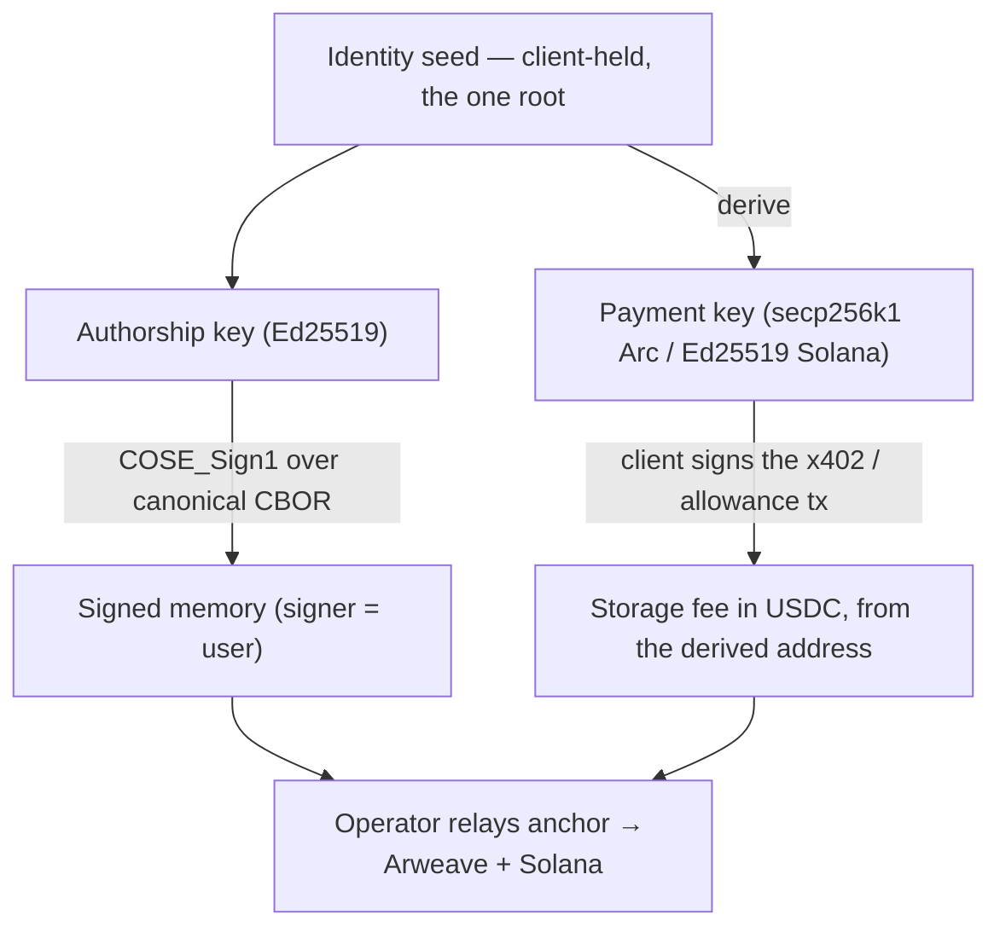

- **Authorship** = the identity's Ed25519 key — signs the artifact, client-side.
- **Payment** = a key **derived from the same identity** — the client signs the
  payment tx itself; the user only needs the **derived address funded** (faucet
  on testnet, a transfer, or a sponsor). **No external wallet, no signing popups.**
- Distinct *roles* ("who said it" vs "who paid"), one self-custodied root.

## 5. Target unified write flow (`sign_memory`, participate)

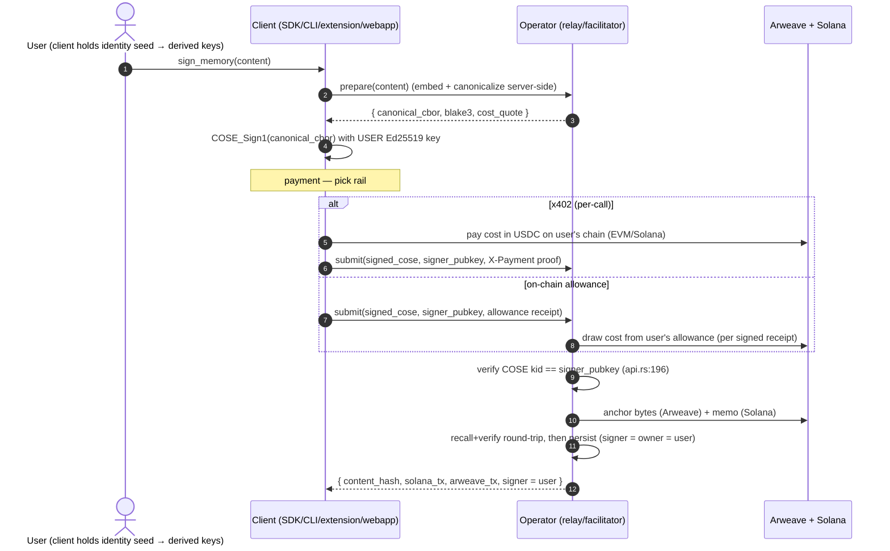

Key change vs today: the **signature step happens on the client with the user's
key**, and **payment is non-custodial** (no prepaid operator balance). The
operator verifies-and-anchors but cannot author or hold funds.

## 6. Non-custodial payment model

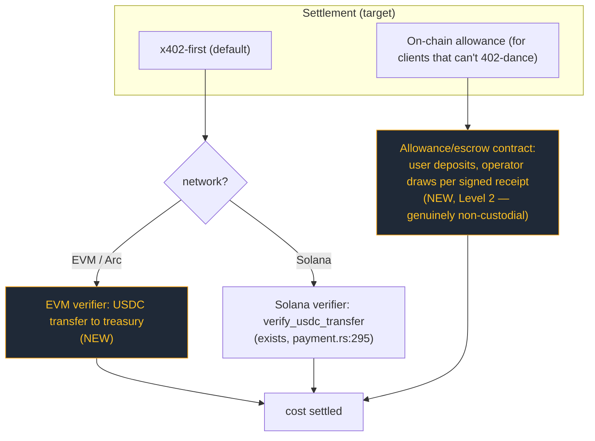

- **Retire** the custodial `mnm_` API key + operator-held balance (report §3).
- **x402 everywhere**: keep Solana (`verify_usdc_transfer`), **add an EVM
  verifier** so Arc/Base USDC works — this is the single highest-leverage change
  for EVM consumers.
- **Allowance** replaces prepaid balance for non-interactive clients: funds stay
  in a user-controlled on-chain allowance; the operator can only pull what a
  signed receipt authorizes. No free-floating custody.

## 7. Trust model — before vs after

| Capability | Today (operator-signed + custodial) | Target (self-sovereign + non-custodial) |
|---|---|---|
| Forge authorship of a memory | Operator can (it holds the signing key) | **No one** — only the user's key signs |
| Move/seize user funds | Operator holds prepaid balance | **No** — funds on user's rail / user allowance |
| Censor an anchor | Operator can refuse to relay | Operator can refuse, but user can self-anchor (fallback) |
| Independently verify an artifact | Yes | Yes (now signer = user, strictly stronger) |
| Single point of failure | Operator key + operator treasury | Operator is a replaceable relay |

---

## 8. Cutover — no legacy (decided)

Per review: **clean break, no backward-compat.**
- **Operator-signed inline mode is removed.** *Every* artifact is client-signed
  (the operator never signs memory content again). `codec::sign` with the
  operator key is deleted from the write path.
- **Custodial `mnm_` API keys + `balance` mode are removed**, not deprecated —
  no issuance, no redemption path retained.
- **One write scheme:** prepare → client-signs → submit → operator verifies +
  anchors. No dual-mode branching, no "thin client" fallback.
- **Recall/verify semantics unchanged** (still blake3 + COSE), but `signer` is
  now *always* the user. Pre-existing operator-signed rows, if any, are out of
  scope for this clean-room target (treat as a fresh deployment).

## 9. Impact on Arco (the EVM consumer)

- **No MetaMask.** The Arco client (backend/agent) holds one **Mnemonic identity
  seed**; it derives an **Arc payment key** from it (§14) and signs the Arc x402
  tx itself. The only external step is **funding the derived address** (faucet on
  testnet, or a sponsor) — there is no browser wallet in the Mnemonic flow.
- Authorship: the same identity signs deliverable/feedback memories, so the
  on-chain `bytes32` points to a **user-signed** artifact (not operator-signed) —
  strictly stronger for the ERC-8004/8183 provenance story.
- The proxy we built already isolates this: swapping operator-fronted billing for
  client-derived x402 is a backend change behind `/api/mnemonic/*`, invisible to
  the UI.

## 10. Build ledger — already done vs new

| Capability | Status |
|---|---|
| User-signed COSE (client signs, server verifies kid==pubkey) | **Exists** (browser/deferred path, `api.rs`/`pending.rs`/`tools.rs`) |
| `signer = owner = user`, JWT-bound | **Exists** (`api.rs:369`, `pending.rs:301`) |
| Solana x402 (on-chain, per-call) | **Exists** (`payment.rs:178/295`) |
| Failure-safe payment (nonce after delivery, refund) | **Exists** (`payment.rs:267`, `:556`) |
| Programmatic (non-browser) client signing | **New** — SDK/CLI sign locally + submit |
| EVM x402 verifier (Arc/Base USDC) | **New** |
| On-chain allowance (replace custodial balance) | **New** (Level 2) |
| Retire/deprecate `mnm_` API keys | **New** (policy + code) |
| F1–F4 hardening (gate `/admin/stats`, etc.) | **New** (quick) |

---

## 11. Implementation plan (waves — to walk through, not yet started)

> Sequenced so each wave ships value independently and de-risks the next.
> Nothing here is implemented yet.

**Wave 0 — Security hardening (small, do first; from report §5 F1–F4)**
- **Split `/admin/stats`**: keep public onboarding/usage metrics, move operator
  P&L (cost/margin/net) behind an admin token (§13). Move `GET /balance` off
  query-string secrets; gate/justify `POST /api-keys`; split payment vs authn
  Bearer usage. *No paradigm change; pure risk reduction.*

**Wave 1 — EVM x402 (highest leverage for Arco)**
- Add an EVM USDC transfer verifier alongside `verify_usdc_transfer`; make x402
  `network`-aware (`payment.rs:38` becomes meaningful); config `(chain, asset,
  treasury)`. *Unlocks Arc-USDC pay-per-call.*

**Wave 2 — Programmatic user-signing (default for all clients)**
- Extend the deferred-sign path so SDK/CLI sign the canonical CBOR **locally**
  (not only via browser `approve_url`). Client-sign is the *only* path.

**Wave 3 — Remove operator signing (no legacy)**
- Delete `codec::sign`-with-operator-key from the write path; the server may
  embed/canonicalize/anchor but **never signs content**. Reject any write that
  arrives without a valid client COSE signature (`kid == caller`).

**Wave 4 — Remove API keys + on-chain allowance**
- Delete `mnm_` keys, `balance` mode, `/api-keys`, `/deposit`, `credit_deposit`,
  `deduct_balance` (custodial ledger gone). Add the on-chain **allowance** path
  so non-interactive clients still pay without a 402 round-trip.

**Wave 5 — Verifiable recall / drop SQL-as-truth (§16)**
- Make Arweave canonical for content; anchor per-owner Merkle commitments on
  Solana; `recall` returns inclusion proofs; demote the vector store to a
  rebuildable, verifiable cache. Decide f32-on-Arweave vs compressed-recall.

**Suggested first step:** Wave 0 (security) in parallel with a spike on Wave 1
(EVM x402) — Wave 1 is what Arco needs and proves the non-custodial rail
end-to-end. Waves 2–4 then execute the clean break (§8); Wave 5 (recall
verifiability) can run independently.

---

## 12. Arc/EVM compatibility — no external wallet, no Solana-key blocker

**Short answer: no blocker, and crucially no MetaMask.** The client generates the
identity and **derives + holds** the Arc/EVM payment key from it; it signs the
Arc payment tx itself. The user never opens a browser wallet.

### What's fixed to Ed25519 (and why it's fine)
- Authorship signing is **EdDSA/Ed25519** (COSE alg `-8`), hardcoded in
  `core/src/codec/sign.rs:56` (sign) and verified at `:144`.
- The identity is a self-generated **Ed25519 keypair** (`Keypair::new()`,
  `core/src/identity/ensure.rs:248`). It is the **root**; the Arc/EVM payment key
  is `HKDF(identity_seed,"pay/arc") mod n` → a valid secp256k1 key the **client
  holds and signs with** (§14, §18).

### Self-contained — no wallet app

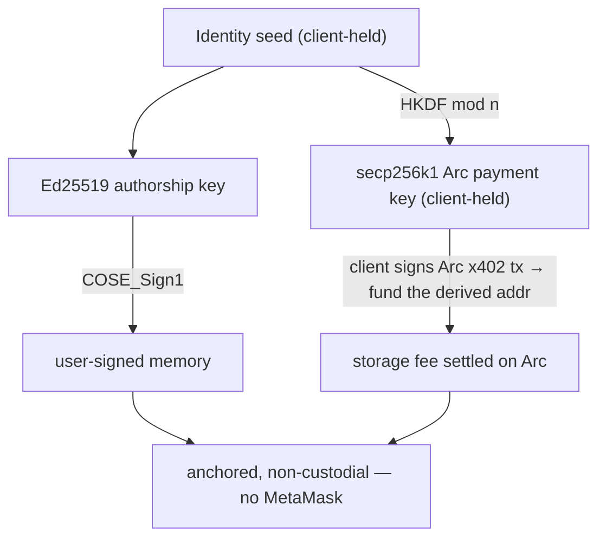

- The client signs the Arc payment with the **derived** secp256k1 key — no
  MetaMask, no EIP-1193, no signing popups. The user only **funds the derived
  address** (testnet faucet / transfer / sponsor).
- Authorship and payment are both client-side from one seed.

### Solana touchpoints — none require a user key or wallet
| Touchpoint | Needs a wallet / blocks EVM? |
|---|---|
| COSE authorship = Ed25519 | No — it's the client-held identity key |
| Arc/EVM payment key | No — **derived** from the identity, client-signed (no MetaMask) |
| `did:sol:` naming | No — cosmetic; could add `did:key`/`did:pkh` later |
| Solana SPL-memo timestamp anchor | No — operator-relayed; user needs no Solana key |
| Payment asset = Solana USDC today | Addressed by Wave 1 (EVM x402 on Arc) |

> Note: "sign the memory with your own Ethereum wallet" (single-key, secp256k1
> COSE/ES256K) is explicitly **not a goal** — we don't use external wallets at
> all. Authorship stays Ed25519; the codec needs no ES256K work.

---

## 13. Note on `/admin/stats` (onboarding vs P&L)

`/admin/stats` was built to surface **onboarding/usage stats**, and a separate
**public** endpoint already exists — `/stats` → `public_stats_handler`
(`mcp/src/api.rs:1264`, cached, non-financial). The issue is only that
`/admin/stats` (`mcp/src/main.rs:261`) *also* returns **operator P&L** (cost,
margin, net) with no gate. So the fix is not "lock it down" but **make it
sophisticated**:

- **Public tier** (no auth): onboarding/usage metrics — counts, memories anchored,
  maybe current price. Extend `public_stats` if more onboarding signal is wanted.
- **Operator tier** (admin-gated): P&L (`earned`, `cost`, `net`, `margin`,
  `avg_sol_price`) moves behind an admin token.
- This replaces the blunt "gate F1" item in Wave 0 with a **split** task.

---

## 14. Can the authorship and payment keys be derived from one another? (corrected)

**Yes — they can, including cross-curve. My earlier "no" was wrong and is
corrected here.** A private key on *any* curve is just a 256-bit scalar, so any
high-entropy secret can be reduced into a valid key on Ed25519 *or* secp256k1.
The real question is not *feasibility* but **which direction to derive, and
whether to *enforce* the binding at the protocol level.**

### Greenfield: there are no pre-existing / pre-funded wallets

**Clarified premise:** clean-room — there is **no external wallet (no MetaMask)**
and nothing pre-funded to "preserve." Keys are **created fresh** and held by the
client, which makes the **authorship identity the natural root** and the payment
key something we *derive*, not import.

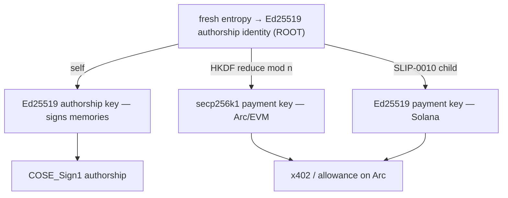

- **Identity-rooted derivation (recommended).** Generate the Ed25519 authorship
  identity from fresh entropy; **derive the payment key(s) from it** —
  `payment_priv = HKDF(identity_seed, "pay/<chain>") mod n` (cross-curve to
  secp256k1 for Arc/EVM, or a SLIP-0010 Ed25519 child for Solana). One secret to
  back up (the identity), funds flow to the derived payment address.
- Equivalent: one neutral master seed → both children (HD-wallet style). Same
  net result — single backup, both keys reproducible.
- **Topology "wallet → identity" is not needed here** (no existing wallet to keep).
  It only matters when a consumer insists on reusing a pre-funded external wallet;
  not our case.

> Cross-curve derivation is **not** a blocker: a private key is just a scalar, so
> `HKDF(...) mod n` yields a valid secp256k1 *or* Ed25519 key. Since nothing is
> pre-funded, we derive everything **from the identity** and fund the derived
> address — no reverse derivation required.

### What to keep regardless: payer ≠ author must stay legal at the protocol level
Identity-rooted derivation is **intra-identity** (one entity's author + pay keys).
It must not be confused with **inter-identity** payment: sponsorship / delegated
pay (an operator, org, or treasury — *a different identity with its own keys* —
paying to anchor someone else's authored memory) is exactly what Arco and agent
fleets need. So the server **must accept any payer for any author**; derivation is
a per-identity key-management convenience, never a `payer == author` constraint.
Blast-radius note: identity-rooted derivation means one seed compromise exposes
both keys — acceptable for single-entity self-custody, but the identity seed must
be guarded like a wallet seed.

> Decision (revised): **keys are generated fresh; derive the payment key(s) *from*
> the Ed25519 authorship identity (identity as root).** One backup, single-key UX.
> Keep the protocol agnostic — any payer may fund any author's write, so
> sponsorship still works. Explicit binding, when needed, is the derivation
> itself *or* a signed attestation — both are fine.

---

## 15. Open question A — does client-signing break Arweave storage?

**No.** Authorship and storage are two different layers:

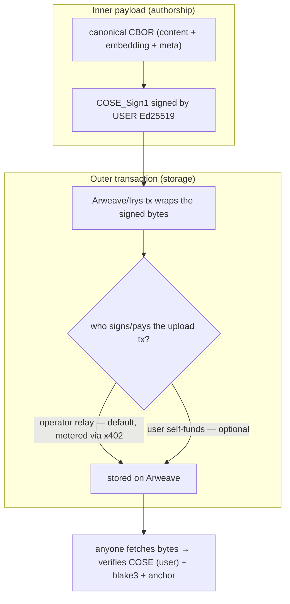

- Arweave stores **bytes**; it does not care who signed the *inner* COSE. The
  COSE signer (user) and the Arweave-tx signer/payer (operator relay or user)
  are **independent** — exactly as the deferred sign-callback path already works
  today (bytes finalized client-side, then anchored).
- **Determinism holds:** the embedding is computed in `prepare()` and included in
  the canonical CBOR the client signs, so the uploaded bytes == the signed bytes
  (tamper-evident). No re-canonicalization after signing.
- The only thing that changes vs today is *who holds the signing key* (user, not
  operator). The Arweave/Irys upload mechanics are untouched.

> Verdict: client-signing is orthogonal to Arweave storage. No break.

---

## 16. Open question B — can we get rid of the SQL database? (verifiable, usable recall)

**Answer: SQL can be demoted from a *trusted store* to a *rebuildable cache*. The
source of truth becomes Arweave (content) + a Solana-anchored commitment
(completeness). The catch is recall *precision*, because of how embeddings are
stored today.**

### What SQLite actually holds vs Arweave
| Data | SQLite | Arweave |
|---|---|---|
| Memory **content** | cached | **canonical** (inside the signed CBOR) ✅ recoverable |
| **Embedding** for recall | **full f32** (`attestation_embeddings.embedding BLOB`, `core/src/storage/sqlite.rs:29`) | only **TurboQuant-compressed** → decompresses to *approximate* f32 (`core/src/compress` "approximate", lossy) |
| The **set** of an owner's memories | the index | derivable via Arweave tag query (GraphQL) |

So **authenticity of any single memory is already trustless** (blake3 + COSE +
anchor) regardless of where it's stored — SQL is not a trust root for *integrity*.
SQL only uniquely provides two things: (1) a fast **f32 vector index**, and (2) an
implicit claim of **completeness** (the full set).

### Two gaps to close to drop SQL-as-truth

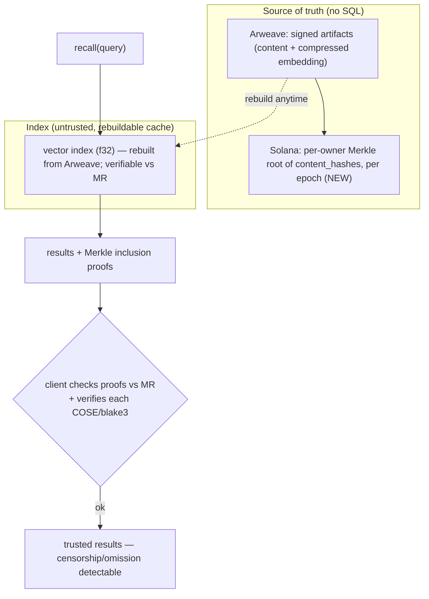

1. **Completeness / censorship-resistance.** Anchor a **per-owner Merkle root of
   `content_hash`es** (per epoch) on Solana. `recall` returns results **plus
   inclusion proofs**; the client checks them against the anchored root, so an
   operator that omits or tampers is **detectable**. This is what makes recall
   *"100% verifiable."*
2. **The vector index.** Options, in order of preference:
   - **(c) Rebuildable cache (recommended):** keep a vector index for speed, but
     it is **reproducible from Arweave** and checkable against the Merkle root —
     so it's a cache *anyone* can rebuild, not a trusted DB. SQLite (or any
     vector store) survives only in this role.
   - **(b) Store full f32 on Arweave:** makes Arweave self-sufficient for
     high-precision recall, at higher storage cost per memory.
   - **(a) Recall from compressed only:** zero extra storage, but recall runs
     over *approximate* (dequantized) vectors → **lower precision**. Acceptable
     for some uses, not for high-recall search.

### The real tradeoff (be honest)
- **"SQL as a trusted database" → can be removed.** Truth = Arweave + anchored
  Merkle commitments; SQL becomes an optional, rebuildable, *verifiable* index.
- **"Any index at all" → only removable for small N.** Pure client-side recall
  (fetch an owner's artifacts from Arweave, decompress, cosine locally) is
  feasible at small scale and is *fully* operator-independent; at large N you
  want an index, but it can be the untrusted/rebuildable kind above.
- **Precision caveat:** today only *compressed* embeddings are on Arweave.
  Operator-independent recall therefore either accepts lower precision (a) or
  pays to store f32 (b). Pick per product need; the verifiability (Merkle +
  COSE) is independent of this choice.

> Verdict: **Yes — drop SQL as a source of truth.** Make Arweave canonical and
> anchor per-owner Merkle commitments so recall returns *proofs*. Keep a vector
> index only as a rebuildable cache. This is a **Wave 5** (post-payment) track.

### Precision tiers (decided): high precision is *optional* and *cheap*
- **Default = compressed.** Recall over dequantized TurboQuant embeddings —
  operator-independent, fine for most cases (coarse semantic match, small corpora,
  exact-hash verification).
- **Opt-in = high precision (full f32).** Stored **inside the signed artifact** on
  Arweave → permanent, tamper-evident, and it *upgrades* embedding verifiability
  (today f32 lives only in untrusted SQLite). Toggle **per-memory or per-owner**.
- **Cost penalty is negligible:** f32 384-dim ≈ 1536 B vs TurboQuant-4bit ≈ 213 B —
  only **~1.3 KB more** per memory, still sub-cent on Arweave (§20). Compression is
  about index/bandwidth at scale, *not* Arweave cost — so offering high precision
  is cheap. In demand for large corpora / fine-grained search; off by default.
- **Privacy caveat (ties to §17):** embeddings can leak content via inversion, so
  **f32-on-public-Arweave is a *public-memory* feature only.** Private/shared
  memories keep embeddings **client-side** and recall stays post-decryption.

---

## 17. Visibility / access control — public vs private vs shared (Arco multi-party)

**Decision for now: ship PUBLIC.** But the real Arco need is *shared-to-N*, and
that interacts hard with the non-custodial decisions — capture it so we don't
forget.

### The reality check (important)
Today `visibility` is **access-control only, not encryption**: recall filters by
`owner_pubkey` + a `visibility` column (`core/src/storage/sqlite.rs:92`); there is
**no encryption in `core/`**. So a "private" memory's **plaintext is still on
public Arweave** — privacy is enforced *only* at the operator's recall layer.

> Consequence: once we make Arweave the source of truth and remove operator trust
> (§16), **"private"/"shared" via a SQL WHERE-clause is meaningless** — you cannot
> access-control public, immutable storage. In the non-custodial target,
> **private/shared ⇒ encryption**, full stop.

### Three tiers
| Tier | Who reads | Enforcement (non-custodial) |
|---|---|---|
| **Public** | anyone | none — plaintext on Arweave (fine; the on-chain hash is public anyway) |
| **Private** | author only | content **encrypted to the author's key** |
| **Shared-to-N** | an explicit set of pubkeys | content **encrypted to each recipient** (key-wrapping) |

### Arco is inherently multi-party — visibility is per-artifact *type*
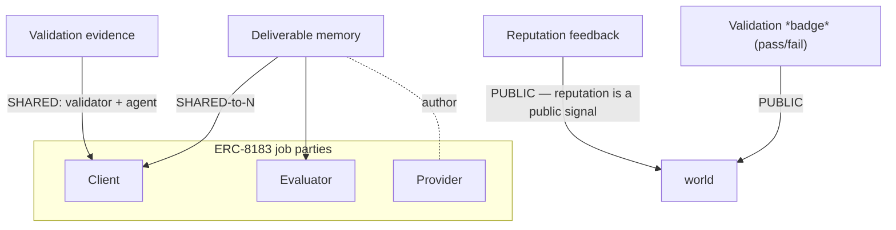
- **Deliverable** → typically **shared-to-N** = `{client, provider, evaluator}` (confidential work); *public* only for open bounties.
- **Reputation feedback** → **public** (a reputation signal everyone should read).
- **Validation** → the *badge* (pass/fail) public; the *evidence/report* often **shared** (validator + agent).

So visibility is chosen **per memory at sign time**, with sensible per-type defaults.

### Encryption model (for the shared/private target — future track)
- Encrypt content to recipients via **X25519 ECIES / key-wrapping**. The Mnemonic
  **Ed25519** identity maps to **X25519** (standard birational conversion), so the
  same identity that *signs* can also be an *encryption recipient*; EVM parties can
  use ECIES over secp256k1. (Note: encryption key ≠ signing key — same two-key
  hygiene as §4/§14.)
- **Recall tension:** semantic recall needs *plaintext* embeddings. For
  encrypted memories, recall is **client-side after decryption**, or the
  embedding is shared (encrypted) to the same recipient set. Public memories keep
  server-side recall as today. (Merkle commitments from §16 work over hashes
  regardless — encryption only changes the stored *content*, not the proof.)

### Proposal
- **MVP / now:** **PUBLIC** for Arco. It matches reputation transparency, keeps
  recall simple, and the on-chain `bytes32` + handle are public regardless. Mark
  each memory `visibility: public` explicitly.
- **Capture as future work (Wave 6 — Encrypted shared memories):** shared-to-N via
  X25519 key-wrapping; per-type defaults (deliverable→shared, feedback→public,
  validation-evidence→shared); client-side recall for encrypted sets.
- **Do not** ship "private" as a SQL ACL in the non-custodial world — it would be
  privacy theatre over public Arweave bytes.

> Open decision to revisit before any confidential-deliverable use case: encrypt
> content + how recall works over encrypted sets. For the current public path,
> nothing blocks us.

---

## 18. Key management (client-side convenience)

**Principle:** key management is a **client concern**. The protocol/server only
ever sees **public keys + signatures + payment proofs** — never a private key or
seed. Everything below lives in the client (CLI / extension / webapp / SDK).

### One root, three purposes
The fresh Ed25519 **identity seed** is the single root; every other key is
**derived deterministically** from it, so there is exactly **one secret to back
up**.

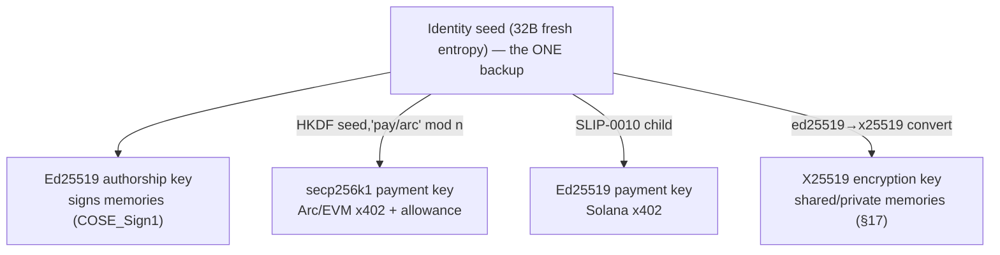

- **Authorship** = the identity key itself (signs COSE).
- **Payment** = derived per chain (`HKDF(seed,"pay/<chain>") mod n` for secp256k1;
  SLIP-0010 child for Ed25519/Solana). Fund the derived address.
- **Encryption** = the identity's Ed25519 mapped to X25519 (standard birational
  conversion) — recipient key for shared/private memories (§17).
- Derivation domains are fixed strings (`"pay/arc"`, `"pay/sol"`, `"enc"`) so the
  same seed always reproduces the same key set.

### Storage (already in the codebase)
- Identity lives in the **OS keychain** with a **file-fallback stub**
  (`~/.mnemonic/identity.json`), bootstrapped by `core/src/identity/ensure.rs`.
  Derived keys are **recomputed on demand** from the seed — they are *not* stored
  separately (nothing extra to leak).

### Backup / restore — non-custodial, server-blind (already in the codebase)
- The repo already ships an **encrypted key-escrow**: an Argon2id-AES-GCM blob
  per user, **opaque to the server** (it never sees plaintext), bound to the
  user's pubkey (`mcp/src/escrow.rs`, chrome-extension T15). This is the
  backup/restore primitive for the seed across devices — keep it; it fits the
  non-custodial model (operator stores ciphertext only).
- Restore = fetch blob → decrypt client-side with the user passphrase → rederive
  all keys from the seed.

### Lifecycle
```
generate (fresh entropy) → store (OS keychain + stub)
   → derive authorship / payment / encryption on demand
   → back up (encrypted blob; server-blind)
   → restore (decrypt → rederive everything)
   → rotate (new identity seed = new identity; link old→new via a signed
             statement if continuity of authorship history is needed)
```

### Caveats (recorded)
- **Blast radius:** one seed reproduces *all* keys — guard it like a wallet seed
  (keychain, encrypted escrow). Acceptable for single-entity self-custody.
- **Determinism:** derivation must be fixed (domains + standard KDF) so any client
  reproduces identical keys; pin the KDF + paths in the SDK.
- **Per-agent identity:** each agent/identity has its **own** seed. Sponsorship
  (one identity paying for another) is **inter-identity** and orthogonal to
  derivation — the server stays agnostic about who pays for whom (§14).
- **Scope:** this is a *client* convenience. No server change is required to
  adopt it; the server contract remains "show me a pubkey, a signature, and a
  payment proof."

> Decision: **identity seed is the single root; authorship/payment/encryption keys
> derive from it; back up via the existing server-blind encrypted escrow.**
> Client-only — the protocol never holds keys.

---

## 19. How a payment tx is signed & executed — without a wallet

**Yes — this is fully specified, and it's standard.** "No MetaMask" does not mean
"no signer"; it means the **client *is* a programmatic signer** (embedded key),
not a browser extension. Nothing in the flow needs a wallet app or a popup.

### The concrete path (Arc / EVM)
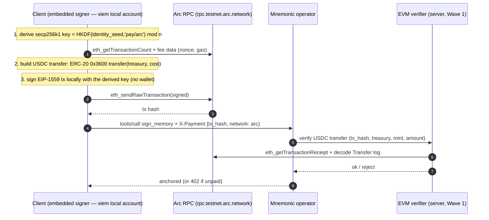

Every step is a library call (viem `privateKeyToAccount` to sign, `eth_*` JSON-RPC
to broadcast) — the same primitives MetaMask uses internally, minus the
extension. On **Solana** the analogue is identical: derived Ed25519 key signs an
SPL USDC transfer, broadcast via the existing `SolanaClient.rpc`.

### What must be true (and is)
- **Signer:** viem (already a dep) signs a raw secp256k1 tx from the derived key. ✓
- **Broadcast:** Arc RPC is public (`rpc.testnet.arc.network`). ✓
- **Proof:** the tx hash is the x402 `X-Payment` proof; the **server EVM verifier
  is the one new piece** (Wave 1) — mirror of `verify_usdc_transfer` for EVM.

### The honest gotcha: the derived address needs gas (and why Arc ≠ generic EVM)
- To broadcast, the derived address must hold **gas**.
- **Arc — no problem, no AA needed.** Gas is **native USDC** (chain
  `nativeCurrency` = USDC, 18-dec), so you fund the derived address with the *same
  asset* you're already paying in. Minimal friction; a derived EOA + local signing
  is sufficient. (Note the two USDC representations: native 18-dec = gas, ERC-20
  `0x3600` 6-dec = the transferred fee.)
- **Generic EVM — gas is ETH → friction → AA-4337 *later*.** On a normal EVM
  chain the EOA would need ETH for gas. The clean fix is an **ERC-4337 paymaster
  that lets gas be paid in USDC** (or an operator relayer / EIP-2771 meta-tx). The
  4337 account is still controlled by the **derived key** — it does *not*
  reintroduce an external wallet; it only sponsors/abstracts gas.
- **Sequencing (decided):** ship the plain derived-EOA path for **Arc** now (no
  AA); add **AA-4337 (USDC paymaster) for generic EVM later** as a gas/UX
  enhancement, not a v1 requirement and not a custody change.

### Precise framing
> "No MetaMask" = **no external/browser wallet and no signing popups**. The client
> holds the derived key and signs+broadcasts itself. It is still a (programmatic,
> self-custodied) wallet under the hood — that's unavoidable and intended; what we
> remove is the *dependency on a third-party wallet app*, not the act of signing.

---

## 20. Economic alignment — storing on Arweave

**Short answer: writes are well-aligned and cheap; the *recall/serving* side is
the only real misalignment — and §16 (operator-independent recall) is what fixes
it.** So the non-custodial direction and the economic fix are the same direction.

### Arweave's model works in our favour
Arweave is **pay-once / store-forever**: a single upload fee funds a long-horizon
endowment, and the bytes are permanent. So storage is a **bounded, one-time cost
per artifact** — there is no recurring storage bill. A memory is tiny (a few
hundred bytes after TurboQuant), so the per-write Arweave cost is a fraction of a
cent (the pricing engine even has a `min_price` floor because it rounds to ~nil,
`mcp/src/pricing.rs:43`).

### Cost vs revenue, per lifecycle

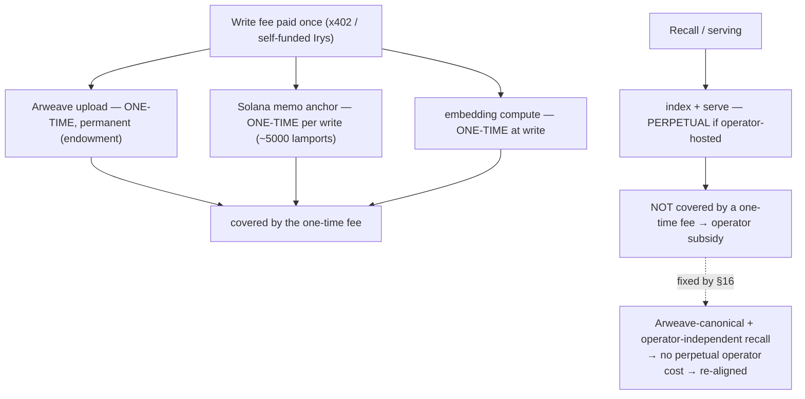

- **Write-time (aligned).** The fee is quoted as `(irys + sol_tx) × SOL/USDC ×
  (1+margin)`, floored — so the user's one-time payment covers the permanent
  Arweave upload + the Solana anchor + a 20% margin. Pay-once matches
  store-forever. ✓
- **Recall-time (the misalignment).** If recall depends on the **operator's
  perpetual index + compute**, a one-time write fee cannot fund forever-serving —
  the operator subsidises recall indefinitely. This is the only structural gap.

### The fix is already on the roadmap (§16)
Making recall **operator-independent** — Arweave canonical for content, a
rebuildable/verifiable vector index, per-owner Merkle commitments — means recall
no longer requires the operator's perpetual infrastructure. Then the **one-time
write fee genuinely covers the artifact's whole lifecycle**, and anyone (the user,
a third-party indexer) can serve recall. So §16 is not only a *trust* fix; it is
the *economic-alignment* fix.

### Who pays — and why each option is aligned
- **Self-funded Irys (most aligned).** The user (the beneficiary) pays the
  Arweave upload directly; the operator bears **zero** storage cost and is a pure
  relay. Perfect alignment, no subsidy.
- **Operator-fronted + x402 margin.** Operator pays Arweave/Solana and recoups via
  the write fee at cost + margin (pricing engine guarantees price ≥ cost). Aligned
  as long as the margin ≥ FX/volatility slippage.
- **Free local mode.** No Arweave, no cost — trivially aligned (free for free).

### Risks (bounded)
- **FX/volatility** between USDC paid and AR/lamports cost at upload time — the
  20% margin + live price refresh (`pricing.rs:93`, CoinGecko + Irys) buffer it.
- **Tiny-write rounding** — the `min_price` floor ensures even sub-cent writes
  cover the Solana anchor fee + overhead.
- **Permanence is a one-way door** — you cannot un-store; matters for the
  encryption/visibility decision (§17), not for cost.

> Verdict: storing on Arweave is **economically sound** — pay-once/store-forever
> matches a one-time write fee, and per-memory cost is negligible. The single
> structural misalignment (perpetual recall serving) is closed by the §16
> operator-independent recall track. Prefer **self-funded Irys** (or allowance) so
> the beneficiary bears the cost; keep the margin + floor to absorb FX and the
> Solana anchor.

---

## 21. Regression safety — do not break other modules (standing rule)

**Standing rule for every implementation wave:** a change is not done until the
**whole workspace still builds, lints, and passes tests**, and the **dependent
modules** of anything we touch are explicitly checked. The paradigm's risk is
*removals* (operator signing, API keys, balance) — those reach into shared code.

### Per-wave gate (run before every push; CI is the backstop)
```bash
cargo build --workspace
cargo test --workspace --no-fail-fast
cargo clippy --workspace --all-targets -- -D warnings
cargo fmt --all -- --check
```
For any **removal**, first enumerate callers (`grep`/`rg` the symbol across
`core/` + `mcp/`) — "find all callers before deleting."

### Blast-surface map (what consumes what we're changing)
| Change (wave) | Modules that depend on it — verify they still work |
|---|---|
| Remove operator signing (W3) | `tools.rs` (`sign_artifact`, `tools.rs:1057`), **`seed.rs` RAG seeding** (signs chunks with `state.keypair`), `mcp.rs` dispatch, `chat.rs`/`download-knowledge` (consumes seeded artifacts) |
| Remove API keys / `balance` / `/deposit` (W4) | `payment.rs`, `main.rs` routes, `mcp.rs` payment gate, storage schema `api_keys`/`payment_events`/`x402_nonces`, `pricing.rs`, any `chat.rs` gating |
| EVM x402 (W1) | `payment.rs` (`check_x402`/verifier), `mcp.rs` quota-subject, config `(chain,asset,treasury)` |
| Drop-SQL / verifiable recall (W5) | `core/storage` (recall, `public_stats`), `lineage`, `seed.rs`, `tools.rs` recall/verify |
| Visibility/encryption (W6) | `core/storage` recall filters, `tools.rs` (`resolve_visibility`), `recall` scoping |

### Known landmines (flagged now, not discovered late)
- **RAG self-knowledge seeding** (`seed.rs`) hard-codes the **inline
  operator-sign** path (`seed.rs:330`+). Removing operator signing (W3) **will
  break startup seeding** unless seeding is given a dedicated server-identity sign
  path *or* explicitly exempted (operator signing its *own* knowledge base is a
  legitimately different case from a user authoring a memory). Decide this in W3.
- **`download-knowledge` / `chat.rs`** consume seeded, signed artifacts — verify
  they still resolve after any signing/storage change.
- **Storage schema** (`api_keys`, `payment_events`, `x402_nonces`) lives in
  `core/src/storage/sqlite.rs`; dropping payment tables (W4) must not break
  migrations or unrelated reads.

> Rule of thumb: treat each removal as an API break — grep callers first, run the
> full workspace gate, and never push a wave that leaves another module red.
