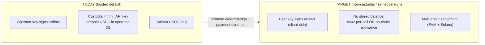
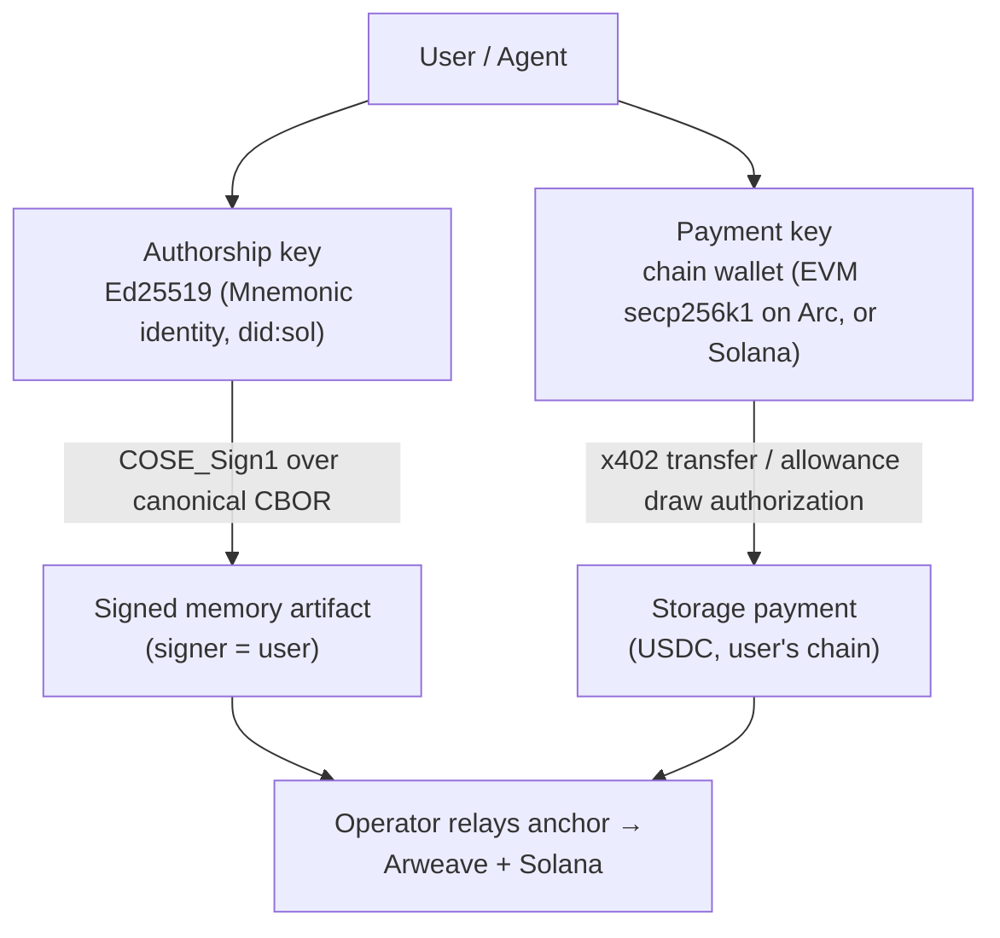
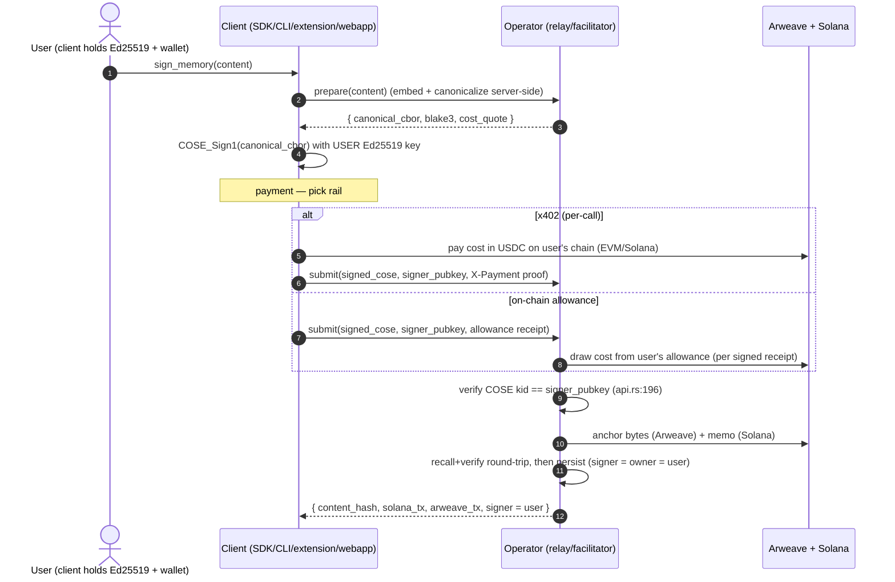
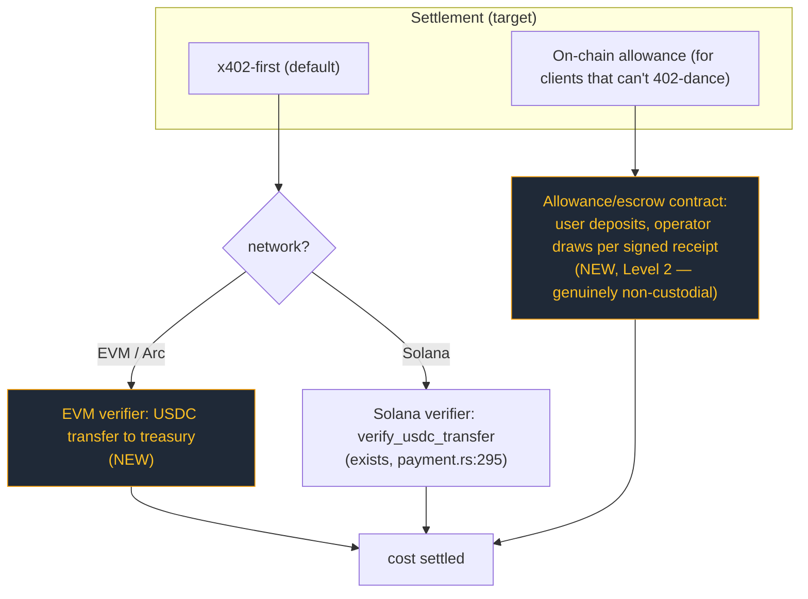
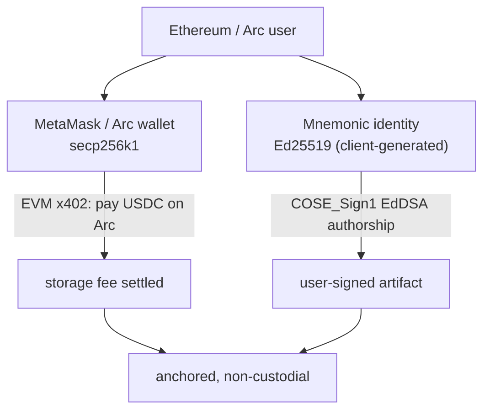

# Mnemonic — Non-Custodial, Self-Sovereign Paradigm (Target Design)

**Status:** design / pre-implementation. Companion to the audit in
[`../payments-robustness/report.md`](../payments-robustness/report.md).

**One sentence:** the user signs their own memories with their own key, and pays
on their own rail — the operator becomes a *relay + facilitator* (embed,
compress, anchor, index), never a custodian of keys or funds.

---

## 1. Principles

1. **Self-sovereign authorship.** The COSE_Sign1 signature is produced by the
   **user's** Ed25519 key, client-side. The operator never holds the user's
   signing key. (*Correcting report §7.3: user-signing is the default, not a
   Level-3 opt-in.*)
2. **Non-custodial funds.** No prepaid balance held by the operator. Payment is
   per-call (x402) or drawn from an **on-chain allowance** the user controls — no
   bearer-secret API key, no operator-held float.
3. **Operator = relay, not authority.** The operator computes the embedding,
   canonicalizes, anchors to Arweave/Solana, and indexes for recall. It cannot
   forge authorship (no key) and cannot move user funds (no custody).
4. **Verifiable output unchanged.** blake3 + COSE + on-chain anchor still make
   every artifact independently verifiable — now with the *user's* pubkey as
   signer, which is strictly stronger.
5. **Backward compatible.** Operator-signed inline mode stays as a legacy
   convenience for clients that can't sign; new clients self-sign by default.

---

## 2. What already exists (we are promoting, not inventing)

Mnemonic already ships **two** signing modes:

| Mode | Who signs | Where | Code |
|---|---|---|---|
| **Inline operator-sign** (legacy default) | operator Ed25519 | server, synchronous | `codec::sign` in the `sign_memory` path, `mcp/src/tools.rs` |
| **Deferred user-sign** (self-sovereign — already built) | **user** Ed25519 | client (browser today) | `mcp/src/tools.rs:854`, `mcp/src/api.rs:128`, `mcp/src/pending.rs:286` |

The deferred path today:
- `sign_memory` prepares embedding + canonical CBOR, parks a **pending bundle**, returns `{status:"awaiting_signature", approve_url, correlation_id}` (`tools.rs:854`).
- The user opens `approve_url` (`mnemonik.xyz/sign/{id}`) and signs the COSE envelope **with their key** in the browser.
- `POST /api/sign-callback` (`api.rs:128`) receives the signed bytes + `signer_pubkey`, **verifies the COSE `kid` == `signer_pubkey`** (`api.rs:196`), and persists with **`signer = owner = user`** (`api.rs:369`), bound to the authenticated `jwt_sub` (`pending.rs:301`).
- `mnemonic_check_pending` resolves the final on-chain state (`tools.rs:884`).

**Implication:** self-sovereign authorship is ~80% built. The target paradigm =
**(A)** make user-sign the default and extend it beyond the browser (SDK/CLI/
extension sign locally — they already hold keys via the keychain), and **(B)**
replace custodial API-key payment with non-custodial x402 + on-chain allowance.

---

## 3. Today vs target (at a glance)

## 4. Two keys, two jobs (the key clarity)

A consumer has **two distinct keys** with **distinct purposes** — do not conflate:

- **Authorship** = the user's Ed25519 key (already client-held in CLI/extension via the keychain). Signs the artifact. Never leaves the client.
- **Payment** = the user's blockchain wallet (Arc/EVM for Arco, or Solana). Authorizes the storage fee. Never signs the artifact.
- This cleanly separates *"who said it"* from *"who paid to anchor it"* — and lets an EVM consumer pay from Arc USDC while still producing an Ed25519-signed artifact.

## 5. Target unified write flow (`sign_memory`, participate)

Key change vs today: the **signature step happens on the client with the user's
key**, and **payment is non-custodial** (no prepaid operator balance). The
operator verifies-and-anchors but cannot author or hold funds.

## 6. Non-custodial payment model

- **Retire** the custodial `mnm_` API key + operator-held balance (report §3).
- **x402 everywhere**: keep Solana (`verify_usdc_transfer`), **add an EVM
  verifier** so Arc/Base USDC works — this is the single highest-leverage change
  for EVM consumers.
- **Allowance** replaces prepaid balance for non-interactive clients: funds stay
  in a user-controlled on-chain allowance; the operator can only pull what a
  signed receipt authorizes. No free-floating custody.

## 7. Trust model — before vs after

| Capability | Today (operator-signed + custodial) | Target (self-sovereign + non-custodial) |
|---|---|---|
| Forge authorship of a memory | Operator can (it holds the signing key) | **No one** — only the user's key signs |
| Move/seize user funds | Operator holds prepaid balance | **No** — funds on user's rail / user allowance |
| Censor an anchor | Operator can refuse to relay | Operator can refuse, but user can self-anchor (fallback) |
| Independently verify an artifact | Yes | Yes (now signer = user, strictly stronger) |
| Single point of failure | Operator key + operator treasury | Operator is a replaceable relay |

---

## 8. Compatibility & migration

- **Legacy stays.** Inline operator-signed + `balance`/x402(Solana) keep working
  behind config — no flag-day. New behavior is additive.
- **Default flips per client capability.** Clients that hold a key (CLI,
  extension, webapp, SDK) self-sign by default; thin clients that can't sign fall
  back to operator-sign (clearly labelled as such in the artifact's `signer`).
- **Recall/verify unchanged.** Artifacts remain blake3+COSE; existing
  operator-signed rows stay valid. `signer` simply reflects whoever signed.
- **API keys deprecated, not deleted.** Mark `balance` mode legacy; stop issuing
  new `mnm_` keys once allowance lands; keep redemption for existing balances.

## 9. Impact on Arco (the EVM consumer)

- Arco users already hold an **Arc wallet** (payment key) — once **EVM x402**
  exists they pay the storage fee in **Arc USDC**, no Solana wallet needed.
- Authorship: the Arco backend (or the agent) holds a **Mnemonic Ed25519** key
  and signs deliverable/feedback memories — the on-chain `bytes32` then points to
  a **user-signed** artifact, not an operator-signed one. Strictly stronger for
  the ERC-8004/8183 provenance story.
- The proxy we built already isolates this: swapping operator-fronted billing for
  user x402 is a backend change behind `/api/mnemonic/*`, invisible to the UI.

## 10. Build ledger — already done vs new

| Capability | Status |
|---|---|
| User-signed COSE (client signs, server verifies kid==pubkey) | **Exists** (browser/deferred path, `api.rs`/`pending.rs`/`tools.rs`) |
| `signer = owner = user`, JWT-bound | **Exists** (`api.rs:369`, `pending.rs:301`) |
| Solana x402 (on-chain, per-call) | **Exists** (`payment.rs:178/295`) |
| Failure-safe payment (nonce after delivery, refund) | **Exists** (`payment.rs:267`, `:556`) |
| Programmatic (non-browser) client signing | **New** — SDK/CLI sign locally + submit |
| EVM x402 verifier (Arc/Base USDC) | **New** |
| On-chain allowance (replace custodial balance) | **New** (Level 2) |
| Retire/deprecate `mnm_` API keys | **New** (policy + code) |
| F1–F4 hardening (gate `/admin/stats`, etc.) | **New** (quick) |

---

## 11. Implementation plan (waves — to walk through, not yet started)

> Sequenced so each wave ships value independently and de-risks the next.
> Nothing here is implemented yet.

**Wave 0 — Security hardening (small, do first; from report §5 F1–F4)**
- **Split `/admin/stats`**: keep public onboarding/usage metrics, move operator
  P&L (cost/margin/net) behind an admin token (§13). Move `GET /balance` off
  query-string secrets; gate/justify `POST /api-keys`; split payment vs authn
  Bearer usage. *No paradigm change; pure risk reduction.*

**Wave 1 — EVM x402 (highest leverage for Arco)**
- Add an EVM USDC transfer verifier alongside `verify_usdc_transfer`; make x402
  `network`-aware (`payment.rs:38` becomes meaningful); config `(chain, asset,
  treasury)`. *Unlocks Arc-USDC pay-per-call.*

**Wave 2 — Programmatic user-signing**
- Extend the deferred-sign path so SDK/CLI sign the canonical CBOR **locally**
  (not only via browser `approve_url`); make user-sign the default when a key is
  present. *Delivers self-sovereign authorship for non-browser consumers.*

**Wave 3 — On-chain allowance (true non-custodial funds)**
- Allowance/escrow the user funds; operator draws per signed receipt; deprecate
  new `mnm_` issuance. *Removes the operator float entirely.*

**Wave 4 — Deprecate custodial API keys**
- Migrate docs/clients to x402/allowance; freeze `mnm_` issuance; keep redemption
  for existing balances. *Completes the paradigm shift.*

**Suggested first step:** Wave 0 (security) in parallel with a spike on Wave 1
(EVM x402), since Wave 1 is what Arco needs and what proves the non-custodial
rail end-to-end.

---

## 12. Ethereum compatibility — is the Solana/Ed25519 key a blocker?

**Short answer: no hard blocker for the two-key model. The only thing the
Ed25519 identity prevents is *single-key "sign the artifact with your Ethereum
wallet"*, which would need additive secp256k1 COSE support — an enhancement, not
a blocker.**

### What's actually fixed to Ed25519
- Authorship signing is **EdDSA/Ed25519** (COSE alg `-8`), hardcoded in
  `core/src/codec/sign.rs:56` (sign) and verified at `:144` (`alg == EdDSA`).
- The identity is a self-generated **Ed25519 keypair** (`Keypair::new()`,
  `core/src/identity/ensure.rs:248`), surfaced as `did:sol:<base58>`.

Crucially, **this key is independent of any blockchain wallet.** It is generated
and held by the Mnemonic client (CLI/extension/webapp), not derived from the
user's Solana or Ethereum account.

### The two-key model has no conflict

- The Ethereum wallet (secp256k1) does the **payment** (EVM x402 / allowance) — no Ed25519 needed there.
- The Mnemonic Ed25519 key does the **authorship** — no Ethereum key needed there.
- An EVM user runs both, exactly like the CLI does today. **Nothing blocks this.**

### The one real constraint (and it's optional)
If the goal is **wallet-native authorship** — "sign the memory with MetaMask, no
separate key" — then:
- Ethereum keys are **secp256k1**; COSE would need **ES256K** (alg `-47`) added
  to `sign.rs`/verify (currently EdDSA-only). *Additive, ~contained.*
- Bigger snag: Ethereum wallets expose `personal_sign`/EIP-712 (recoverable
  secp256k1 over a **keccak** digest), **not** arbitrary-hash ECDSA suitable for
  a clean COSE ES256K envelope. True wallet-native COSE would need either a
  custom verification profile or a signing shim.

**Recommendation:** ship the **two-key model** (no blocker, works now with EVM
x402). Treat **secp256k1/ES256K wallet-native authorship as a separate future
track** if "one wallet, no extra key" UX is later deemed worth the codec work.

### Other Solana touchpoints — none block EVM consumers
| Touchpoint | Blocker for ETH? |
|---|---|
| COSE authorship = Ed25519 | No — separate client key (two-key model) |
| `did:sol:` naming | No — cosmetic; could add `did:key`/`did:pkh` later |
| Solana SPL-memo timestamp anchor | No — operator-relayed; user needs no Solana key |
| Payment = Solana USDC | Yes today → **fixed by Wave 1 (EVM x402)** |

---

## 13. Note on `/admin/stats` (onboarding vs P&L)

`/admin/stats` was built to surface **onboarding/usage stats**, and a separate
**public** endpoint already exists — `/stats` → `public_stats_handler`
(`mcp/src/api.rs:1264`, cached, non-financial). The issue is only that
`/admin/stats` (`mcp/src/main.rs:261`) *also* returns **operator P&L** (cost,
margin, net) with no gate. So the fix is not "lock it down" but **make it
sophisticated**:

- **Public tier** (no auth): onboarding/usage metrics — counts, memories anchored,
  maybe current price. Extend `public_stats` if more onboarding signal is wanted.
- **Operator tier** (admin-gated): P&L (`earned`, `cost`, `net`, `margin`,
  `avg_sol_price`) moves behind an admin token.
- This replaces the blunt "gate F1" item in Wave 0 with a **split** task.
