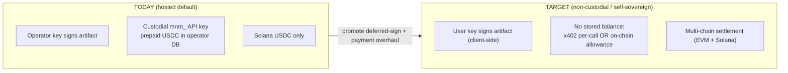
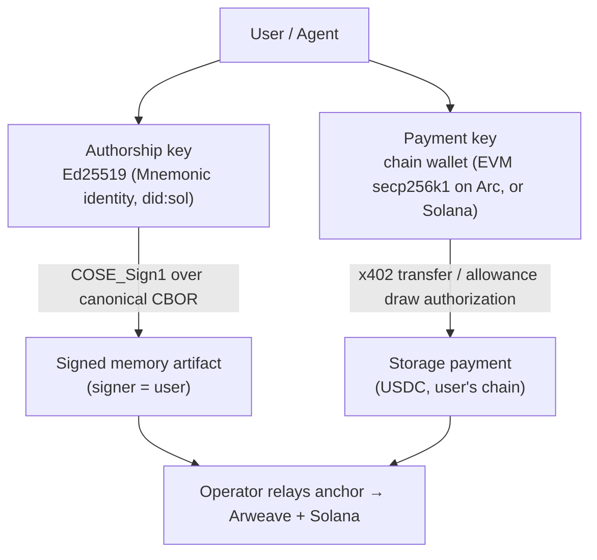
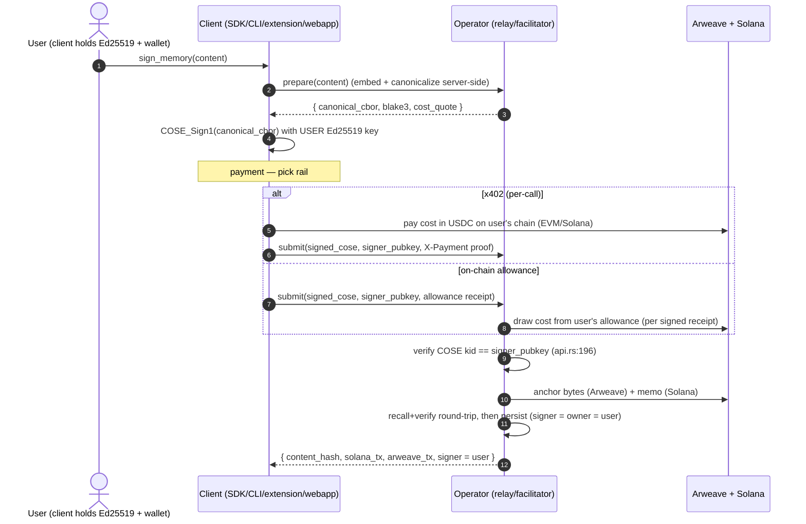
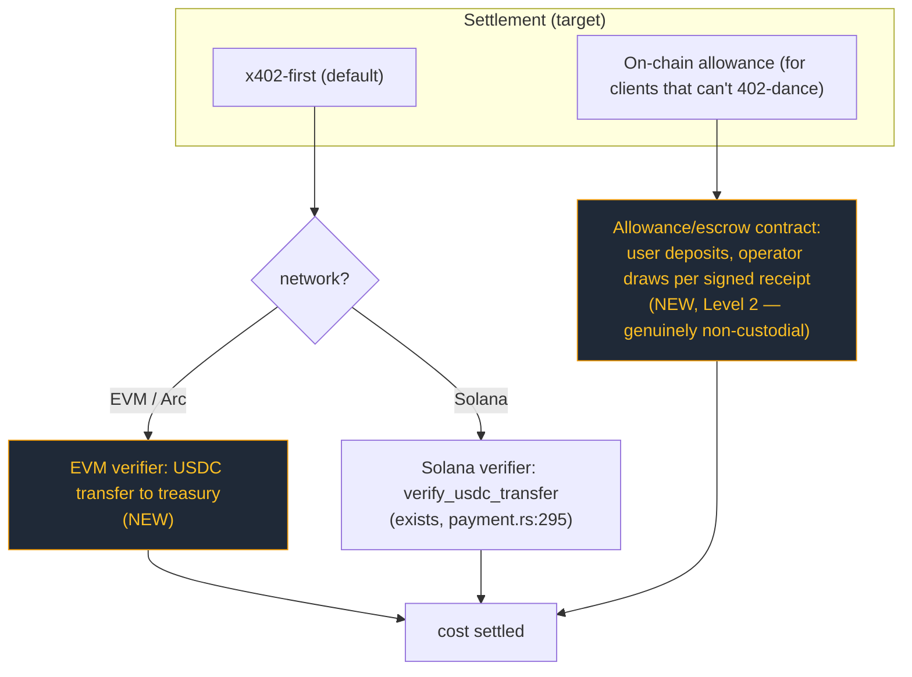
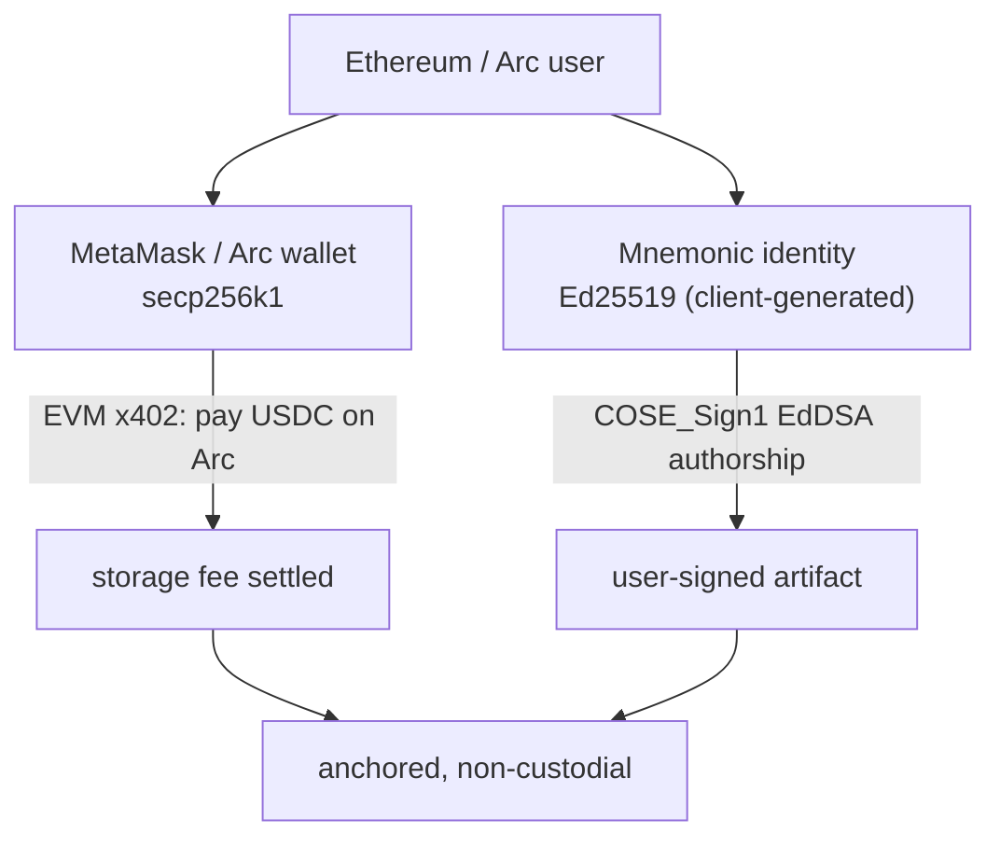
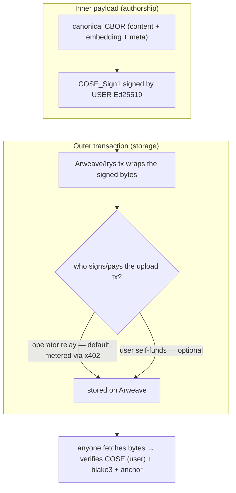
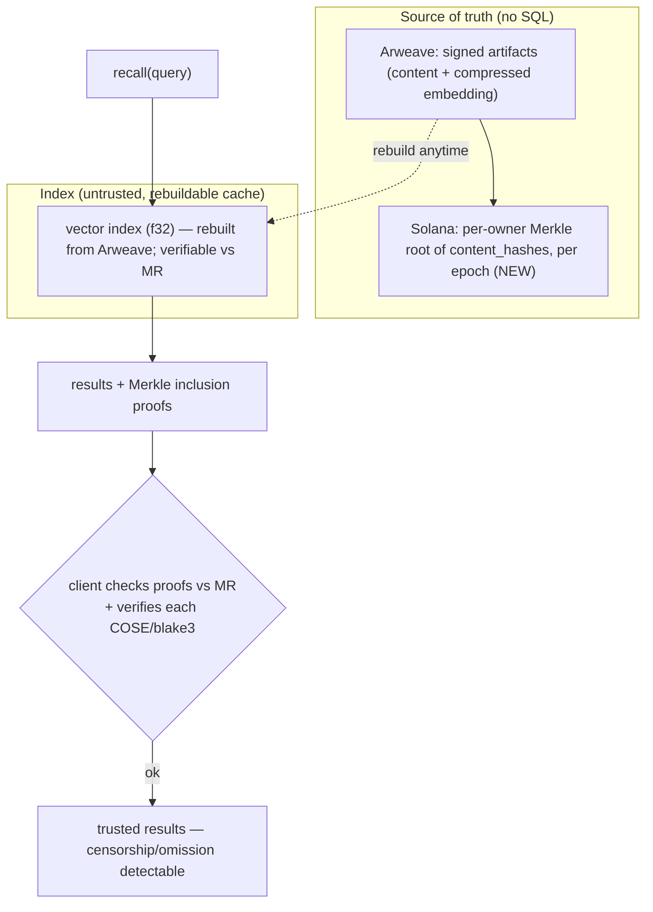

# Mnemonic — Non-Custodial, Self-Sovereign Paradigm (Target Design)

**Status:** design / pre-implementation. Companion to the audit in
[`../payments-robustness/report.md`](../payments-robustness/report.md).

**One sentence:** the user signs their own memories with their own key, and pays
on their own rail — the operator becomes a *relay + facilitator* (embed,
compress, anchor, index), never a custodian of keys or funds.

---

## 1. Principles

1. **Self-sovereign authorship.** The COSE_Sign1 signature is produced by the
   **user's** Ed25519 key, client-side. The operator never holds the user's
   signing key. (*Correcting report §7.3: user-signing is the default, not a
   Level-3 opt-in.*)
2. **Non-custodial funds.** No prepaid balance held by the operator. Payment is
   per-call (x402) or drawn from an **on-chain allowance** the user controls — no
   bearer-secret API key, no operator-held float.
3. **Operator = relay, not authority.** The operator computes the embedding,
   canonicalizes, anchors to Arweave/Solana, and indexes for recall. It cannot
   forge authorship (no key) and cannot move user funds (no custody).
4. **Verifiable output unchanged.** blake3 + COSE + on-chain anchor still make
   every artifact independently verifiable — now with the *user's* pubkey as
   signer, which is strictly stronger.
5. **Clean break — no legacy.** Operator-signed inline mode is **removed**, not
   kept: *all* artifacts are client-signed. Custodial `mnm_` API keys are
   **removed**. No dual-mode, no migration shims — one scheme.

---

## 2. What already exists (we are promoting, not inventing)

Mnemonic already ships **two** signing modes:

| Mode | Who signs | Where | Code |
|---|---|---|---|
| **Inline operator-sign** (legacy default) | operator Ed25519 | server, synchronous | `codec::sign` in the `sign_memory` path, `mcp/src/tools.rs` |
| **Deferred user-sign** (self-sovereign — already built) | **user** Ed25519 | client (browser today) | `mcp/src/tools.rs:854`, `mcp/src/api.rs:128`, `mcp/src/pending.rs:286` |

The deferred path today:
- `sign_memory` prepares embedding + canonical CBOR, parks a **pending bundle**, returns `{status:"awaiting_signature", approve_url, correlation_id}` (`tools.rs:854`).
- The user opens `approve_url` (`mnemonik.xyz/sign/{id}`) and signs the COSE envelope **with their key** in the browser.
- `POST /api/sign-callback` (`api.rs:128`) receives the signed bytes + `signer_pubkey`, **verifies the COSE `kid` == `signer_pubkey`** (`api.rs:196`), and persists with **`signer = owner = user`** (`api.rs:369`), bound to the authenticated `jwt_sub` (`pending.rs:301`).
- `mnemonic_check_pending` resolves the final on-chain state (`tools.rs:884`).

**Implication:** self-sovereign authorship is ~80% built. The target paradigm =
**(A)** make user-sign the default and extend it beyond the browser (SDK/CLI/
extension sign locally — they already hold keys via the keychain), and **(B)**
replace custodial API-key payment with non-custodial x402 + on-chain allowance.

---

## 3. Today vs target (at a glance)

## 4. Two keys, two jobs (the key clarity)

A consumer has **two distinct keys** with **distinct purposes** — do not conflate:

- **Authorship** = the user's Ed25519 key (already client-held in CLI/extension via the keychain). Signs the artifact. Never leaves the client.
- **Payment** = the user's blockchain wallet (Arc/EVM for Arco, or Solana). Authorizes the storage fee. Never signs the artifact.
- This cleanly separates *"who said it"* from *"who paid to anchor it"* — and lets an EVM consumer pay from Arc USDC while still producing an Ed25519-signed artifact.

## 5. Target unified write flow (`sign_memory`, participate)

Key change vs today: the **signature step happens on the client with the user's
key**, and **payment is non-custodial** (no prepaid operator balance). The
operator verifies-and-anchors but cannot author or hold funds.

## 6. Non-custodial payment model

- **Retire** the custodial `mnm_` API key + operator-held balance (report §3).
- **x402 everywhere**: keep Solana (`verify_usdc_transfer`), **add an EVM
  verifier** so Arc/Base USDC works — this is the single highest-leverage change
  for EVM consumers.
- **Allowance** replaces prepaid balance for non-interactive clients: funds stay
  in a user-controlled on-chain allowance; the operator can only pull what a
  signed receipt authorizes. No free-floating custody.

## 7. Trust model — before vs after

| Capability | Today (operator-signed + custodial) | Target (self-sovereign + non-custodial) |
|---|---|---|
| Forge authorship of a memory | Operator can (it holds the signing key) | **No one** — only the user's key signs |
| Move/seize user funds | Operator holds prepaid balance | **No** — funds on user's rail / user allowance |
| Censor an anchor | Operator can refuse to relay | Operator can refuse, but user can self-anchor (fallback) |
| Independently verify an artifact | Yes | Yes (now signer = user, strictly stronger) |
| Single point of failure | Operator key + operator treasury | Operator is a replaceable relay |

---

## 8. Cutover — no legacy (decided)

Per review: **clean break, no backward-compat.**
- **Operator-signed inline mode is removed.** *Every* artifact is client-signed
  (the operator never signs memory content again). `codec::sign` with the
  operator key is deleted from the write path.
- **Custodial `mnm_` API keys + `balance` mode are removed**, not deprecated —
  no issuance, no redemption path retained.
- **One write scheme:** prepare → client-signs → submit → operator verifies +
  anchors. No dual-mode branching, no "thin client" fallback.
- **Recall/verify semantics unchanged** (still blake3 + COSE), but `signer` is
  now *always* the user. Pre-existing operator-signed rows, if any, are out of
  scope for this clean-room target (treat as a fresh deployment).

## 9. Impact on Arco (the EVM consumer)

- Arco users already hold an **Arc wallet** (payment key) — once **EVM x402**
  exists they pay the storage fee in **Arc USDC**, no Solana wallet needed.
- Authorship: the Arco backend (or the agent) holds a **Mnemonic Ed25519** key
  and signs deliverable/feedback memories — the on-chain `bytes32` then points to
  a **user-signed** artifact, not an operator-signed one. Strictly stronger for
  the ERC-8004/8183 provenance story.
- The proxy we built already isolates this: swapping operator-fronted billing for
  user x402 is a backend change behind `/api/mnemonic/*`, invisible to the UI.

## 10. Build ledger — already done vs new

| Capability | Status |
|---|---|
| User-signed COSE (client signs, server verifies kid==pubkey) | **Exists** (browser/deferred path, `api.rs`/`pending.rs`/`tools.rs`) |
| `signer = owner = user`, JWT-bound | **Exists** (`api.rs:369`, `pending.rs:301`) |
| Solana x402 (on-chain, per-call) | **Exists** (`payment.rs:178/295`) |
| Failure-safe payment (nonce after delivery, refund) | **Exists** (`payment.rs:267`, `:556`) |
| Programmatic (non-browser) client signing | **New** — SDK/CLI sign locally + submit |
| EVM x402 verifier (Arc/Base USDC) | **New** |
| On-chain allowance (replace custodial balance) | **New** (Level 2) |
| Retire/deprecate `mnm_` API keys | **New** (policy + code) |
| F1–F4 hardening (gate `/admin/stats`, etc.) | **New** (quick) |

---

## 11. Implementation plan (waves — to walk through, not yet started)

> Sequenced so each wave ships value independently and de-risks the next.
> Nothing here is implemented yet.

**Wave 0 — Security hardening (small, do first; from report §5 F1–F4)**
- **Split `/admin/stats`**: keep public onboarding/usage metrics, move operator
  P&L (cost/margin/net) behind an admin token (§13). Move `GET /balance` off
  query-string secrets; gate/justify `POST /api-keys`; split payment vs authn
  Bearer usage. *No paradigm change; pure risk reduction.*

**Wave 1 — EVM x402 (highest leverage for Arco)**
- Add an EVM USDC transfer verifier alongside `verify_usdc_transfer`; make x402
  `network`-aware (`payment.rs:38` becomes meaningful); config `(chain, asset,
  treasury)`. *Unlocks Arc-USDC pay-per-call.*

**Wave 2 — Programmatic user-signing (default for all clients)**
- Extend the deferred-sign path so SDK/CLI sign the canonical CBOR **locally**
  (not only via browser `approve_url`). Client-sign is the *only* path.

**Wave 3 — Remove operator signing (no legacy)**
- Delete `codec::sign`-with-operator-key from the write path; the server may
  embed/canonicalize/anchor but **never signs content**. Reject any write that
  arrives without a valid client COSE signature (`kid == caller`).

**Wave 4 — Remove API keys + on-chain allowance**
- Delete `mnm_` keys, `balance` mode, `/api-keys`, `/deposit`, `credit_deposit`,
  `deduct_balance` (custodial ledger gone). Add the on-chain **allowance** path
  so non-interactive clients still pay without a 402 round-trip.

**Wave 5 — Verifiable recall / drop SQL-as-truth (§16)**
- Make Arweave canonical for content; anchor per-owner Merkle commitments on
  Solana; `recall` returns inclusion proofs; demote the vector store to a
  rebuildable, verifiable cache. Decide f32-on-Arweave vs compressed-recall.

**Suggested first step:** Wave 0 (security) in parallel with a spike on Wave 1
(EVM x402) — Wave 1 is what Arco needs and proves the non-custodial rail
end-to-end. Waves 2–4 then execute the clean break (§8); Wave 5 (recall
verifiability) can run independently.

---

## 12. Ethereum compatibility — is the Solana/Ed25519 key a blocker?

**Short answer: no hard blocker for the two-key model. The only thing the
Ed25519 identity prevents is *single-key "sign the artifact with your Ethereum
wallet"*, which would need additive secp256k1 COSE support — an enhancement, not
a blocker.**

### What's actually fixed to Ed25519
- Authorship signing is **EdDSA/Ed25519** (COSE alg `-8`), hardcoded in
  `core/src/codec/sign.rs:56` (sign) and verified at `:144` (`alg == EdDSA`).
- The identity is a self-generated **Ed25519 keypair** (`Keypair::new()`,
  `core/src/identity/ensure.rs:248`), surfaced as `did:sol:<base58>`.

Crucially, **this key is independent of any blockchain wallet.** It is generated
and held by the Mnemonic client (CLI/extension/webapp), not derived from the
user's Solana or Ethereum account.

### The two-key model has no conflict

- The Ethereum wallet (secp256k1) does the **payment** (EVM x402 / allowance) — no Ed25519 needed there.
- The Mnemonic Ed25519 key does the **authorship** — no Ethereum key needed there.
- An EVM user runs both, exactly like the CLI does today. **Nothing blocks this.**

### The one real constraint (and it's optional)
If the goal is **wallet-native authorship** — "sign the memory with MetaMask, no
separate key" — then:
- Ethereum keys are **secp256k1**; COSE would need **ES256K** (alg `-47`) added
  to `sign.rs`/verify (currently EdDSA-only). *Additive, ~contained.*
- Bigger snag: Ethereum wallets expose `personal_sign`/EIP-712 (recoverable
  secp256k1 over a **keccak** digest), **not** arbitrary-hash ECDSA suitable for
  a clean COSE ES256K envelope. True wallet-native COSE would need either a
  custom verification profile or a signing shim.

**Recommendation:** ship the **two-key model** (no blocker, works now with EVM
x402). Treat **secp256k1/ES256K wallet-native authorship as a separate future
track** if "one wallet, no extra key" UX is later deemed worth the codec work.

### Other Solana touchpoints — none block EVM consumers
| Touchpoint | Blocker for ETH? |
|---|---|
| COSE authorship = Ed25519 | No — separate client key (two-key model) |
| `did:sol:` naming | No — cosmetic; could add `did:key`/`did:pkh` later |
| Solana SPL-memo timestamp anchor | No — operator-relayed; user needs no Solana key |
| Payment = Solana USDC | Yes today → **fixed by Wave 1 (EVM x402)** |

---

## 13. Note on `/admin/stats` (onboarding vs P&L)

`/admin/stats` was built to surface **onboarding/usage stats**, and a separate
**public** endpoint already exists — `/stats` → `public_stats_handler`
(`mcp/src/api.rs:1264`, cached, non-financial). The issue is only that
`/admin/stats` (`mcp/src/main.rs:261`) *also* returns **operator P&L** (cost,
margin, net) with no gate. So the fix is not "lock it down" but **make it
sophisticated**:

- **Public tier** (no auth): onboarding/usage metrics — counts, memories anchored,
  maybe current price. Extend `public_stats` if more onboarding signal is wanted.
- **Operator tier** (admin-gated): P&L (`earned`, `cost`, `net`, `margin`,
  `avg_sol_price`) moves behind an admin token.
- This replaces the blunt "gate F1" item in Wave 0 with a **split** task.

---

## 14. Should the payment key be derived from the authorship key? (argued)

**Recommendation: no — keep them independent at the protocol level. Offer
*same-seed* derivation only as a client backup convenience, and bind author↔payer
(when needed) with a *signed attestation*, not key derivation.**

**For derivation (one key → both):**
- One secret to back up / restore (single seed-phrase UX).
- Implicit binding: "the payer is provably the author" with no extra step.

**Against (decisive):**
1. **Cross-curve.** Authorship is **Ed25519**; EVM payment is **secp256k1**.
   There is no clean, standard, safe way to *derive a secp256k1 key from an
   Ed25519 key*. The most you can do is **one seed → SLIP-0010 → an Ed25519
   child + a secp256k1 child** ("same seed, two curve keys") — that's *not*
   "payment derived from authorship," it's a shared root.
2. **Causality is backwards.** The payment key is usually a **pre-existing
   funded wallet** (MetaMask / the user's Arc wallet). You can't derive an
   already-funded external wallet from the Mnemonic identity. The only feasible
   direction is the reverse — derive the *identity* from a deterministic wallet
   signature — which couples authorship to one chain wallet (undesirable).
3. **Sponsorship dies.** Hard-binding `payer == author` forbids
   delegated/operator-fronted/third-party payment — the exact primitive Arco and
   agent fleets need ("my app/treasury pays to anchor the agent's memory"). The
   protocol must allow **payer ≠ author**.
4. **Blast radius.** The payment key is *hot* (signs transactions constantly).
   You do not want a leaked payment key to also forge authorship.

**Better binding when you need "same entity":** the authorship key signs a tiny
statement `{pays_with: <payment_addr>, chains: [...]}` (or the payment wallet
signs `authorizes_author: <ed25519_pubkey>`). Explicit, cross-curve, revocable,
and auditable — and it still permits sponsorship (a sponsor signs "I pay for
author X"). The session (`jwt_sub`) already correlates the two today.

> Decision: **independent keys; payer ≠ author allowed; optional one-seed
> (SLIP-0010) client backup; link by signed attestation, never by derivation.**

---

## 15. Open question A — does client-signing break Arweave storage?

**No.** Authorship and storage are two different layers:

- Arweave stores **bytes**; it does not care who signed the *inner* COSE. The
  COSE signer (user) and the Arweave-tx signer/payer (operator relay or user)
  are **independent** — exactly as the deferred sign-callback path already works
  today (bytes finalized client-side, then anchored).
- **Determinism holds:** the embedding is computed in `prepare()` and included in
  the canonical CBOR the client signs, so the uploaded bytes == the signed bytes
  (tamper-evident). No re-canonicalization after signing.
- The only thing that changes vs today is *who holds the signing key* (user, not
  operator). The Arweave/Irys upload mechanics are untouched.

> Verdict: client-signing is orthogonal to Arweave storage. No break.

---

## 16. Open question B — can we get rid of the SQL database? (verifiable, usable recall)

**Answer: SQL can be demoted from a *trusted store* to a *rebuildable cache*. The
source of truth becomes Arweave (content) + a Solana-anchored commitment
(completeness). The catch is recall *precision*, because of how embeddings are
stored today.**

### What SQLite actually holds vs Arweave
| Data | SQLite | Arweave |
|---|---|---|
| Memory **content** | cached | **canonical** (inside the signed CBOR) ✅ recoverable |
| **Embedding** for recall | **full f32** (`attestation_embeddings.embedding BLOB`, `core/src/storage/sqlite.rs:29`) | only **TurboQuant-compressed** → decompresses to *approximate* f32 (`core/src/compress` "approximate", lossy) |
| The **set** of an owner's memories | the index | derivable via Arweave tag query (GraphQL) |

So **authenticity of any single memory is already trustless** (blake3 + COSE +
anchor) regardless of where it's stored — SQL is not a trust root for *integrity*.
SQL only uniquely provides two things: (1) a fast **f32 vector index**, and (2) an
implicit claim of **completeness** (the full set).

### Two gaps to close to drop SQL-as-truth

1. **Completeness / censorship-resistance.** Anchor a **per-owner Merkle root of
   `content_hash`es** (per epoch) on Solana. `recall` returns results **plus
   inclusion proofs**; the client checks them against the anchored root, so an
   operator that omits or tampers is **detectable**. This is what makes recall
   *"100% verifiable."*
2. **The vector index.** Options, in order of preference:
   - **(c) Rebuildable cache (recommended):** keep a vector index for speed, but
     it is **reproducible from Arweave** and checkable against the Merkle root —
     so it's a cache *anyone* can rebuild, not a trusted DB. SQLite (or any
     vector store) survives only in this role.
   - **(b) Store full f32 on Arweave:** makes Arweave self-sufficient for
     high-precision recall, at higher storage cost per memory.
   - **(a) Recall from compressed only:** zero extra storage, but recall runs
     over *approximate* (dequantized) vectors → **lower precision**. Acceptable
     for some uses, not for high-recall search.

### The real tradeoff (be honest)
- **"SQL as a trusted database" → can be removed.** Truth = Arweave + anchored
  Merkle commitments; SQL becomes an optional, rebuildable, *verifiable* index.
- **"Any index at all" → only removable for small N.** Pure client-side recall
  (fetch an owner's artifacts from Arweave, decompress, cosine locally) is
  feasible at small scale and is *fully* operator-independent; at large N you
  want an index, but it can be the untrusted/rebuildable kind above.
- **Precision caveat:** today only *compressed* embeddings are on Arweave.
  Operator-independent recall therefore either accepts lower precision (a) or
  pays to store f32 (b). Pick per product need; the verifiability (Merkle +
  COSE) is independent of this choice.

> Verdict: **Yes — drop SQL as a source of truth.** Make Arweave canonical and
> anchor per-owner Merkle commitments so recall returns *proofs*. Keep a vector
> index only as a rebuildable cache. Decide f32-on-Arweave vs compressed-recall
> based on the precision you need. This is a **Wave 5** (post-payment) track.
