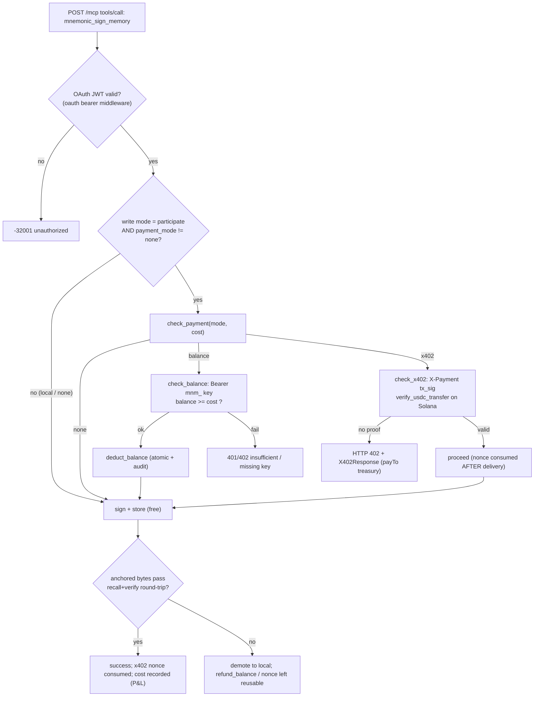
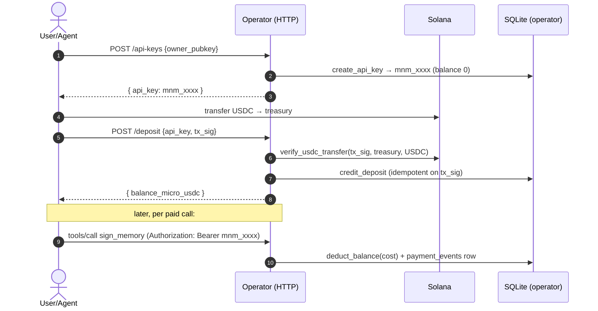
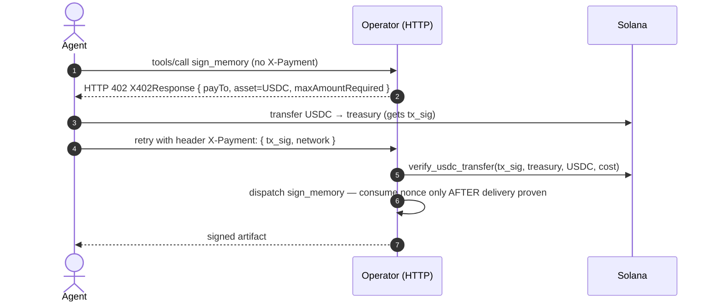
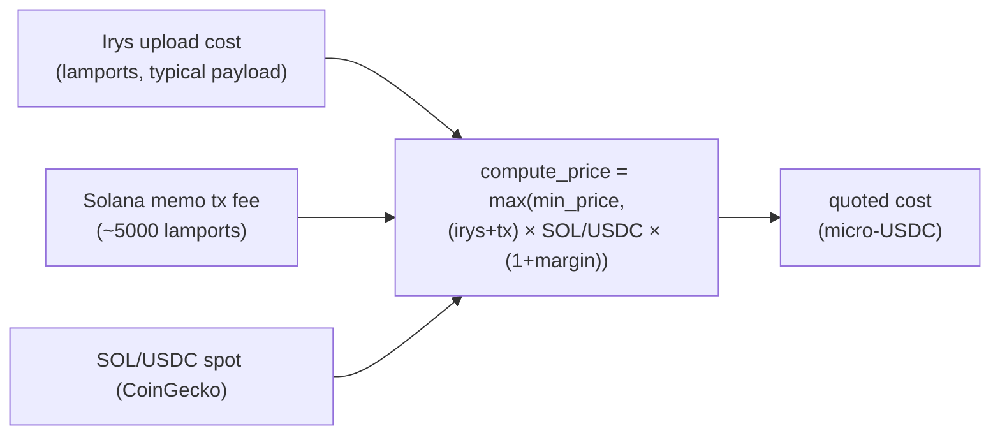
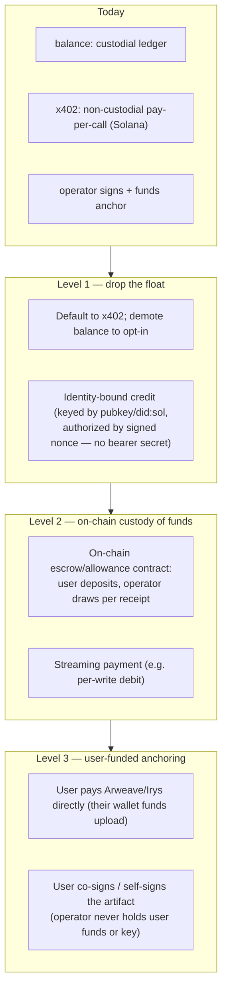

# Mnemonic Protocol — Payment Surface Report

**Scope:** every place a payment is defined, gated, settled, or accounted for in
the Mnemonic codebase, with exact `path:line` references, flow diagrams, and a
critical assessment of the API-key model and overall *universality* for
consumers (especially EVM/Arc consumers like Arco).

**This is a findings report only.** The remediation plan is a separate step.

---

## TL;DR

- Payment logic lives entirely in **`mcp/src/payment.rs`** + **`mcp/src/pricing.rs`**; the **DB schema** (`api_keys`, `payment_events`, `x402_nonces`) lives in **`core/src/storage/sqlite.rs`**. `core/` has no payment *logic* (architecture rule #1 holds).
- There are **three rails**: `none` (free, operator-absorbed), `balance` (custodial prepaid **`mnm_` API key**), `x402` (per-call on-chain transfer), plus `both`.
- **Settlement is single-chain, single-asset: USDC on _Solana_** (mainnet mint `EPjFW…Dt1v`), paid to one operator **treasury** pubkey, priced in **micro-USDC** with a 20% margin over the Arweave(Irys)+Solana cost.
- **The API-key model is the weak point**: it's a custodial, Web2 bearer-secret prepaid account that duplicates an identity the protocol *already has* (Ed25519 / `did:sol`), and it is bound to one chain/asset.
- **Two unrelated things share the `Authorization: Bearer` header** — a `mnm_` API key (payment) and an OAuth **JWT** (authn). Distinguished only by the `mnm_` prefix.
- **Security finding:** `GET /admin/stats` (operator P&L — revenue, cost, margin) appears **ungated**; `GET /balance?api_key=` leaks balance to anyone holding the key in a URL query.

---

## 1. Payment surface inventory (clickable `path:line`)

### Gating & wire protocol — `mcp/src/payment.rs`
| Concern | Symbol | Location |
|---|---|---|
| x402 request proof (`X-Payment`) | `X402PaymentProof` | `mcp/src/payment.rs:36` |
| x402 402-response body | `X402Response` / `PaymentOption` | `mcp/src/payment.rs:47` / `:54` |
| Gate result enum | `PaymentGate` | `mcp/src/payment.rs:71` |
| Extract `mnm_` API key from Bearer | `extract_api_key` | `mcp/src/payment.rs:83` |
| Extract x402 proof (raw/base64 JSON) | `extract_x402_proof` | `mcp/src/payment.rs:93` |
| **Main gate** (`none`/`balance`/`x402`/`both`) | `check_payment` | `mcp/src/payment.rs:116` |
| Balance check path | `check_balance` | `mcp/src/payment.rs:155` |
| x402 check path | `check_x402` | `mcp/src/payment.rs:178` |
| x402 replay read / consume | `x402_nonce_already_consumed` / `consume_x402_nonce_after_success` | `mcp/src/payment.rs:243` / `:267` |
| **On-chain USDC verification** | `verify_usdc_transfer` | `mcp/src/payment.rs:295` |

### Account lifecycle & accounting — `mcp/src/payment.rs`
| Concern | Symbol | Location |
|---|---|---|
| Create `mnm_` API key | `create_api_key` | `mcp/src/payment.rs:371` |
| Owner pubkey for key | `get_owner_pubkey` | `mcp/src/payment.rs:382` |
| Read balance | `get_balance` | `mcp/src/payment.rs:391` |
| Deduct balance (+audit row) | `deduct_balance` | `mcp/src/payment.rs:414` |
| Credit deposit (idempotent on tx_sig) | `credit_deposit` | `mcp/src/payment.rs:483` |
| Refund on failed call | `refund_balance` | `mcp/src/payment.rs:556` |
| Mark x402 nonce consumed | `mark_x402_nonce` | `mcp/src/payment.rs:610` |
| Record operator cost (P&L) | `record_attestation_cost` | `mcp/src/payment.rs:628` |
| P&L stats | `get_pnl_stats` | `mcp/src/payment.rs:654` |
| Hash API key (storage) | `hash_api_key` | `mcp/src/payment.rs:742` |

### Pricing — `mcp/src/pricing.rs`
| Concern | Symbol | Location |
|---|---|---|
| Engine doc (Irys + SOL/USDC → price) | module header | `mcp/src/pricing.rs:1` |
| Refresh (fetch Irys + SOL spot) | `PricingEngine::refresh` | `mcp/src/pricing.rs:93` |
| **Price formula** (break-even + margin, floored) | `compute_price` | `mcp/src/pricing.rs:43` |

### Config — `mcp/src/config.rs`
| Knob | Default | Location |
|---|---|---|
| `PAYMENT_MODE` | `none` | `mcp/src/config.rs:149` |
| `TREASURY_PUBKEY` | `""` | `mcp/src/config.rs:150` |
| `USDC_MINT` | `EPjFW…Dt1v` (Solana mainnet USDC) | `mcp/src/config.rs:151` |
| `PRICING_MARGIN_BPS` | `2000` (20%) | `mcp/src/config.rs:156` |

### HTTP endpoints — `mcp/src/main.rs`
| Route | Handler | Location |
|---|---|---|
| `POST /api-keys` (create key) | `create_api_key` | `mcp/src/main.rs:104` (route `:1156`) |
| `GET /balance?api_key=` | `get_balance` | `mcp/src/main.rs:124` |
| `POST /deposit` (verify+credit) | `deposit` | `mcp/src/main.rs:154` (route `:1158`) |
| `GET /admin/stats` (P&L) | `admin_stats` | `mcp/src/main.rs:261` (route `:1159`) |

### Dispatch gating — `mcp/src/mcp.rs`
| Concern | Location |
|---|---|
| Quota subject derivation (key vs x402 vs none) | `mcp/src/mcp.rs:413` |
| `sign_memory` pay→deduct→dispatch→refund flow | `mcp/src/mcp.rs:1085` |
| Participate gate (`payment_mode != "none"`) | `mcp/src/mcp.rs:1227` |

### Schema (in `core/`) — `core/src/storage/sqlite.rs`
| Table | Location |
|---|---|
| `api_keys` (api_key PK, owner_pubkey, balance_micro_usdc) | `core/src/storage/sqlite.rs:37` |
| `payment_events` (audit: deposit/charge/refund) | `core/src/storage/sqlite.rs:45` |
| `x402_nonces` (replay protection) | `core/src/storage/sqlite.rs:61` |

### Auth (separate from payment) — `mcp/src/oauth/mod.rs`
| Concern | Location |
|---|---|
| JWT issuer / audience (`mcp.mnemonik.xyz` / `mcp`) | `mcp/src/oauth/mod.rs:57` |
| JSON-RPC methods bypassing JWT | `ALLOWLIST_METHODS` `mcp/src/oauth/mod.rs:2249` |
| `tools/call` names bypassing JWT (`mnemonic_recall`) | `mcp/src/oauth/mod.rs:2295` |
| Bearer extraction for JWT | `mcp/src/oauth/mod.rs:2416` |

---

## 2. Flow diagrams

### 2.1 Where payment sits in a `sign_memory` call

### 2.2 `balance` rail (custodial prepaid API key)

### 2.3 `x402` rail (per-call, on-chain)

### 2.4 Pricing (what `cost` is)

---

## 3. "API keys, really?" — critical assessment

Yes — and your instinct is right. The `balance` rail (`mnm_` keys) is the
weakest, least "Mnemonic-native" part of the payment design. Specifics:

1. **It duplicates an identity the protocol already has.** Every Mnemonic
   instance has an Ed25519 keypair and a `did:sol:…` (`mnemonic_whoami`).
   Introducing a *separate* `mnm_` bearer secret (`create_api_key`,
   `mcp/src/payment.rs:371`) means two parallel identity systems — a
   cryptographic one for signing memories and a Web2 one for paying for them.
2. **It's custodial.** The operator holds users' prepaid USDC and tracks
   balances in its own SQLite (`api_keys.balance_micro_usdc`,
   `core/src/storage/sqlite.rs:37`). Users trust the operator's ledger; there is
   no on-chain claim on deposited funds. This is a centralizing dependency in an
   otherwise trust-minimized stack.
3. **Bearer-secret hygiene.** The key is a long-lived shared secret sent on
   every request (`Authorization: Bearer mnm_…`). It is stored hashed
   (`hash_api_key`, `:742`) — good — but theft of the raw key = drain the
   balance, and **`GET /balance?api_key=` puts it in a URL query string**
   (`mcp/src/main.rs:124`) where it lands in logs/proxies.
4. **Header overload.** The same `Authorization: Bearer` header carries *either*
   a payment API key (`mnm_…`, `:83`) *or* an OAuth **JWT** (authn,
   `mcp/src/oauth/mod.rs:2416`), disambiguated only by the `mnm_` prefix. Two
   concerns, one slot — fragile and confusing for integrators.
5. **It's redundant with x402.** `x402` already gives non-custodial,
   pay-per-call settlement with on-chain proof and no stored secret. API keys
   exist mainly to serve MCP clients (Cursor/Claude Desktop) that can't do an
   inline 402→pay→retry dance — a real constraint, but a narrow one.

**Verdict:** keep a *prepaid/credit* option for clients that genuinely need it,
but it should be **identity-bound (keyed by pubkey, not a bearer secret)** and
ideally **non-custodial** (an on-chain balance/allowance the operator draws
against), not a Web2 API key. x402 should be the default agent path.

---

## 4. Universality gaps (esp. for EVM / Arc consumers like Arco)

| Gap | Today | Why it hurts a consumer |
|---|---|---|
| **Single chain** | Settlement only on **Solana** (`verify_usdc_transfer` over `&SolanaClient`, `mcp/src/payment.rs:295`) | An Arc/EVM consumer (Arco) lives in **Arc USDC**. To pay Mnemonic it must hold **Solana USDC** + a Solana signer — a second wallet/rail. |
| **Single asset** | Only **USDC** at one mint (`config.rs:151`) | No native token, no EURC, no other stablecoin, no credits. |
| **Single recipient** | One operator `TREASURY_PUBKEY` (`config.rs:150`) | No per-tenant/per-app routing, no revenue split, no marketplace. |
| **x402 network unenforced** | `X402PaymentProof.network` parsed but **not inspected** (`payment.rs:38-42`) | Network field is decorative; verification is implicitly whatever Solana RPC is configured — no EVM x402 facilitator. |
| **Custodial credit only** | `balance` ledger in operator SQLite | No on-chain escrow, no streaming (e.g. Superfluid), no allowance model. |
| **No delegated/sponsored pay** | Caller must pay directly | No "operator sponsors, meters back via app" primitive — the exact thing Arco needs to keep users on one rail. |

**Net:** for an EVM consumer the cleanest integration today is *operator-fronted*
(the app's backend holds the Mnemonic relationship and pays Solana-side, users
stay on Arc) — which works, but the protocol offers no first-class primitive for
it, and no EVM-native settlement path.

---

## 5. Findings (ranked)

| # | Severity | Finding | Location |
|---|---|---|---|
| F1 | **High** | `GET /admin/stats` (operator P&L: revenue, cost, margin, SOL price) has **no auth gate** — financial disclosure to any caller. | `mcp/src/main.rs:261`, route `:1159` |
| F2 | Medium | `GET /balance?api_key=` accepts the secret in a **URL query** (logged by proxies/servers). | `mcp/src/main.rs:124` |
| F3 | Medium | `POST /api-keys` (key creation) appears **ungated** — anyone can mint zero-balance keys (DoS/clutter; low direct impact since unfunded). | `mcp/src/main.rs:104` |
| F4 | Medium | **Header overload**: payment API key and authn JWT share `Authorization: Bearer`. | `payment.rs:83` vs `oauth/mod.rs:2416` |
| F5 | Low/Design | **Custodial balance** model centralizes funds + trust. | `payment.rs:414`/`483` |
| F6 | Design | **Single chain/asset/recipient** settlement; x402 `network` not enforced. | `payment.rs:295`, `38` |

> Positives worth noting: deposits are **verified on-chain** before crediting
> (`mcp/src/main.rs:154`→`verify_usdc_transfer`); balance ops are **atomic +
> idempotent** (`deduct_balance`/`credit_deposit`); x402 nonces are consumed
> **only after delivery is proven**, so a failed anchor doesn't burn the payment
> (`payment.rs:267`). The accounting/audit discipline is solid — the issue is
> *model* (custodial, single-rail), not correctness.

---

## 6. Candidate directions (for the plan, not decided here)

1. **Make x402 the primary agent rail; add EVM x402** (accept USDC on Arc/Base via an EVM verifier alongside the Solana one). Removes the API key for agents and the rail mismatch for Arco.
2. **Replace custodial API keys with identity-bound credit** keyed by the caller's pubkey/`did:sol` (the identity the protocol already issues), authorized by a signed nonce rather than a bearer secret.
3. **Add an operator-sponsored / delegated-payment primitive** so an app (Arco) can front storage and meter it back on its own rail — first-class, not improvised.
4. **Abstract settlement**: `(chain, asset, recipient)` as config/route rather than hard-coded Solana-USDC-single-treasury; enable revenue split.
5. **Fix F1–F4** regardless of direction (gate `/admin/stats`, move key out of query string, gate/justify key creation, split the auth vs payment headers).

---

### Appendix — settlement facts
- **Asset/chain:** USDC, Solana (mint `EPjFWdd5AufqSSqeM2qN1xzybapC8G4wEGGkZwyTDt1v`, `config.rs:151`).
- **Recipient:** operator `TREASURY_PUBKEY` (`config.rs:150`).
- **Price:** `max(min_price, (irys_lamports + sol_tx_fee) × SOL/USDC × (1 + 20%))`, micro-USDC (`pricing.rs:43`).
- **Paid call:** only `mnemonic_sign_memory`, only `participate` + `payment_mode != none` (`mcp.rs:1227`). `recall`/`verify`/`whoami` are free; `recall` even bypasses JWT (`oauth/mod.rs:2295`).

---

## 7. Can Mnemonic be non-custodial? (analysis)

**Short answer: yes — the *payment* layer can be made non-custodial today, and
the *anchoring* layer can be made trust-minimized but not fully trustless
without a deeper change.** They are two separate trust questions.

### 7.1 Two distinct custody questions
1. **Payment custody** — does the operator hold the user's money? Today: **yes**
   in `balance` mode (prepaid USDC sits in the operator's ledger,
   `core/src/storage/sqlite.rs:37`). In `x402` mode: **already non-custodial** —
   the user pays per call directly to the treasury and nothing is pre-held
   (`payment.rs:178`).
2. **Storage/anchoring custody** — who funds and controls the Arweave/Solana
   write, and can the user trust it happened? Today the **operator's keypair**
   signs the COSE artifact and pays Arweave/Solana. The user trusts the operator
   to actually anchor — but this is already **verifiable after the fact**: the
   `participate` write only succeeds after a recall+verify round-trip
   (`mcp.rs:1227`+), and anyone can independently `verify` the anchored bytes.

So "non-custodial" splits into **funds custody** (easy to fix) and **signing
custody** (harder, and partly by-design).

### 7.2 What's already non-custodial
- **x402 rail**: pay-per-call, on-chain, no stored balance, no shared secret.
- **Verification**: COSE_Sign1 + blake3 + on-chain anchor means the *artifact*
  is independently verifiable regardless of who paid — trust-minimized output.
- **Failure safety**: failed anchor ⇒ no charge (nonce not consumed / balance
  refunded, `payment.rs:267`, `refund_balance:556`).

### 7.3 What makes it custodial today
- **Prepaid `balance`**: operator holds funds in its DB ledger (the API-key model, §3).
- **Operator-signed anchoring**: the operator's Ed25519 key signs and the
  operator's wallet funds the Arweave/Solana write — the user's funds (in
  `balance` mode) are pooled and spent by the operator.

### 7.4 Paths to non-custodial (increasing ambition)

- **Level 1 (low effort, high value):** make **x402 the default** and replace the
  custodial API key with **identity-bound credit** — a balance keyed by the
  caller's existing pubkey/`did:sol`, authorized per request by a signed nonce
  instead of a stored bearer secret. Removes the bearer-secret risk and the
  "two identity systems" smell; funds float still exists but is minimized.
- **Level 2 (medium):** move the float **on-chain** — a small escrow/allowance
  the user funds and the operator *draws against per signed receipt*, or a
  streaming debit. Now the operator never holds a free-floating balance; it can
  only pull what a receipt authorizes. This is genuinely non-custodial for funds.
- **Level 3 (high effort, fully trustless funds+anchor):** the **user funds the
  Arweave upload directly** (their wallet pays Irys) and/or **co-signs** the
  artifact, so the operator is a pure relay that never touches user funds or
  keys. Cost: much heavier client (Arweave/Irys signing in-wallet), loses the
  "drop-in MCP backend" simplicity, and breaks the operator-fronted UX.

### 7.5 Recommendation (to debate in the plan)
- **Funds:** adopt **Level 1 now** (x402-first + identity-bound credit); design
  toward **Level 2** (on-chain allowance) for a credible non-custodial claim.
- **Anchoring:** keep operator-signed (it's what enables the drop-in,
  offline-first UX) but lean on the **already-verifiable** output as the trust
  story; offer **Level 3 self-funded anchoring as an opt-in** for users who want
  zero operator trust.
- For **EVM consumers (Arco)** specifically, the highest-leverage single change
  is **EVM x402** (§4/§6 item 1): it makes the non-custodial rail usable from Arc
  USDC without a Solana wallet — solving the custody question and the rail
  mismatch at once.

> Bottom line: **x402 + EVM settlement + on-chain allowance gets you a defensible
> "non-custodial payments" story** without sacrificing the operator-signed
> anchoring that makes Mnemonic easy to consume. Fully trustless *anchoring*
> (Level 3) is possible but is a different product with a much heavier client.
