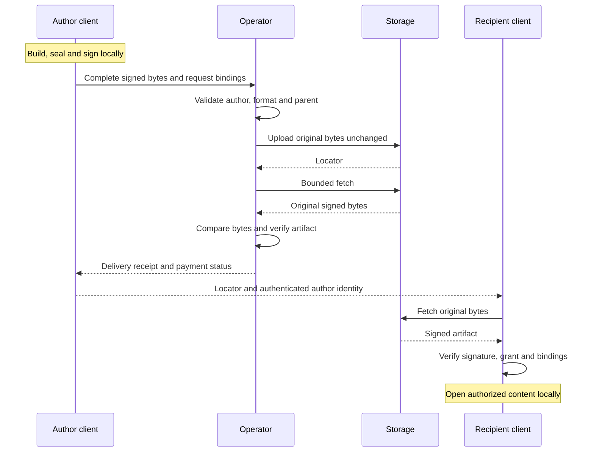
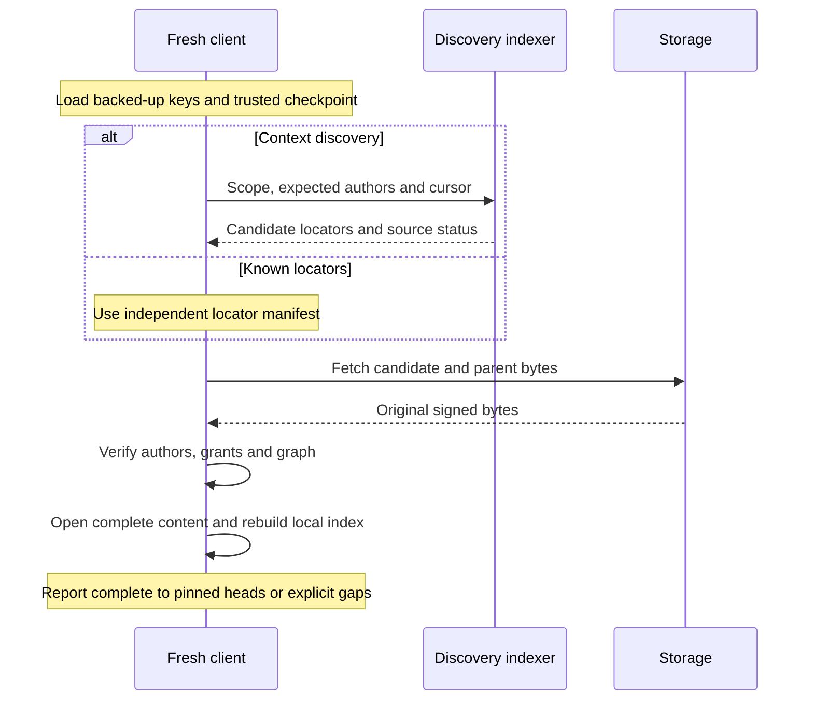
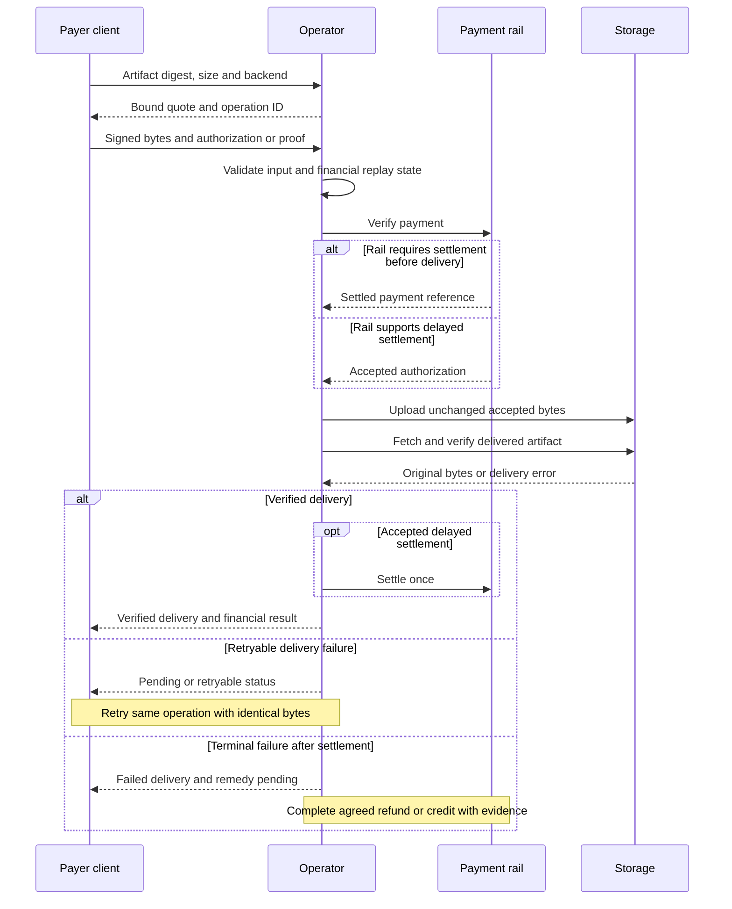

# Information and payment flows

Status: planned logical contracts, not evidence of deployed behavior.
Related: [technical specification](tech-spec.md) and [proof of concept](proof-of-concept.md).

## Save and handoff

Payer identity does not confer authorship or read access.
An operator transport signature is not the artifact author signature.
Keys and private plaintext remain on clients in the target private path.

## Independent recovery

The original operator is absent from this flow.
Indexer omissions, outage and lag remain explicit.
Known-locator fetch can bypass discovery.
Storage migration follows [storage-portability-spec.md](storage-portability-spec.md).

## Payment and delivery

Settlement ordering depends on the rail.
The branches do not represent two charges.
Store financial replay state durably; receipt loss does not erase a settled operation.
Invalid input must fail before irreversible payment where possible.

Quote amount binds size, artifact digest, backend and expiry.
A retry retains operation identity and cannot substitute different bytes.
The baseline requires client resubmission because hosted SQL retains no artifact bytes.
Financial state loss is an operational incident, not permission for blind replay.

Operator payments to storage, gateway and payment providers are separate expenses.
This contract defines no token, buyback, fee router or numeric revenue split.
