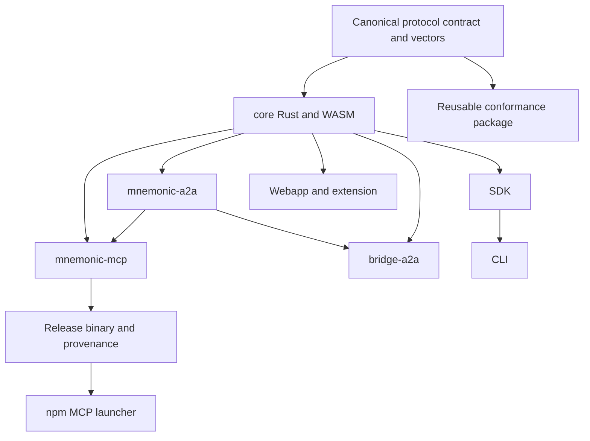

# Repository extraction inventory

Status: reviewed planning deliverable for task 11. Repository creation and extraction remain proposed.
Inventory baseline: `89532db4556e53e81b5243c57535a76046c08207` on 2026-10-02.
Recheck this inventory after the current implementation tasks change public interfaces.

## Existing packages and dependencies

Versions below come from source manifests. They do not establish published registry versions.

| Unit | Version at baseline | Dependencies that prevent isolated extraction |
|---|---|---|
| [mnemonic-core](../../core/Cargo.toml) | 0.2.8 | Owns schemas, native services and WebAssembly exports in one crate |
| [mnemonic-a2a](../../mnemonic-a2a/Cargo.toml) | 0.1.0 | Path dependency on `../core`, with `a2a-experimental` |
| [mnemonic-mcp](../../mcp/Cargo.toml) | 0.2.8 | Path dependencies on core and mnemonic-a2a; integrated test support |
| [bridge-a2a](../../bridge-a2a/Cargo.toml) | 0.1.0 | Path dependencies on core and mnemonic-a2a |
| [SDK](../../packages/sdk/package.json) | 0.3.0 | Builds WebAssembly from the root core crate; tests import generated core artifacts |
| [CLI](../../packages/cli/package.json) | 0.3.0 | Depends on SDK `^0.3.0`; workspace development resolves local package |
| [MCP launcher](../../packages/mcp/package.json) | 0.2.8 | Downloads Rust release artifacts and verifies their release provenance |
| [Conformance package](../../packages/conformance/package.json) | 1.0.0 | Publishes A2A vectors; actual publication is not established here |
| [Extension](../../packages/extension/package.json) | 0.1.0, private | Shares generated core artifacts and fixture generation |
| [Webapp](../../webapp/package.json) | 0.1.0, private | Declares `mnemonic-core` 0.2.4; also has a local WebAssembly build script |

The [Cargo workspace](../../Cargo.toml) contains four crates, not the two described in legacy contributor documentation.
The [npm workspace](../../package.json) includes `packages/*` and `webapp`.
Package versions do not define signed format versions. Preserve format identifiers and existing byte vectors separately.
Resolve the webapp's declared core version and generated artifact source before any independent web release.

This shows logical build direction. It does not introduce new runtime services.
The future indexer consumes discovery contracts; it must not become a trust authority or dependency of core verification.

## Canonical specification ownership proposal

| Asset | Current source | Proposed disposition |
|---|---|---|
| Signed format definitions | [schema.rs](../../core/src/codec/schema.rs), codec/sealed implementations | Extract reviewed normative descriptions; keep executable implementation in this monorepo |
| A2A recovery contract | [a2a-recovery-spec.md](../sealed-memories/a2a-recovery-spec.md) | Preserve its ownership until a reviewed canonical transfer; tasks 18–21 remain here |
| Product service contracts | [tech-spec.md](tech-spec.md), indexer and portability specifications | Separate format invariants from operator policy before transfer |
| Rust-generated fixtures | [golden_fixtures.rs](../../core/tests/golden_fixtures.rs), [sealed_a2a_vectors.rs](../../core/tests/sealed_a2a_vectors.rs) | Publish immutable vectors with generator revision and checksums |
| Reusable A2A vectors | [conformance package](../../packages/conformance/package.json) | Reuse existing package; avoid competing vector authorities |
| SDK vectors | [SDK fixtures](../../packages/sdk/test/fixtures) | Consume pinned canonical vectors; retain generator parity checks |
| Operational guidance | [shipping plan](shipping-plan.md), deployment and payment records | Keep with the operator implementation and its release |

The owner must select canonical repository ownership, visibility and maintainers before extraction.
Keep Apache-2.0 notices and [contribution terms](../../CONTRIBUTING.md); document any ownership transfer explicitly.
Leave redirects or short pointers at old document locations. Do not maintain two editable normative copies.
Move selected paths with history preservation after an inventory review. Never copy credentials or local runtime state.

## Build and release migration list

| Existing coupling | Required change before extraction |
|---|---|
| [SDK WASM script](../../packages/sdk/scripts/build-wasm.sh) uses root-relative paths and shared `core/pkg*` outputs | Fetch a pinned core source/artifact; isolate web and node outputs; verify digests |
| [Webapp WASM script](../../webapp/scripts/build-wasm.sh) builds the same crate | Pin compatible core version and declare generated artifact provenance |
| [SDK build scripts](../../packages/sdk/package.json) and [CLI's SDK dependency](../../packages/cli/package.json) use local workspace build ordering | Test clean packed-package installation outside this checkout |
| [Rust CI](../../.github/workflows/ci.yml) compiles the complete workspace | Add a pinned cross-repository integration matrix before separating crates |
| [Node CI](../../.github/workflows/node-test.yml) regenerates Rust fixtures and runs real HTTP/WASM tests | Keep parity and integrated recovery jobs against released component combinations |
| [Release workflow](../../.github/workflows/release.yml) uses one tag family for binaries, npm and registry metadata | Define component release tags and compatibility manifest; preserve checksums and provenance |
| MCP launcher [installer](../../packages/mcp/src/install-binary.ts) and [paths](../../packages/mcp/src/paths.ts) resolve binary releases | Update repository identity only with matching artifact/provenance verification tests |
| [MCP registry metadata](../../server.json) and npm repository fields name this monorepo | Update URLs and publisher identity only after destination and ownership are approved |
| [Documentation link job](../../.github/workflows/docs-link-check.yml) excludes `work/` | Include moved contract pointers and migration links in extraction validation |

The current release workflow treats Linux binaries as nonblocking and gates its release job on macOS.
Its npm publication job is separate from the Rust release job.
Extraction must preserve the declared support matrix or explicitly change it with evidence.
This proposal does not alter either policy.

## Link and contributor migration

1. Inventory relative links in `work/`, `docs/`, package READMEs, AGENTS.md and CLAUDE.md.
2. Inventory agent-card, crawler-summary, package metadata, registry and website links.
3. Map each moved path to its immutable contract version and maintained public URL.
4. Keep existing issue numbers linked to this repository; do not assume destination numbers match.
5. Update contributor setup, local workspace instructions and issue-routing guidance.
6. Validate old pointers and new links from a fresh checkout of each affected consumer.

## Proposed release and extraction gates

| Gate | Evidence needed | State |
|---|---|---|
| E1 Inventory | Dependency graph, path/link migration and release coupling review | Prepared here; review before extraction |
| E2 Ownership | Named maintainers, destination, visibility, license continuity and publisher configuration | Owner choices pending |
| E3 Canonical contract | Versioned immutable formats, vectors, checksum manifest and compatibility policy | Planned |
| E4 Consumer compatibility | Rust/WASM parity, prior-format verification and SDK-to-operator recovery against pinned versions | Planned |
| E5 Release installation | Clean packed SDK/CLI installation and launcher verification from proposed release origins | Planned |
| E6 Migration and rollback | Preserved history, working old links, contributor guide and ability to repin previous contracts | Planned |

A compatibility manifest should pin contract revision, format IDs, vector digests and exact component versions.
Run existing and prior supported format vectors before any release changes that manifest.
Include real SDK/WASM recovery; list mocked provider results separately from live-source observations.
No extraction gate is satisfied merely by creating a repository.
Tasks 2–5, 9–10 and 12 can proceed in this monorepo without extraction.
