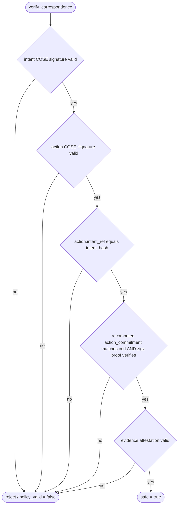
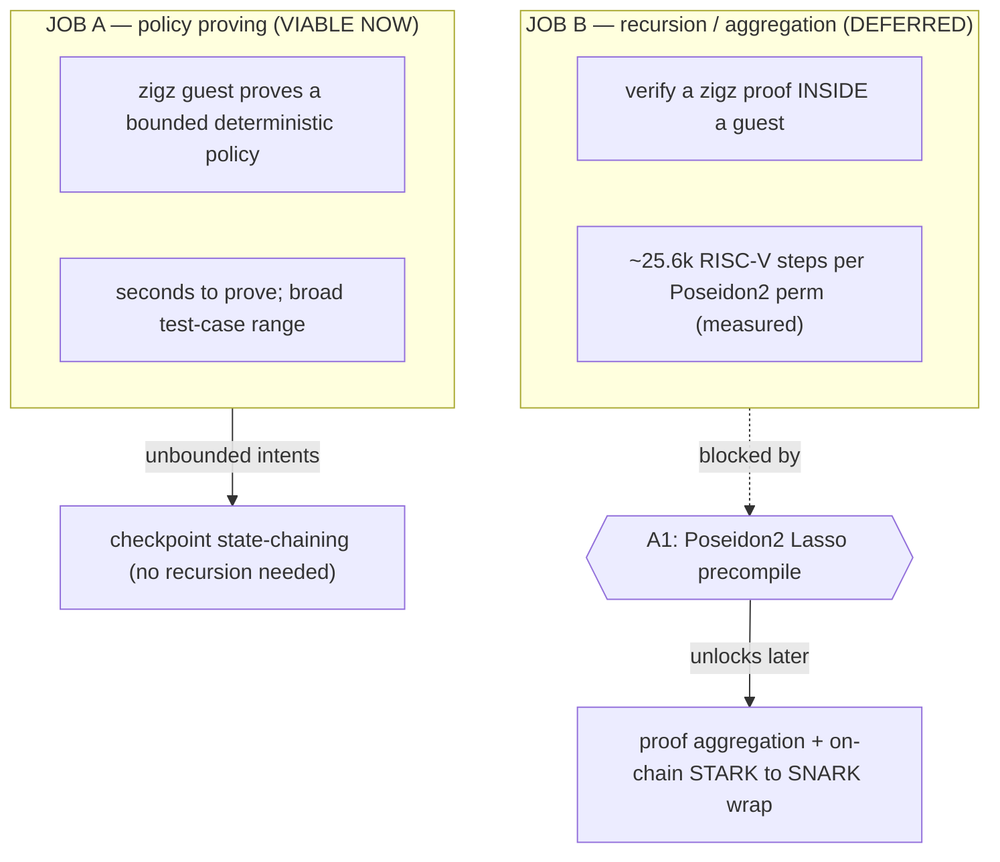
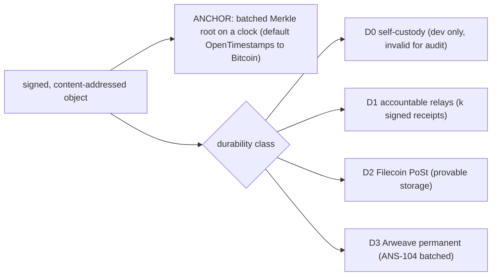
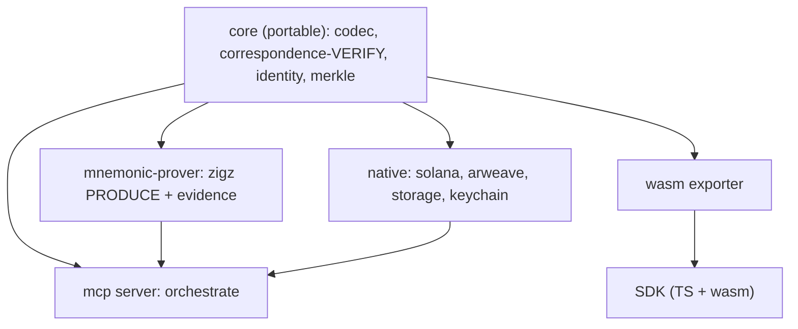
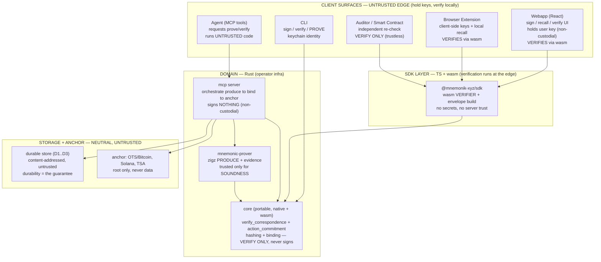

# Mnemonic correspondence — viable architecture (flow diagrams)

The architecture we converged on after the zigz recursion PoC. Core principle:
**zigz proves the policy (no in-guest hashing); Rust does the hashing/binding and
verifies; recursion is deferred behind a Poseidon2 precompile.**

## 1. End-to-end flow (intent → action → proof → verify)

```mermaid
sequenceDiagram
    autonumber
    actor P as Principal
    participant REG as Policy Registry
    actor AG as Agent (AI)
    participant EV as Evidence
    participant PR as Prover zigz
    participant CORE as core verify
    participant ST as Storage plus Anchor
    actor V as Verifier

    Note over P: ROOT OF AUTHORITY. Signs the mandate (Ed25519). Trust anchor for what was authorized.
    Note over REG: Compiled policy programs (guest ELF), addressed by policy_id = program_hash. Public.
    Note over AG: The agent's own code (LLM plus tools). May be buggy or compromised. NOT TRUSTED.
    Note over EV: zkTLS proves bytes came from the endpoint, not that the endpoint is honest.
    Note over PR: Runs the policy guest in the zkVM. Trusted only for SOUNDNESS: cannot prove a false statement.
    Note over CORE: Pure verifier (Rust plus wasm). TRUSTLESS, runs anywhere. Does hashing plus binding.

    P->>REG: pick policy_id (e.g. payment_mandate_v1)
    P->>P: sign INTENT with policy_id, params (cap, allowlist_root), expiry, nonce
    P-->>AG: signed Intent plus intent_hash
    Note over AG,EV: Agent decides an action, then must PROVE compliance. It cannot merely assert.
    AG->>EV: fetch authenticated evidence (merchant receipt)
    EV-->>AG: evidence plus attestation
    AG->>PR: witness = action, evidence, params; program = policy_id
    PR->>PR: execute policy guest, produce proof pi plus public_inputs
    PR-->>AG: pi binds program_hash, intent_hash, action_commitment, evidence_commitment
    AG->>AG: sign ACTION with agent key (cert in metadata)
    AG->>ST: store bytes (durability class) plus anchor batched root
    V->>ST: fetch by content hash
    V->>CORE: verify_correspondence(intent, action, cert)
    Note over V,CORE: Re-checks program_hash == intent.policy_id, every binding, and pi. No trust in agent/prover/storage.
    CORE-->>V: authorship + integrity + intent_link + POLICY + evidence  =>  policy_valid
```

### Reading the flow — the questions this answers

**Where does the policy live?** The policy is a **compiled program** (the zigz
guest, e.g. `payment_mandate_v1`), content-addressed by `program_hash` and
published in the **policy registry**. The **Principal's signed Intent names the
`policy_id` (= program_hash) + parameters** (cap, allowlist root, expiry). So the
policy code is public and immutable, and *which* policy applies is fixed by the
Principal's signature. The verifier checks the proof's `program_hash` equals the
Intent's `policy_id` — you cannot silently swap in a weaker policy.

**Who is the agent, and does it run its own code?** The Agent is the autonomous
AI (LLM + tools) acting for the Principal. It runs **arbitrary, untrusted code** —
its reasoning is *not* proven. What gets proven is only that the **recorded action
satisfies the policy given the evidence**. The agent drives the prover but cannot
make it prove a false statement. Treat the agent as potentially adversarial — that
is the whole design premise.

**What is the trust assumption?** In one line: **trust the Principal's signature
and the soundness of the proof system; trust nothing about the agent, the prover's
honesty, or storage.**

### Trust assumptions

| Party | Trusted for | NOT trusted for |
|---|---|---|
| **Principal** | defining the mandate (root of authority), via Ed25519 sig | — |
| **Policy registry** | serving the correct program for a `program_hash` (content-addressed, self-verifying) | — |
| **Agent (AI)** | **nothing** | honesty, correctness, non-compromise |
| **Prover (zigz)** | **soundness** (valid π ⇒ statement holds) | honesty (can't fake π). *Caveat: zigz unaudited → experimental* |
| **Evidence (zkTLS)** | bytes came from *that TLS endpoint* | that the endpoint told the truth |
| **core verifier** | correctness of the verify code (differential-tested) | — (trustless to run) |
| **Storage / relay** | **nothing** (content-addressed) | availability → the durability class provides it |
| **Anchor chain** | existence + time + ordering of a root | data (never holds data) |

### Attack surfaces (and mitigation)

| # | Attack | Mitigation |
|---|---|---|
| 1 | Agent lies about action data (fakes a compliant amount) | **evidence binding** — action fields must equal merchant-authenticated evidence |
| 2 | Agent swaps in a weaker policy | verifier checks `program_hash == intent.policy_id`; Intent is Principal-signed |
| 3 | Agent forges the Intent | Ed25519 signature — unforgeable |
| 4 | Replay an old Intent / proof | `nonce` + `expiry` in the Intent; anchored timestamp |
| 5 | Prover fakes a proof of a false result | **soundness** of the proof system (can't). Residual: zigz unaudited |
| 6 | Agent fabricates evidence | zkTLS transcript is unforgeable (stub evidence is a *dev-only* trust hole) |
| 7 | Merchant/endpoint itself lies | **NOT mitigated** — zkTLS proves origin, not truth; residual trust in the source |
| 8 | Producer deletes the record to dodge audit | **durability class D1–D3** — independent custody; producer not sole holder |
| 9 | Compromised agent/principal key | out of scope of the proof — identity / key-management layer |
| 10 | Buggy verifier accepts bad proofs | pure-Rust verifier + **differential conformance** vs the Zig prover |

## 2. Division of labor (the load-bearing decision)

```mermaid
flowchart LR
    subgraph GUEST["zigz GUEST (rv64im) — POLICY LOGIC ONLY"]
        direction TB
        g1["arithmetic and aggregates (sum ≤ cap)"]
        g2["membership (scan / range)"]
        g3["equality to evidence"]
        g4["temporal / sequencing"]
        g5["*** NO in-guest hashing ***"]
    end
    subgraph RUST["Rust core/correspondence — VERIFY ONLY (native + wasm)"]
        direction TB
        r1["blake3 hashing and commitments"]
        r2["action_commitment binding"]
        r3["re-verify zigz proof"]
        r4["5-check verify_correspondence"]
    end
    GUEST -->|"proof + public_inputs"| RUST
    RUST -->|"policy_valid: Option bool"| OUT["verify result"]
```



**Why this split (measured, not aesthetic):** the recursion PoC found one real
Poseidon2 hash costs **~25.6k RISC-V steps in-VM**. So hashing is kept in Rust
(microseconds, native) and the guest does only policy arithmetic — which keeps the
policy test-case range broad and proving cheap. The guest that hashes is the guest
that's slow; we don't build those.

## 3. The five independent verifier checks



## 4. Two guest-prover jobs: viable now vs deferred



## 5. Anchor is not storage — durability classes



## 6. Workspace / dependency DAG (one-way, everything points at portable core)



## 7. Application layers + client surfaces (what runs where)



**Trust boundary.** Everything the relying party needs to trust is *cryptographic*,
not *operational*: the **Principal's signature** and **proof soundness**. The
client edge holds keys and **verifies locally** (wasm), so it never trusts the
server; the operator infra **produces + orchestrates but signs nothing**
(non-custodial); storage + anchor are **neutral and untrusted** (content-addressed
+ durability-guaranteed). An auditor or smart contract at the edge re-checks
everything with the same open verifier — no operator trust required.

### What each level does

| Level | Surface / component | Job | P/V/A | Trust |
|---|---|---|---|---|
| Client | Webapp, Extension | UX + hold keys + **verify client-side (wasm)** | Verify (+ trigger produce) | untrusted edge; verifies locally |
| Client | CLI | sign / verify / prove; keychain identity | Produce + Verify | holds user key (non-custodial) |
| Client | Agent (MCP tools) | request prove/verify | Produce (via server) | **UNTRUSTED** (adversarial) |
| Client | Auditor / Contract | independent re-check | **Verify only** | trustless relying party |
| SDK | @mnemonik-xyz/sdk | wasm verifier + envelope building | Verify | no secrets, no server trust |
| Domain | core | hashing, binding, `verify_correspondence` | **Verify** (never produces) | trustless to run |
| Domain | mnemonic-prover | zigz policy proof + evidence | **Produce** | trusted for **soundness only** |
| Domain | mcp server | orchestrate produce → bind → anchor | Orchestrate | signs nothing (non-custodial) |
| Infra | durable store + anchor | availability guarantee + timestamp | Anchor / Store | untrusted (content-addressed) |

**Invariant:** the verifier is a *library* that runs on every client surface
(browser, CLI, contract) — "verify everywhere." Only `mnemonic-prover` produces;
`core` only verifies; the server only orchestrates and never signs.
