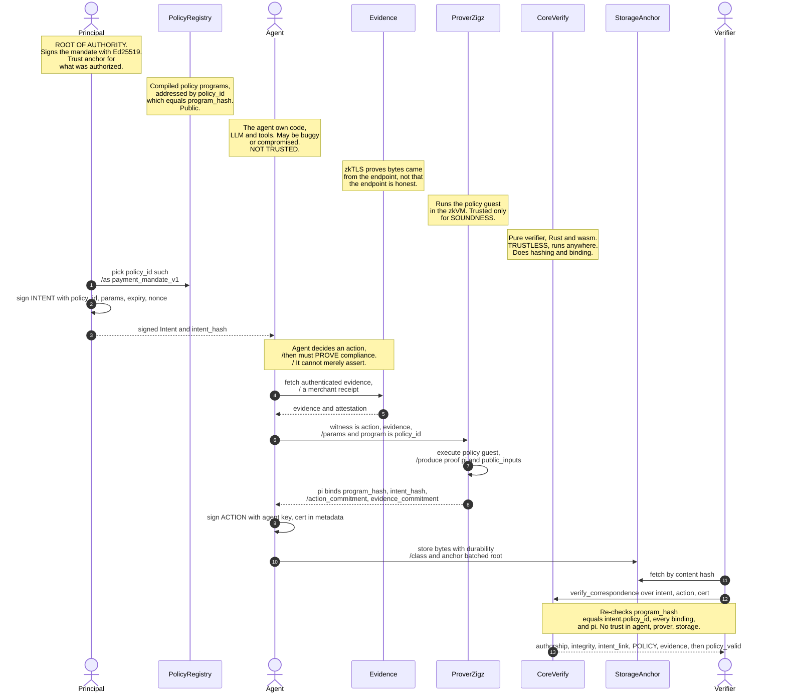
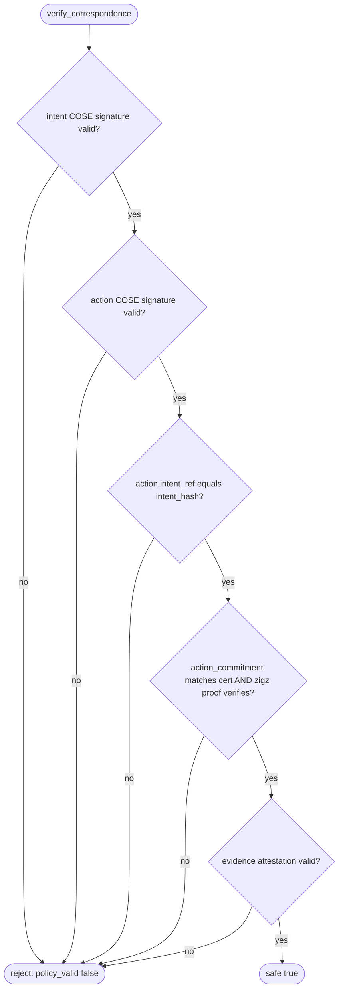
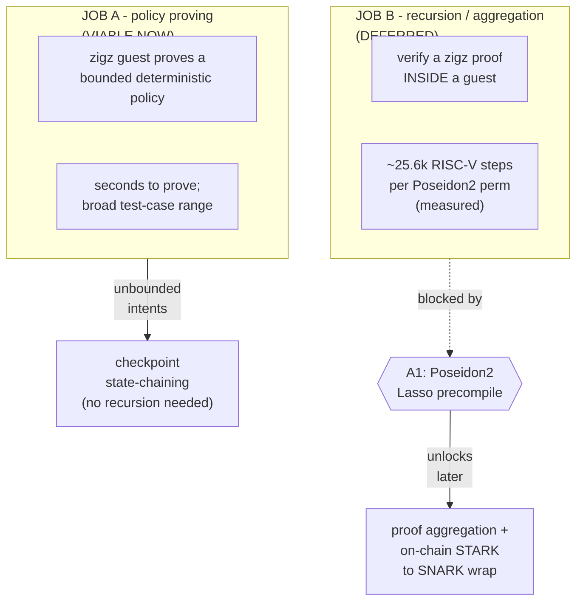
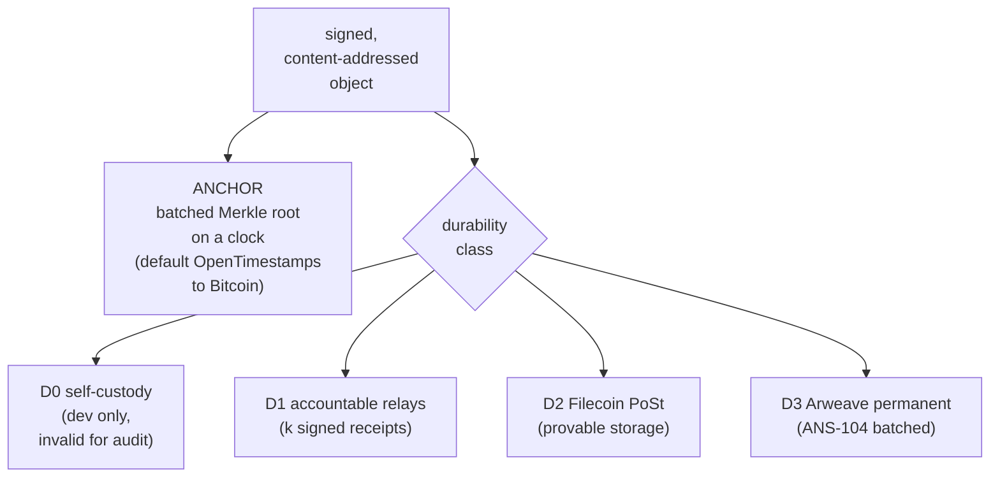
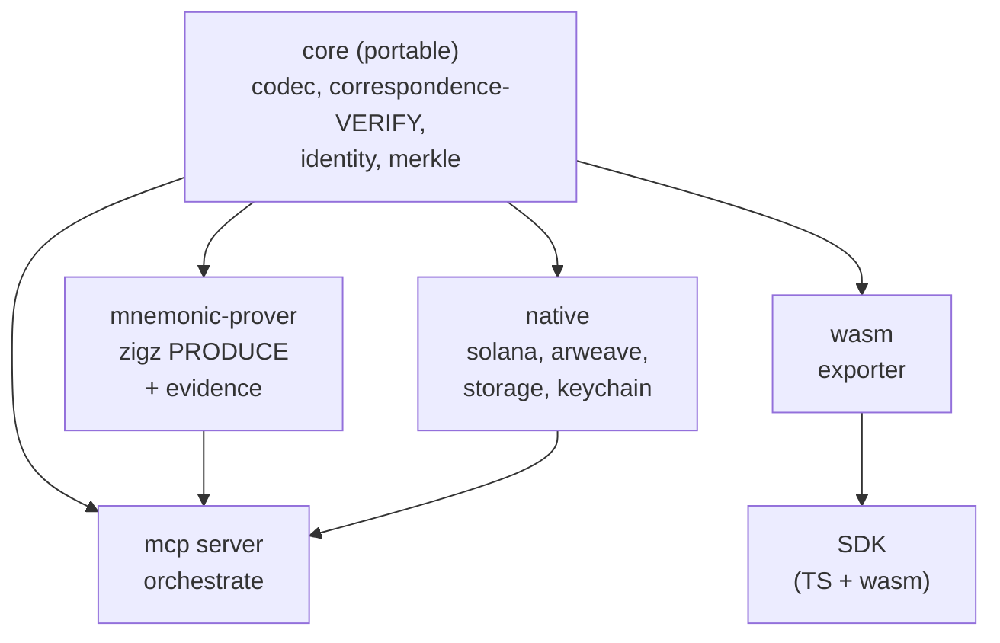
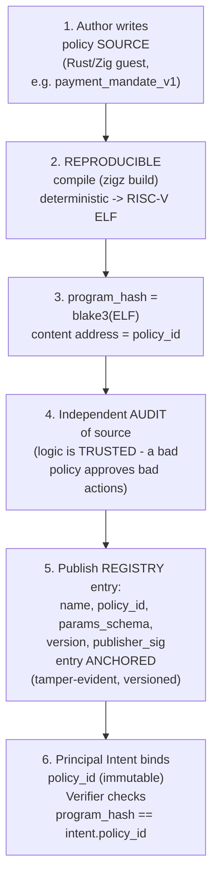

# Mnemonic correspondence — viable architecture (flow diagrams)

The architecture we converged on after the zigz recursion PoC. Core principle:
**zigz proves the policy (no in-guest hashing); Rust does the hashing/binding and
verifies; recursion is deferred behind a Poseidon2 precompile.**

## 1. End-to-end flow (intent → action → proof → verify)

### Reading the flow — the questions this answers

**Where does the policy live?** The policy is a **compiled program** (the zigz
guest, e.g. `payment_mandate_v1`), content-addressed by `program_hash` and
published in the **policy registry**. The **Principal's signed Intent names the
`policy_id` (= program_hash) + parameters** (cap, allowlist root, expiry). So the
policy code is public and immutable, and *which* policy applies is fixed by the
Principal's signature. The verifier checks the proof's `program_hash` equals the
Intent's `policy_id` — you cannot silently swap in a weaker policy.

**Who is the agent, and does it run its own code?** The Agent is the autonomous
AI (LLM + tools) acting for the Principal. It runs **arbitrary, untrusted code** —
its reasoning is *not* proven. What gets proven is only that the **recorded action
satisfies the policy given the evidence**. The agent drives the prover but cannot
make it prove a false statement. Treat the agent as potentially adversarial — that
is the whole design premise.

**What is the trust assumption?** In one line: **trust the Principal's signature
and the soundness of the proof system; trust nothing about the agent, the prover's
honesty, or storage.**

### Trust assumptions

| Party | Trusted for | NOT trusted for |
|---|---|---|
| **Principal** | defining the mandate (root of authority), via Ed25519 sig | — |
| **Policy registry** | serving the correct program for a `program_hash` (content-addressed, self-verifying) | — |
| **Agent (AI)** | **nothing** | honesty, correctness, non-compromise |
| **Prover (zigz)** | **soundness** (valid π ⇒ statement holds) | honesty (can't fake π). *Caveat: zigz unaudited → experimental* |
| **Evidence (zkTLS)** | bytes came from *that TLS endpoint* | that the endpoint told the truth |
| **core verifier** | correctness of the verify code (differential-tested) | — (trustless to run) |
| **Storage / relay** | **nothing** (content-addressed) | availability → the durability class provides it |
| **Anchor chain** | existence + time + ordering of a root | data (never holds data) |

### Attack surfaces (and mitigation)

| # | Attack | Mitigation |
|---|---|---|
| 1 | Agent lies about action data (fakes a compliant amount) | **evidence binding** — action fields must equal merchant-authenticated evidence |
| 2 | Agent swaps in a weaker policy | verifier checks `program_hash == intent.policy_id`; Intent is Principal-signed |
| 3 | Agent forges the Intent | Ed25519 signature — unforgeable |
| 4 | Replay an old Intent / proof | `nonce` + `expiry` in the Intent; anchored timestamp |
| 5 | Prover fakes a proof of a false result | **soundness** of the proof system (can't). Residual: zigz unaudited |
| 6 | Agent fabricates evidence | zkTLS transcript is unforgeable (stub evidence is a *dev-only* trust hole) |
| 7 | Merchant/endpoint itself lies | **NOT mitigated** — zkTLS proves origin, not truth; residual trust in the source |
| 8 | Producer deletes the record to dodge audit | **durability class D1–D3** — independent custody; producer not sole holder |
| 9 | Compromised agent/principal key | out of scope of the proof — identity / key-management layer |
| 10 | Buggy verifier accepts bad proofs | pure-Rust verifier + **differential conformance** vs the Zig prover |

## 2. Division of labor (the load-bearing decision)

```mermaid
flowchart LR
    subgraph GUEST["zigz GUEST (rv64im)<br/>POLICY LOGIC ONLY"]
        direction TB
        g1["arithmetic + aggregates<br/>(sum <= cap)"]
        g2["membership<br/>(scan / range)"]
        g3["equality to evidence"]
        g4["temporal / sequencing"]
        g5["*** NO in-guest<br/>hashing ***"]
    end
    subgraph RUST["Rust core/correspondence<br/>VERIFY ONLY<br/>(native + wasm)"]
        direction TB
        r1["blake3 hashing<br/>+ commitments"]
        r2["action_commitment<br/>binding"]
        r3["re-verify<br/>zigz proof"]
        r4["5-check<br/>verify_correspondence"]
    end
    GUEST -->|"proof +<br/>public_inputs"| RUST
    RUST -->|"policy_valid:<br/>Option bool"| OUT["verify<br/>result"]
```

**Why this split (measured, not aesthetic):** the recursion PoC found one real
Poseidon2 hash costs **~25.6k RISC-V steps in-VM**. So hashing is kept in Rust
(microseconds, native) and the guest does only policy arithmetic — which keeps the
policy test-case range broad and proving cheap. The guest that hashes is the guest
that's slow; we don't build those.

## 3. The five independent verifier checks

## 4. Two guest-prover jobs: viable now vs deferred

## 5. Anchor is not storage — durability classes

## 6. Workspace / dependency DAG (one-way, everything points at portable core)

## 7. Application layers + client surfaces (what runs where)

**Trust boundary.** Everything the relying party needs to trust is *cryptographic*,
not *operational*: the **Principal's signature** and **proof soundness**. The
client edge holds keys and **verifies locally** (wasm), so it never trusts the
server; the operator infra **produces + orchestrates but signs nothing**
(non-custodial); storage + anchor are **neutral and untrusted** (content-addressed
+ durability-guaranteed). An auditor or smart contract at the edge re-checks
everything with the same open verifier — no operator trust required.

### What each level does

| Level | Surface / component | Job | P/V/A | Trust |
|---|---|---|---|---|
| Client | Webapp, Extension | UX + hold keys + **verify client-side (wasm)** | Verify (+ trigger produce) | untrusted edge; verifies locally |
| Client | CLI | sign / verify / prove; keychain identity | Produce + Verify | holds user key (non-custodial) |
| Client | Agent (MCP tools) | request prove/verify | Produce (via server) | **UNTRUSTED** (adversarial) |
| Client | Auditor / Contract | independent re-check | **Verify only** | trustless relying party |
| SDK | @mnemonik-xyz/sdk | wasm verifier + envelope building | Verify | no secrets, no server trust |
| Domain | core | hashing, binding, `verify_correspondence` | **Verify** (never produces) | trustless to run |
| Domain | mnemonic-prover | zigz policy proof + evidence | **Produce** | trusted for **soundness only** |
| Domain | mcp server | orchestrate produce → bind → anchor | Orchestrate | signs nothing (non-custodial) |
| Infra | durable store + anchor | availability guarantee + timestamp | Anchor / Store | untrusted (content-addressed) |

**Invariant:** the verifier is a *library* that runs on every client surface
(browser, CLI, contract) — "verify everywhere." Only `mnemonic-prover` produces;
`core` only verifies; the server only orchestrates and never signs.

## 8. Policy lifecycle — authoring a policy into the registry

The registry is a **trust root**: the Intent binds a `policy_id`, and the whole
system is only as sound as the policy behind it. This is the *provenance of the
policy itself* — a distinct flow from the runtime prove/verify.

### Why it needs its own flow — the properties that make the registry trustworthy

- **Immutable + content-addressed.** A policy *is* its `program_hash`. A "new
  version" is a *new* hash, never an edit. So a registered policy can't be
  silently changed.
- **Reproducible build = verifiable trust.** Anyone can take the published source,
  rebuild deterministically, and confirm it hashes to `program_hash`. Trust is
  **checkable**, not authority-based. (Requires a pinned, reproducible build
  pipeline — a hard requirement, called out.)
- **Audit is the real trust root.** The hash proves *which* code ran; it does NOT
  prove the code is *safe*. A policy that always returns `ok=1` would pass anything.
  So a policy must be **audited** before registration — that human-audit judgment is
  what the `publisher_sig` attests.
- **No per-policy ceremony.** Because zigz is **transparent** (no trusted setup),
  registering a policy is just *publish source + reproducible ELF + hash* — no
  Groth16-style per-circuit ceremony. A genuine advantage over SNARK backends.
- **Intents bind the hash, not the name.** The signed Intent commits to
  `policy_id (= program_hash)` directly, so even if the registry's human name
  mapping (`payment_mandate_v1` → hash) is later repointed, **already-signed
  Intents are unaffected.** The name is a convenience; the hash is the contract.

### Governance choice (open question)

- **Open** — anyone publishes; Principals/Verifiers choose which policies /
  publishers they accept (like package registries). Maximally decentralized.
- **Curated** — a publisher authority signs a vetted policy set. Easier for
  regulated buyers who want an accountable auditor behind each policy.
- Recommended: **signed-by-publisher + open-source + reproducible**, with the
  relying party free to pin the exact `program_hash`(es) it trusts. Content
  addressing makes both models safe against silent tampering.

### Registry attack surfaces

| # | Attack | Mitigation |
|---|---|---|
| 1 | Backdoored policy that looks strict | open-source + independent audit + reproducible build (anyone re-derives the hash from source) |
| 2 | Registry operator repoints a name to a weaker hash | name→hash mapping is signed + anchored; Intents bind the **hash**, not the name |
| 3 | Non-deterministic build → hash ≠ source | pinned, reproducible build pipeline; published recipe |
| 4 | Params confusion (policy fed wrong-shaped params) | `params_schema` is part of the registry entry and bound into the Intent |
| 5 | Stale/withdrawn policy still used | `version` + optional revocation list; Verifier policy on accepted versions |
