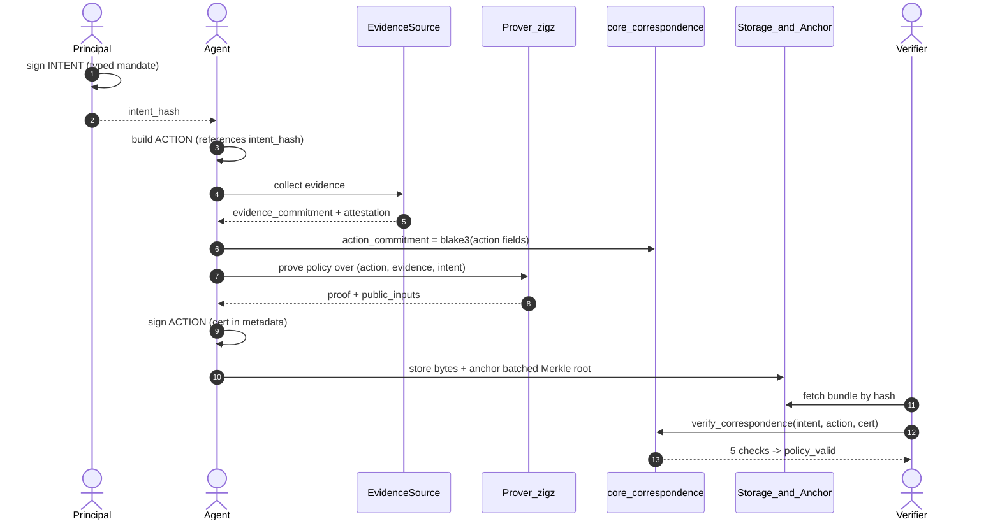
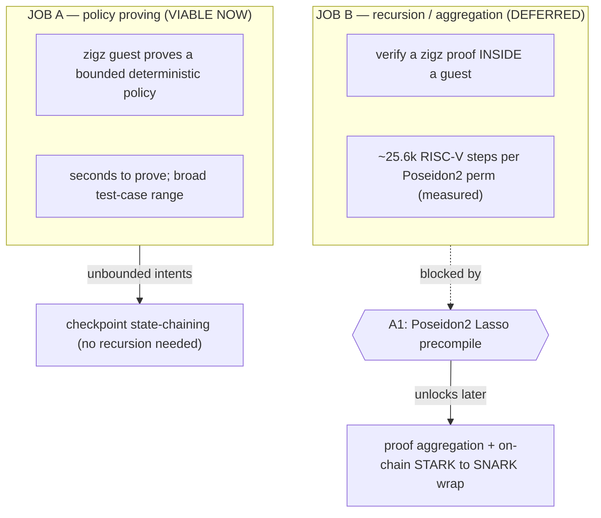
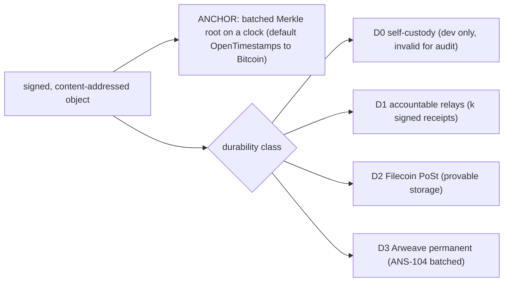
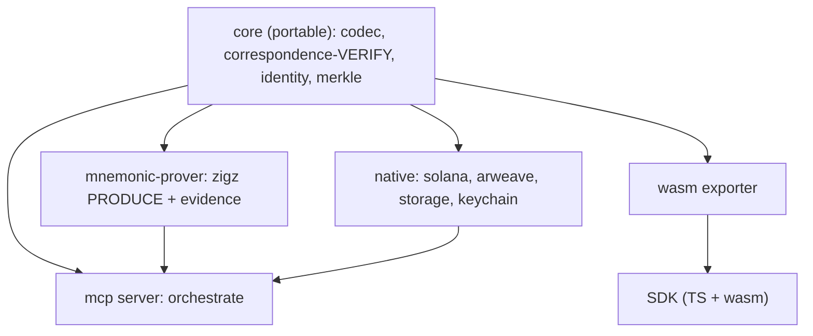
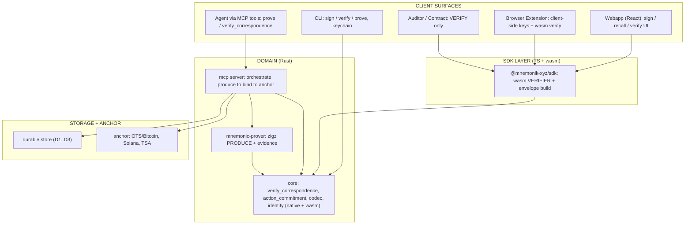

# Mnemonic correspondence — viable architecture (flow diagrams)

The architecture we converged on after the zigz recursion PoC. Core principle:
**zigz proves the policy (no in-guest hashing); Rust does the hashing/binding and
verifies; recursion is deferred behind a Poseidon2 precompile.**

## 1. End-to-end flow (intent → action → proof → verify)

## 2. Division of labor (the load-bearing decision)

```mermaid
flowchart LR
    subgraph GUEST["zigz GUEST (rv64im) — POLICY LOGIC ONLY"]
        direction TB
        g1["arithmetic and aggregates (sum ≤ cap)"]
        g2["membership (scan / range)"]
        g3["equality to evidence"]
        g4["temporal / sequencing"]
        g5["*** NO in-guest hashing ***"]
    end
    subgraph RUST["Rust core/correspondence — VERIFY ONLY (native + wasm)"]
        direction TB
        r1["blake3 hashing and commitments"]
        r2["action_commitment binding"]
        r3["re-verify zigz proof"]
        r4["5-check verify_correspondence"]
    end
    GUEST -->|"proof + public_inputs"| RUST
    RUST -->|"policy_valid: Option bool"| OUT["verify result"]
```

## 3. The five independent verifier checks

## 4. Two guest-prover jobs: viable now vs deferred

## 5. Anchor is not storage — durability classes

## 6. Workspace / dependency DAG (one-way, everything points at portable core)

## 7. Application layers + client surfaces (what runs where)

### What each level does

| Level | Surface / component | Job | Produce / Verify / Anchor |
|---|---|---|---|
| Client | Webapp, Extension | UX + hold keys + **verify client-side (wasm)** | Verify (+ trigger produce) |
| Client | CLI | sign / verify / prove; keychain identity | Produce + Verify |
| Client | Agent (MCP tools) | request prove/verify of correspondence | Produce (via server) |
| Client | Auditor / Contract | independent re-check | **Verify only** |
| SDK | @mnemonik-xyz/sdk | wasm verifier + envelope building | Verify |
| Domain | core | hashing, binding, `verify_correspondence` | **Verify** (never produces) |
| Domain | mnemonic-prover | zigz policy proof + evidence | **Produce** |
| Domain | mcp server | orchestrate produce → bind → anchor | Orchestrate |
| Infra | durable store + anchor | availability guarantee + timestamp | Anchor / Store |

**Invariant:** the verifier is a *library* that runs on every client surface
(browser, CLI, contract) — "verify everywhere." Only `mnemonic-prover` produces;
`core` only verifies; the server only orchestrates and never signs.
