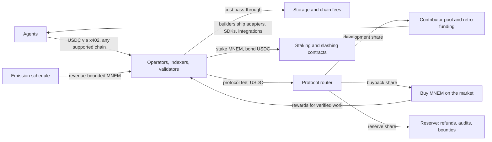

# Tech Spec: Mnemonic protocol economics and a native token

This document designs how value moves through the Mnemonic protocol. It also decides when a
native token is justified, and what jobs it may do. Nothing here is implemented unless the text
says "available now". Every external claim links to a source in [Sources](#sources).

Abbreviations used: USD (United States dollar), USDC (USD Coin, a stablecoin), bps (basis
points, 1 bps = 0.01 %), EVM (Ethereum Virtual Machine), FDV (fully diluted valuation), SEC (US
Securities and Exchange Commission), CFTC (US Commodity Futures Trading Commission), MiCA (EU
Markets in Crypto-Assets Regulation), CCTP (Circle Cross-Chain Transfer Protocol), COSE (CBOR
Object Signing and Encryption), CBOR (Concise Binary Object Representation), ERC (Ethereum
Request for Comments). The working token name is `MNEM`. It is not final.

## 1. Verdict first

**Do not launch a token now.** Build a stablecoin fee architecture that a token can join later
without a redesign. Launch a token only after the measured gates in section 8 pass.

Reasons, each expanded below:

1. **The fee base is too small to support a token.** The only paid action is an anchored write
   at about 0.001 USD (section 2). A token priced above that fee flow is priced on speculation.
2. **No current role needs a native token.** Payment after delivery already removes the need
   for operator collateral (section 4). Where collateral helps, a stablecoin bond does the job
   and is not reflexive.
3. **The protocol is removing cost, not adding it.** Memo removal and Merkle batching (both
   planned) reduce the fee per write. That is correct for users, and it shrinks any fee-based token value further.
4. **Legal status in the US is not settled.** The CLARITY Act (Digital Asset Market Clarity
   Act) failed a Senate cloture vote on 2026-09-15 [S3]. The SEC and CFTC interpretation of
   2026-03-17 is an agency interpretation, not a statute [S1].

The token has three legitimate future jobs: a bootstrap subsidy for supply-side roles,
ownership and governance of a shared network, and long-term funding of development. Section 7
designs all three. Section 8 sets the gates.

## 2. Baseline: the economy that exists today

Measured from the code on 2026-09-28.

| Fact | Where | Status |
|---|---|---|
| One paid action: `mnemonic_sign_memory` with `mode: "anchored"` | `CLAUDE.md` § Payment | available now |
| Price = max(minimum, (Irys + chain fee) × SOL/USD × (1 + margin)) | `mcp/src/pricing.rs:7` | available now |
| Margin default 2000 bps (20 %) | `mcp/src/config.rs:329` | available now |
| Minimum price 0.001 USD | `docs/WHITEPAPER.md` § 13 | available now |
| Payment rail: x402 in USDC, Solana and EVM networks | `mcp/src/payment.rs:518` | available now |
| Free quota: 10 anchored writes per Google account per day, global cap 1000 | `docs/tools.md` § Free daily quota | available now |
| Local writes, verification and restore are free | `docs/WHITEPAPER.md` § 13 | available now |
| The client signs; the operator only relays and pays fees | `CLAUDE.md` § Signing | available now |
| Charge only after the anchored bytes pass recall and verify | `CLAUDE.md` § Write modes | available now |
| Per-owner Merkle commitment over content hashes | `core/src/merkle.rs` | library available now; anchoring the root is planned |
| Solana memo becomes optional; pluggable storage and anchoring | `work/DECOUPLING-SEQUENCE.md` | planned |

**Illustrative arithmetic, not a forecast.** With a 20 % margin above cost, the margin is about
one sixth of the price. When the floor applies, the margin is the floor minus the cost. So the
gross margin is at most about 0.001 USD per write. One million paid writes per month give at
most about 1,000 USD of gross margin. Ten million give at most about 10,000 USD. Operator fixed
costs come out of that (`economics.md` § Cost layer separation).

The conclusion is plain: fee revenue cannot carry a token valuation for a long time. Any design
that says otherwise is selling a speculative asset.

## 3. Invariants

These rules hold in every phase. A governance vote cannot change them.

- **I-1. Verification is free and token-free.** It needs no token, account, server or payment
  (`docs/WHITEPAPER.md` § 9).
- **I-2. The artifact never references the token.** No token field enters `MEMORY_V1`. Signing
  and the canonical CBOR stay independent of economics.
- **I-3. Users pay in stablecoins.** No user must buy or hold `MNEM` to write, read, restore or
  verify. Agents need predictable USD costs, and a payment-only token has a velocity problem
  [T1].
- **I-4. Local mode stays free.** It runs on the agent's own machine and costs the protocol
  nothing.
- **I-5. No reward is larger than the fee the rewarded action pays.** Otherwise self-dealing is
  profitable. On LooksRare, which paid token rewards for trading, a 2022 analysis found about
  98 % of volume was wash trading [T9].
- **I-6. Slashing applies only to faults that anyone can prove from data.** No slashing by vote.
- **I-7. Prices are cost-plus and public.** The protocol fee is a separate, visible line.
- **I-8. Chain-agnostic at the edges.** Clients pay on any supported x402 network [T15]. The
  token, if it exists, lives on one home chain and is not required on the others.
- **I-9. The token never pays for storage.** Storage networks have their own economics: Arweave
  funds permanent storage from an endowment [T16], and Walrus pays nodes and stakers over time
  [T17]. The operator pays each backend in its own currency. Mnemonic does not compete with them.

## 4. Roles, and which ones need collateral

A token can only do real work where a role is open to anyone, the role can harm users, and the
harm is provable. This table tests each role in the chain-agnostic design.

| Role | Work | Paid by | Provable fault | Needs collateral? | Status |
|---|---|---|---|---|---|
| Agent (writer) | Creates and signs memories | — (pays) | — | No | available now |
| Operator (relayer) | Sends signed bytes to storage; pays storage and chain fees | Cost + margin, x402 | "Charged but not stored" | **No.** The charge happens only after recall + verify pass | available now, one operator |
| Storage backend | Keeps bytes (Arweave today) | Operator, in the backend's own currency | External to Mnemonic | No | Arweave available now; others planned |
| Indexer | Lists every item of one owner, for restore | Per query, x402 | Omission, provable against a signed owner Merkle root | **Candidate** | planned |
| Batcher | Puts many content hashes under one anchor | Share of the saved fee | Exclusion; the client pays only for an inclusion proof | No | planned |
| Validator (ERC-8004) | Posts a `validationResponse` about a memory claim | Per validation, x402 | False response, provable by COSE re-verification | **Candidate** | planned |
| Builder | SDKs, clients, storage and anchor adapters | Rebates, retro funding | — | No | planned |
| Core contributor | Maintains the protocol | Development share | — | No | planned |

Three findings follow.

**F-1. Pay after delivery beats a bond.** The shipped rule "charge only after the anchored bytes
verify" means a relayer cannot take money for work it did not do. So a relayer needs no stake.
The batcher gets the same property from inclusion proofs.

**F-2. Censorship is not provable, so it is not slashable.** An operator can refuse a write.
Nobody can prove a refusal on chain. The defence is choice: several operators and client-side
routing. Do not promise slashing for it.

**F-3. Two roles can use collateral: indexers and validators.** Both have faults that a third
party can check from data.

- An **indexer omission** is provable when the owner has signed a Merkle root over its content
  hashes (`core/src/merkle.rs`). A list that misses an item under that root is evidence.
- A **false validation** is provable because anyone can re-run COSE verification on the bytes.
  ERC-8004 already names "stake-secured re-execution" as one validator trust model [S6].

The enumeration gap makes the indexer role real, not invented. Today only the Irys index and the
Solana memo can list an owner's items (`work/chain-agnostic/decisions.md` F6, D-4). Several
independent indexers remove that single-provider risk.

## 5. Why collateral should be a stablecoin first

A native-token stake is reflexive. When the protocol struggles, the token falls, and the
security falls with it at the worst moment. The EigenLayer whitepaper notes that such services
are usually secured by their own native token. It argues that this fragments security, and that
the cost to corrupt a system is no more than the cost to corrupt its weakest dependency [T6].

So the design separates two jobs:

- **Security in an exogenous asset.** Slashable bonds are in USDC. A proven fault pays the
  harmed user and the challenger from this bond.
- **Alignment in the native token, later.** If `MNEM` exists, stake decides the share of reward
  emissions and routing weight. It does not replace the USDC bond.

This split keeps user protection independent of the token price.

## 6. Phases

Each phase has entry conditions. No phase starts on a date alone.

### Phase 0 — revenue before a token (now)

Entry: none. Most parts exist.

1. **Split the price into three visible lines:** cost, operator margin, protocol fee. Today the
   reference operator is also the protocol, so the protocol fee equals the margin. Add a
   `protocol_fee_micro_usdc` field next to `charge_micro_usdc` in the cost hint (planned).
2. **Open a public treasury.** A multi-signature wallet receives protocol fees in USDC. Publish a
   monthly report. Consolidate USDC from several chains with CCTP, which burns and mints native
   USDC across chains [T14].
3. **Start the development share (section 9, M-1).** A fixed part of each protocol fee goes to a
   contributor pool.
4. **Take non-dilutive money.** Apply to ecosystem grant programs [T18]. Sell enterprise support
   for self-hosted deployments (`economics.md` § Enterprise self-host).
5. **Publish the gate metrics** of section 8 on a public dashboard.

Exit: the decoupling steps 1–6 in `work/DECOUPLING-SEQUENCE.md` are done.

### Phase 1 — an open network with stablecoin bonds

Entry: pluggable anchoring and pluggable storage are shipped. Enumeration works without the
Solana memo. Owners can publish a signed Merkle root.

1. **Operator registry.** A signed list of operators that meet a published service level.
   Default clients route writes to listed operators. Reputation comes from ERC-8004 feedback
   (`work/erc8004-reputation/`).
2. **Network fee.** A listed operator pays the protocol fee to the treasury. It pays for routed
   demand and listing. It does not pay for the code: the code is Apache-2.0 and anyone can fork
   it. Split the payment at settlement where the network allows it. Elsewhere, settle
   periodically and publish the audit.
3. **Indexer pilot.** Two or three indexers post USDC bonds. Clients query at least two and
   merge the results. A proven omission slashes the bond.
4. **Integrator rebates and retro funding** (section 9, M-2 to M-4).

Exit: the gates of section 8 are measured for six consecutive months.

### Phase 2 — a token, only if the gates pass

Section 7 designs it. If the gates do not pass, Phase 1 continues without a token. That is a
valid end state.

## 7. The token design (Phase 2 only)

### 7.1 The three jobs, and nothing else

| Job | What `MNEM` does | What it does not do |
|---|---|---|
| J-1. Alignment for supply roles | Indexers and validators stake it to get work and a share of rewards | It does not replace the USDC slashing bond (section 5) |
| J-2. Bootstrap subsidy | Emissions pay for verified work before fee demand is large | Emissions never pay for unverified or self-dealable activity (I-5) |
| J-3. Ownership and development | Holders govern the treasury within bounds; contributors receive vested allocations | It never governs the invariants of section 3 |

`MNEM` is never a payment currency for users (I-3). This avoids the velocity problem [T1] and
matches the work-token model, where providers stake to earn the right to do work [T2]. The Graph
uses this model for indexers, with delegation and slashing [T4].

### 7.2 How value circulates



The loop "breathes" through real demand. Agents pay stablecoins. Workers earn stablecoins and
`MNEM`. Part of the fee buys `MNEM` back and pays it to workers who did verified work. Part funds
the people who build the next integration, which brings the next paying agent.

**Buyback-to-workers, not burn.** Burning is a common choice: Ethereum burns its base fee
[T13], and Uniswap governance executed a fee switch with a programmatic UNI burn in December 2025
[T20]. A burn transfers value to every holder, whether or not they work. Paying bought-back
tokens for verified work rewards the service itself. Counsel must check both options against
the SEC and CFTC interpretation of 2026-03-17 [S1].

**Why not burn-and-mint credits.** Helium sells USD-pegged, non-transferable Data Credits that
users create by burning the network token [T3]. That gives users a stable price. Mnemonic already
has a stable price, because x402 settles in USDC. A credit layer would add a step and no value.

### 7.3 Revenue-bounded emissions

Fixed emissions with little usage make supply grow while demand stays flat. So emissions follow
a rule, not a calendar alone:

```text
emission(epoch) = min( schedule_cap(epoch),  floor(epoch) + k × protocol_fee_usd(epoch) / p(epoch) )

schedule_cap  — a decaying cap drawn from the fixed network-rewards pool
floor         — a bootstrap amount for audited availability; it decays to zero in 24 months
k             — revenue multiplier; k ≤ 1 for any reward paid per query or per validation (I-5)
p             — a time-weighted MNEM/USD price for the epoch
```

Epoch rewards go to workers in proportion to verified work units:

- **Indexers:** random audits passed, plus paid queries served. An audit asks for the full list
  of a randomly chosen owner root, with proofs, before a deadline. The protocol chooses the
  challenge, so an indexer cannot self-deal it. The Graph uses a similar idea, proofs of
  indexing, and slashes wrong ones [T4]. Filecoin penalises storage providers that miss their
  periodic proofs [T5].
- **Validators:** paid validation responses that no challenge overturned.

Stake weight has a cap per worker, so one large holder cannot take the whole epoch.

### 7.4 Supply and allocation (a starting proposal for modelling)

A fixed maximum supply. No uncapped inflation. The absolute number is cosmetic.

| Bucket | Share | Release |
|---|---|---|
| Network rewards | 35 % | Only through the emission rule of 7.3 |
| Ecosystem: retro funding, grants, bounties | 20 % | Per funding round, from the treasury |
| Core contributors | 18 % | 12-month cliff, then 48 months linear |
| Treasury (governed reserve) | 12 % | Governance budgets only |
| Early backers, only if money is raised | ≤ 10 % | 12-month cliff, then 36 months linear |
| Retroactive community distribution | 5 % | At launch, weighted by fees paid |

If no money is raised, the backer share moves to network rewards and ecosystem.

Rules for the launch:

- **No insider unlock before 12 months.** Publish the full unlock calendar before launch.
  Low float with a high FDV creates years of unlock pressure [T7].
- **The community share is weighted by fees paid before an unannounced snapshot.** Free-quota
  writes count for nothing. There is a cap per identity. Rewarding activity that costs nothing
  invites farming [T9].
- **Launch only after usage exists.** The gates of section 8 enforce this.

### 7.5 Staking and slashing

- A worker posts a **USDC bond** (security) and stakes **`MNEM`** (alignment and reward share).
- **Unbonding period:** longer than the longest challenge window, so a worker cannot exit before
  a fault is proven.
- **Slashing:** only on a proof from section 4, F-3. The USDC bond compensates the harmed user
  first, then the challenger. A slashed `MNEM` stake is burned, so nobody profits from it.
- **Delegation:** allowed, capped per worker. Delegators share slashing risk.

### 7.6 Governance

Scope: treasury budgets, the protocol fee inside fixed bounds, the router split, emission
parameters inside the schedule cap, and the operator registry rules.

Out of scope, for ever: the invariants I-1 to I-9, the artifact format, the COSE `kid` format and
the `MEMORY_V1` field order (`CLAUDE.md` § Anchored artifacts).

Safeguards against capture:

- A time lock between a vote and its execution.
- A quorum, and a contributor council that can veto only proposals that breach the scope above.
- Treasury transfers above a limit need two separate votes.

Compound Proposal 289 in 2024 shows why. A large holder passed, over objections, a proposal that
moved 5 % of the treasury (499,000 COMP, about 24 million USD) into a product its backers had
designed [T19].

### 7.7 Chain placement

The token lives on **one home chain**. Staking, slashing, governance and the router live there.
Clients do not need it on any other chain (I-8).

Criteria for the home chain (owner decision, `decisions.md` Q-4):

1. The cost to verify an Ed25519 signature inside a fault proof. Every artifact `kid` is Ed25519.
2. Access to the ERC-8004 registries, which are Ethereum contracts [S6].
3. Native USDC with CCTP support, for fee consolidation [T14].
4. Mature audit tooling for the staking and slashing contracts.

**Do not bridge the token to every chain.** In 2022, 64 % of the 3.1 billion USD stolen in
crypto hacks came from cross-chain bridges [T8]. If a second chain needs `MNEM`, use a native burn-and-mint standard with rate limits.

## 8. Gates for a token launch

All gates must hold for six consecutive months, on published data. The owner sets the numbers
(`decisions.md` Q-6). The proposals below are starting points.

| Gate | Condition | Proposal |
|---|---|---|
| G-1. Demand | Protocol fee revenue covers a stated share of the core budget | ≥ 50 % |
| G-2. Supply | Independent operators and indexers are active with USDC bonds | ≥ 5 operators, ≥ 3 indexers, none above 50 % of volume |
| G-3. Concentration | No single customer pays most of the fees | ≤ 30 % of fees from one payer |
| G-4. A governance job exists | The treasury or the registry is too large for one team to control credibly | owner judgement, written down |
| G-5. Legal | Written opinions for the US and the EU on the final design | both received |
| G-6. Security | Staking, slashing and router contracts are audited; fault proofs work on a test network | both done |

If a gate fails, stay in Phase 1. Do not lower a gate to reach a launch date.

## 9. Mechanisms that fund development

This is the part that must work even if no token ever exists. Each mechanism is paid from real
revenue or from outside money first.

| # | Mechanism | Phase | How it works | Failure mode | Mitigation |
|---|---|---|---|---|---|
| M-1 | **Development share** | 0 | A fixed part of every protocol fee streams to a contributor pool in USDC | Small while usage is small | Combine with M-5; the share grows with usage automatically |
| M-2 | **Retro funding rounds** | 1 | Each quarter, reward shipped work by measured impact | Large rounds become popularity contests; slow feedback | Use metrics and narrow scopes, as Optimism did after two years of rounds [T10] |
| M-3 | **Adapter bounties** | 1 | A fixed bounty for each storage backend that passes the eligibility bar, each anchor adapter, each SDK with conformance vectors | Low-quality adapters | Pay only on merge plus a passing conformance test |
| M-4 | **Integrator rebate** | 1 | An `integrator_id` in the payment gets a share of the protocol fee from its writes | Self-dealing | Rebate is always below the fee (I-5) |
| M-5 | **Outside grants** | 0 | Ecosystem grant programs and quadratic-funding rounds [T12] [T18] | Dependence on outside priorities | Treat as a bridge, not a model |
| M-6 | **Security bounties** | 0 | Paid from the reserve | Under-funded reserve | Fixed reserve share in the router |
| M-7 | **Contributor pool rules** | 0 | Members are weighted by time contributed and claim vested funds from a split contract, as in Protocol Guild [T11] | Closed membership | Published entry rules; current members admit new ones |
| M-8 | **Token allocations** | 2 | Contributors and ecosystem receive vested `MNEM` (7.4) | Sell pressure; funding shrinks when the price falls | Pay core salaries from M-1 in USDC; tokens are a supplement |

**Proposed router split (owner decision, `decisions.md` Q-2):**

| Share of the protocol fee | Phase 0–1 | Phase 2 |
|---|---|---|
| Development share (M-1, M-2, M-3) | 60 % | 40 % |
| Network programs: indexer stipends, integrator rebates | 25 % | — |
| Buyback of `MNEM` for verified work | — | 40 % |
| Reserve: refunds, audits, bounties | 15 % | 20 % |

## 10. Patterns this design rejects

| Pattern | Why it is rejected | Source |
|---|---|---|
| Users pay per write in the native token | Payment-only tokens have a velocity problem; agents need USD prices | [T1] |
| Rewards larger than fees, or rewards for free actions | Self-dealing becomes profitable | [T9] |
| Low float and high FDV at launch | Long unlock pressure | [T7] |
| The native token as the only security | Security falls with the price | [T6] |
| One bridged token on every chain | Bridges are a large theft target | [T8] |
| Slashing by vote | Subjective, and open to capture | [T19] |
| Governance over the artifact format | Anchored artifacts are permanent; a format change strands them | `work/DECOUPLING-SEQUENCE.md` |

## 11. Legal position (not legal advice)

**US, interpretation (in force).** The SEC and CFTC released a joint interpretation dated
2026-03-17 (Release 33-11412) [S1]. Four points matter for this design:

- It sorts crypto assets into five categories: digital commodities, digital collectibles,
  digital tools, stablecoins and digital securities. The first three are not securities.
- An asset stops being subject to an investment contract when the issuer fulfils its promised
  managerial efforts. Software milestones on a roadmap are one example. Public abandonment also
  ends it. So a token plan needs a public milestone list, and the team must finish it.
- Protocol staking, as the release describes it, is not an offer of a security. That analysis
  covers digital commodities on proof-of-stake and proof-of-work networks only. It does not
  cover application-level rewards such as indexer emissions. Counsel must assess those.
- The SEC chair described the same direction in November 2025 [S2].

**US, proposals and statute (open).** On 2026-08-18 the SEC proposed "Regulation Crypto
Assets" [S5]. It includes offering exemptions and a safe harbor after the issuer completes its
essential managerial efforts. It is a proposal, not a rule. The CLARITY Act failed cloture in
the Senate on 2026-09-15, 49 to 50 [S3]. The statutory position stays open.

**EU.** MiCA Article 4 requires a published crypto-asset white paper for a public offer of a
token that is not an asset-referenced or e-money token [S4]. Relevant exemptions and limits:

- Title II does not apply to a free offer, or to a token created automatically as a reward for
  maintaining the ledger or validating transactions (Art. 4(3)).
- An offer is not "free" if the offeror receives fees or other benefits for it, or if buyers
  must give personal data. This matters for a community distribution weighted by fees paid.
- The exemptions do not apply if the offeror announces an intention to seek admission to
  trading (Art. 4(4)).

Gate G-5 makes written US and EU opinions a hard condition.

## 12. Risks and honest limits

- **R-1. Demand may stay small.** Then no token launches. Phase 1 without a token is a valid end
  state.
- **R-2. Cheaper writes mean smaller fees.** Memo removal and batching cut user cost. We choose
  lower user cost over token value, every time.
- **R-3. Forks can drop the protocol fee.** The code is Apache-2.0. Value must come from the
  network (registry, routing, reputation), not from the licence.
- **R-4. One operator today.** Any "network" claim is premature until independent operators run.
- **R-5. Contract risk.** Every staking, slashing and router contract adds audit cost and an
  attack surface.
- **R-6. Treasury key custody.** A multi-signature wallet with independent signers, published.

## 13. How to test the economics before a decision

- **Simulation.** Model emissions, buyback and staking under low, medium and high demand. A
  design passes only if worker income stays positive without the bootstrap floor after 24
  months, at medium demand.
- **Self-dealing red team.** For every reward rule, try to earn more than you pay. A rule fails
  if any strategy profits.
- **Phase 1 data.** Real fees, real operators and real indexer audits replace the model inputs.

## 14. Planned engineering work (not scheduled)

Payment logic stays in `mcp/src/payment.rs` and `mcp/src/pricing.rs` (`CLAUDE.md` hard rule 1).

| # | Work | Where | Depends on |
|---|---|---|---|
| E-1 | `protocol_fee_micro_usdc` in the cost hint, the 402 body and `whoami` | `mcp/src/pricing.rs`, `docs/tools.md` | — |
| E-2 | A configurable protocol-fee recipient and a public treasury report | `mcp/src/payment.rs` | E-1 |
| E-3 | Owners publish a signed Merkle root of their content hashes | `core/src/merkle.rs`, anchoring | `pluggable-anchoring` |
| E-4 | An indexer interface: list by owner, with proofs against the root | `core/src/restore/`, `pluggable-storage` | E-3 |
| E-5 | `integrator_id` in payment metadata, and rebate accounting | `mcp/src/payment.rs` | E-1 |
| E-6 | A public dashboard for the gate metrics | webapp | E-1 |

## Sources

Checked on 2026-09-28. `[S]` = law, regulation and standards. `[T]` = token design and market
evidence.

### Law, regulation and standards

- **[S1]** SEC and CFTC, "Application of the Federal Securities Laws to Certain Types of Crypto
  Assets and Certain Transactions Involving Crypto Assets", Release 33-11412, 2026-03-17:
  <https://www.sec.gov/files/rules/interp/2026/33-11412.pdf>
- **[S2]** SEC Chairman P. Atkins, "The SEC's Approach to Digital Assets: Inside 'Project
  Crypto'", 2025-11-12:
  <https://www.sec.gov/newsroom/speeches-statements/atkins-111225-secs-approach-digital-assets-inside-project-crypto>
- **[S3]** US Senate roll call vote 234 (119th Congress, 2nd session), cloture on the motion to
  proceed to H.R. 3633, rejected 49–50, 2026-09-15:
  <https://www.senate.gov/legislative/LIS/roll_call_votes/vote1192/vote_119_2_00234.htm>.
  Report: <https://www.coindesk.com/policy/2026/09/15/crypto-clarity-act-flames-out-in-failed-u-s-senate-vote>
- **[S4]** Regulation (EU) 2023/1114 (MiCA), Article 4:
  <https://eur-lex.europa.eu/legal-content/EN/TXT/HTML/?uri=CELEX:32023R1114>
- **[S5]** SEC press release 2026-76, "SEC Proposes New Regulation Crypto Assets", 2026-08-18:
  <https://www.sec.gov/newsroom/press-releases/2026-76-sec-proposes-new-regulation-crypto-assets>
- **[S6]** ERC-8004 "Trustless Agents" (status: Draft): <https://eips.ethereum.org/EIPS/eip-8004>

### Token design and market evidence

- **[T1]** K. Samani, "Understanding Token Velocity", Multicoin Capital, 2017-12-08:
  <https://multicoin.capital/2017/12/08/understanding-token-velocity/>
- **[T2]** K. Samani, "New Models for Utility Tokens" (work token model), Multicoin Capital,
  2018-02-13: <https://multicoin.capital/2018/02/13/new-models-utility-tokens/>
- **[T3]** Helium, "Data Credit": <https://docs.helium.com/tokens/data-credit/>
- **[T4]** The Graph, "Tokenomics": <https://thegraph.com/docs/en/resources/tokenomics/>, and
  "Indexing overview" (proofs of indexing, disputes, slashing):
  <https://thegraph.com/docs/en/indexing/overview/>
- **[T5]** Filecoin, "FIL collateral":
  <https://docs.filecoin.io/provide-storage/filecoin-economics/fil-collateral>, and "Slashing":
  <https://docs.filecoin.io/provide-storage/filecoin-economics/slashing>
- **[T6]** EigenLayer whitepaper (official Layr-Labs repository copy):
  <https://raw.githubusercontent.com/Layr-Labs/eigenlayer-docs/main/static/pdf/EigenLayer_WhitePaper.pdf>
- **[T7]** Binance Research, "Low Float & High FDV: How Did We Get Here?", 2024-05-17:
  <https://www.binance.com/en/research/analysis/low-float-and-high-fdv-how-did-we-get-here>
- **[T8]** Chainalysis, "2022 Biggest Year Ever For Crypto Hacking", 2023-02-01:
  <https://www.chainalysis.com/blog/2022-biggest-year-ever-for-crypto-hacking/>
- **[T9]** CoinDesk, "Over $30B of NFT Trading Volume on Ethereum Is Wash Trading, Research
  Suggests", 2022-12-23:
  <https://www.coindesk.com/web3/2022/12/23/over-30b-of-nft-trading-volume-on-ethereum-is-wash-trading-research-suggests>
- **[T10]** Optimism, "Lessons learned from two years of Retroactive Public Goods Funding",
  2024-11-05: <https://gov.optimism.io/t/lessons-learned-from-two-years-of-retroactive-public-goods-funding/9239>,
  and "Retro Funding 2025", 2024-11-21: <https://www.optimism.io/blog/retro-funding-2025>
- **[T11]** Protocol Guild documentation: <https://protocol-guild.readthedocs.io/en/latest/>,
  and membership weighting:
  <https://protocol-guild.readthedocs.io/en/latest/01-membership.html>
- **[T12]** V. Buterin, Z. Hitzig, E. G. Weyl, "A Flexible Design for Funding Public Goods"
  (quadratic funding): <https://arxiv.org/abs/1809.06421>
- **[T13]** EIP-1559, fee market change (the base fee is burned):
  <https://eips.ethereum.org/EIPS/eip-1559>
- **[T14]** Circle, "Cross-Chain Transfer Protocol": <https://developers.circle.com/cctp>
- **[T15]** x402 payment standard: <https://github.com/coinbase/x402> and <https://www.x402.org/>
- **[T16]** Arweave yellow paper, § 3.2.3 storage endowment:
  <https://www.arweave.org/yellow-paper.pdf>
- **[T17]** Walrus, "WAL token": <https://walrus.xyz/wal-token/>, and "WAL staking rewards",
  2025-03-24: <https://blog.walrus.xyz/wal-staking-rewards/>
- **[T18]** Grant programs: Ethereum Foundation Ecosystem Support Program
  <https://esp.ethereum.foundation/>; Solana Foundation <https://solana.org/grants-funding>;
  Gitcoin Grants 24 <https://gitcoin.co/campaigns/gitcoin-grants-24-gg24>
- **[T19]** The Block, "$24 million Compound Finance proposal passed by whale over DAO
  objections", 2024-07-28:
  <https://www.theblock.co/post/307943/24-million-compound-finance-proposal-passed-by-whale-over-dao-objections>
- **[T20]** Uniswap, "UNIfication" proposal, 2025-11-10: <https://blog.uniswap.org/unification>;
  executed on-chain as proposal 93: <https://vote.uniswapfoundation.org/proposals/93>
