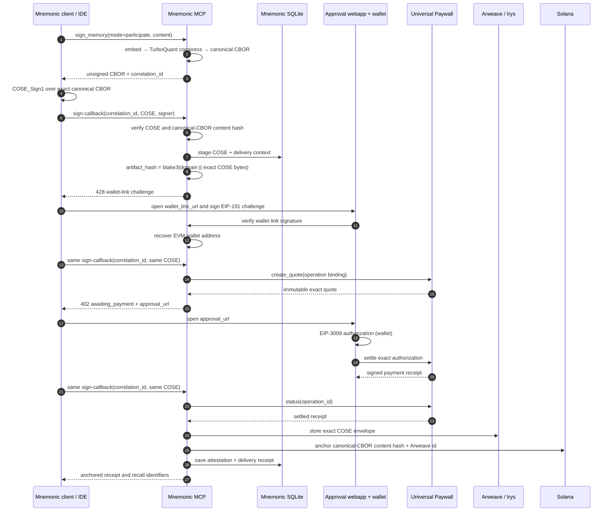
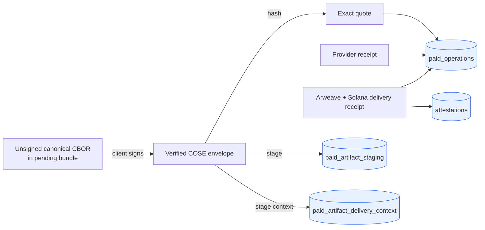
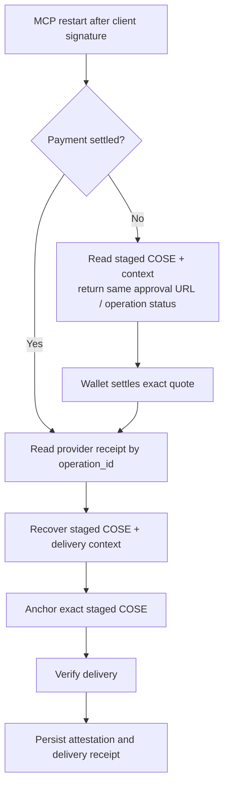

# Universal Paywall exact-payment flow

This document describes the Phase 1 exact-payment journey as implemented and
the restart-resume boundary being completed before wallet identity linking.
Local writes remain free and do not enter this flow.

## Primary journey

The payment binding is deliberately the signed COSE envelope, not raw editor
content and not only the unsigned canonical CBOR. Thus it commits to the
TurboQuant-compressed embedding inside the canonical artifact, the payload,
the protected headers, and the client signer.

## Persistent state boundaries

- `paid_operations` stores only operation metadata, quote metadata, state,
  and receipts; it never stores private artifact bytes.
- The dedicated staging tables hold the verified COSE envelope and private
  delivery context under the same local SQLite trust boundary used for private
  attestations. They are needed only until delivery is confirmed or abandoned.
- Universal Paywall remains the independent source of truth for settlement.
  Arweave and Solana remain the independent evidence of completed delivery.

## Wallet link requirement

Before a quote, Mnemonic issues an EIP-191 `personal_sign` message bound to
the opaque Mnemonic subject hash, operation id, configured EVM chain, random
nonce, and five-minute expiry. Mnemonic recovers the signer address server
side and stores the verified link as single-use metadata. The Universal Paywall
binding uses that recovered address; `UNIVERSAL_PAYWALL_PAYER_WALLET` is no
longer used as the production quote source.

## Restart-resume path

The recovery route must never create a replacement quote, change the signed
artifact, request another wallet authorization, or re-embed content.

## Current limits and follow-on work

- Wallet-to-Mnemonic-subject binding is not yet implemented; the configured
  payer wallet remains a development-only identity source. This is Task 03.
- The legacy `/api/authorization` endpoint still exists but the active E2E
  flow no longer calls it. Task 04 removes it and adds authenticated status /
  resume surfaces.
- The operation lease, quote-expiry, concurrent callback, delivery failure,
  and provider/MCP restart cases require explicit integration tests in Task 06
  before production readiness.
